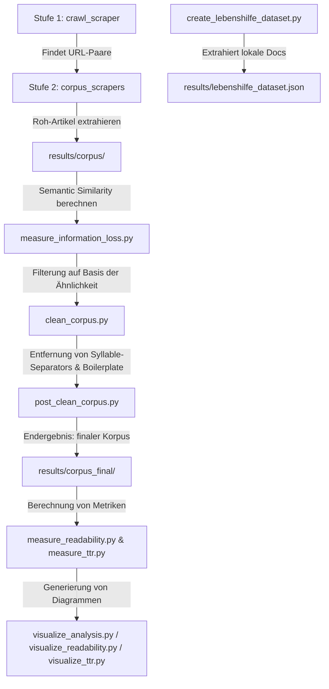

# Master Thesis: Automatische Übersetzung in Leichte Sprache

Dieses Repository enthält den Quellcode, die Web-Scraper, die Analyse-Tools sowie die Machine-Learning-Pipelines für die Masterarbeit **"Automatische Übersetzung in Leichte Sprache"**.

Das Ziel dieser Arbeit ist die Entwicklung und Evaluierung eines Übersetzungssystems, das deutsche Alltagssprache (AS) in Leichte Sprache (LS) übersetzt. Der Fokus liegt dabei auf der Erstellung eines robusten, parallelen Textkorpus, der SBERT-basierten Bewertung semantischer Ähnlichkeit zur Qualitätsmessung und der anschließenden Optimierung von Übersetzungsmodellen.

---

## Inhaltsverzeichnis
1. [Projektstruktur](#projektstruktur)
2. [Installation & Setup](#installation--setup)
3. [Die Daten- & Analyse-Pipeline](#die-daten---analyse-pipeline)
4. [Detaillierte Skript-Referenz](docs/scripts.md) (Zusammenfassung siehe [unten](#detaillierte-skript-referenz))
5. [Notebook-Referenz](docs/notebooks.md) (Zusammenfassung siehe [unten](#notebook-referenz))

---

## Projektstruktur

Das Projekt ist wie folgt organisiert:

```text
├── data/
│   └── texts_lebenshilfe/         # Rohdaten der Lebenshilfe (docx, rtf, odt) aufgeteilt in /as und /ls
├── docs/
│   ├── scripts.md                 # Detaillierte Dokumentation aller Python-Skripte
│   └── notebooks.md               # Detaillierte Dokumentation aller Jupyter Notebooks
├── scripts/
│   ├── crawl_scraper/            # Stufe 1: Crawler zur URL-Findung und -Paarung
│   ├── corpus_scrapers/          # Stufe 2: Scraper zum Herunterladen & Extrahieren von Texten
│   └── *.py                      # Python-Skripte für Bereinigung, Metriken und Evaluierung
├── results/
│   ├── aligned_urls/             # Gefundene URL-Paare der Webseiten (.json)
│   ├── corpus/                   # Roh-Scraping-Ergebnisse pro Quelle (.json)
│   ├── corpus_cleaned/           # Gefilterte Artikelpaare (.json)
│   ├── corpus_final/             # Post-prozessierte & bereinigte Artikelpaare (.json)
│   ├── *.csv / *.json            # Analyseergebnisse, Metriken und Trainingsdaten
│   └── *.pt                      # Trainierte PyTorch-Modelle (LSTM etc.)
├── notebooks/
│   └── *.ipynb                   # Jupyter Notebooks für Modelltraining & Experimente
├── research/
│   ├── img/analysis/             # Generierte Abbildungen und Grafiken
│   └── *.md                      # Analyseberichte, Statistiken und Zusammenfassungen
└── requirements.txt              # Python-Abhängigkeiten
```

---

## Installation & Setup

### 1. Virtuelle Umgebung erstellen und aktivieren
Es wird empfohlen, eine virtuelle Python-Umgebung zu nutzen:

```bash
# Virtuelle Umgebung erstellen
python3 -m venv .venv

# Aktivieren (macOS / Linux)
source .venv/bin/activate

# Aktivieren (Windows PowerShell)
# .venv\Scripts\Activate.ps1
```

### 2. Abhängigkeiten installieren
Installiere die benötigten Python-Pakete:

```bash
pip install -r requirements.txt
```

### 3. SpaCy Sprachmodelle herunterladen
Das Projekt nutzt SpaCy zur linguistischen Analyse und Named Entity Recognition (NER). Installiere die deutschen Sprachmodelle:

```bash
# Großes Modell für genaue Analysen (NER, POS-Tagging)
python3 -m spacy download de_core_news_lg

# Kleines Modell für schnellere Sentence-Analysen
python3 -m spacy download de_core_news_sm
```

---

## Die Daten- & Analyse-Pipeline

Die Verarbeitung und Evaluierung der Daten läuft in mehreren aufeinanderfolgenden Schritten ab:



---

## Detaillierte Skript-Referenz

Führe alle Befehle aus dem Hauptverzeichnis des Projekts aus. Wenn die virtuelle Umgebung aktiviert ist, reicht `python` statt `.venv/bin/python`.

### 1. Scraping & URL-Alignment

Die Erstellung des parallelen Web-Korpus erfolgt in zwei Schritten für jede der 12 Quellen (Apotheken, Behindertenbeauftragter, BrandEins, Hamburg, Hannover, Köln, Main-Taunus, MDR, Sozialpolitik, Stuttgart, Taz, Wiesbaden):

#### Stufe 1: URL Alignment (`scripts/crawl_scraper/`)
Sucht auf den Webseiten nach Artikeln in Leichter Sprache (LS) und versucht, die entsprechende alltagssprachliche (AS) Version zu finden. Speichert die URL-Paare in `results/aligned_urls/<quelle>_aligned_urls.json`.
* **Beispiel-Befehl:**
  ```bash
  .venv/bin/python scripts/crawl_scraper/apotheken_scraper.py
  ```

#### Stufe 2: Content Extraction (`scripts/corpus_scrapers/`)
Liest die URL-Paare ein, lädt den HTML-Inhalt herunter, extrahiert den Fließtext (ohne Navigation/Footer) und zählt die Token. Speichert die Ergebnisse in `results/corpus/<quelle>_articles.json`.
* **Beispiel-Befehl:**
  ```bash
  .venv/bin/python scripts/corpus_scrapers/apotheken_scraper.py
  ```

---

### 2. Lokale Datensatzerstellung

#### `create_lebenshilfe_dataset.py`
Sammelt Dokumente im Format `.docx`, `.rtf` und `.odt` aus `data/texts_lebenshilfe/as` und `data/texts_lebenshilfe/ls`, führt ein Alignment auf Basis von Dateinamen oder manuell definierten Mappings durch und speichert das Ergebnis.
* **Input:** `data/texts_lebenshilfe/`
* **Output:** `results/lebenshilfe_dataset.json`
* **Befehl:**
  ```bash
  .venv/bin/python scripts/create_lebenshilfe_dataset.py
  ```

---

### 3. Datenbereinigung & Post-Processing

#### `clean_corpus.py`
Filtert den Roh-Korpus auf Basis der semantischen Ähnlichkeit (Jina 8192 score), der minimalen Token-Anzahl und filtert Platzhalter (Lorem Ipsum) aus.
* **Filterregeln:** Ähnlichkeit $0.60 \leq \text{Sim} \leq 0.99$, Mindestlänge LS-Artikel: 10 Tokens.
* **Input:** `results/information_loss_analysis_cleaned.csv` & `results/corpus/`
* **Output:** `results/corpus_cleaned/`
* **Befehl:**
  ```bash
  .venv/bin/python scripts/clean_corpus.py
  ```

#### `post_clean_corpus.py`
Führt quellenspezifische Textreinigungen durch (Entfernen von Mediopunkten `·`, Beseitigung von Datums- und Autorenzeilen bei *BrandEins*, Entfernen von Standard-Boilerplates bei *MDR* und *TAZ*).
* **Input:** `results/corpus_cleaned/`
* **Output:** `results/corpus_final/`
* **Befehl:**
  ```bash
  .venv/bin/python scripts/post_clean_corpus.py
  ```

---

### 4. Analyse von Informationsverlust & Ähnlichkeit

#### `measure_information_loss.py`
Nutzt ein deutsches SBERT-Modell (`jinaai/jina-embeddings-v2-base-de` mit 8192 Tokens Kontext) und SpaCy (`de_core_news_lg`), um die semantische Ähnlichkeit (Cosine Similarity) sowie bidirektionale Named Entity Recognition (NER) Recall-Werte zu berechnen.
* **Argumente:**
  * `--input_dir`: Pfad zum Eingabeverzeichnis (Standard: `results/corpus`)
  * `--output_csv`: Pfad für die Ergebnis-Tabelle (Standard: `results/information_loss_analysis.csv`)
* **Befehl (für Rohdaten):**
  ```bash
  .venv/bin/python scripts/measure_information_loss.py --input_dir results/corpus --output_csv results/information_loss_analysis.csv
  ```
* **Befehl (für finalen Korpus):**
  ```bash
  .venv/bin/python scripts/measure_information_loss.py --input_dir results/corpus_final --output_csv results/information_loss_analysis_cleaned.csv
  ```

#### `info_loss_stats.py`
Gibt eine Zusammenfassung der Token-Statistiken (AS vs. LS) aus und vergleicht Mittelwert, Standardabweichung und Perzentile.
* **Input:** `results/information_loss_analysis.csv`
* **Befehl:**
  ```bash
  .venv/bin/python scripts/info_loss_stats.py
  ```

#### `calculate_sbert_coverage.py`
Analysiert, wie viel Prozent des Textkorpus bei einer maximalen SBERT-Kontextlänge (z.B. 512 Tokens) vollständig erfasst oder abgeschnitten werden.
* **Input:** `results/information_loss_analysis.csv`
* **Befehl:**
  ```bash
  .venv/bin/python scripts/calculate_sbert_coverage.py
  ```

#### `count_total_tokens.py`
Zählt die linguistischen Tokens (Wörter und Satzzeichen separat) über alle Rohdateien im Korpus und gibt eine tabellarische Zusammenfassung aus.
* **Input:** `results/corpus/*.json`
* **Befehl:**
  ```bash
  .venv/bin/python scripts/count_total_tokens.py
  ```

#### `generate_review_report.py`
Findet extreme Artikelpaare (Ähnlichkeit $< 0.6$ oder $> 0.98$) für ein manuelles Audit. So werden fehlerhafte Alignments (zu niedrige Ähnlichkeit) oder identische, nicht-übersetzte Texte (zu hohe Ähnlichkeit) leicht identifizierbar.
* **Input:** `results/information_loss_analysis.csv`
* **Output:** `results/outlier_review.md`
* **Befehl:**
  ```bash
  .venv/bin/python scripts/generate_review_report.py
  ```

---

### 5. Qualitätsmetriken & Lesbarkeit

#### `corpus_stats.py`
Generiert eine Markdown-Tabelle aller Quellen mit Paaren, Wörtern, Tokens (via `tiktoken`), Sätzen, Vokabulargrößen, Type-Token-Ratio (TTR) sowie Wörtern pro Satz.
* **Argumente:**
  * `--input_dir`: Eingabepfad (Standard: `results/corpus`)
  * `--output_file`: Ausgabepfad (Standard: `research/corpus_statistics.md`)
* **Befehl (für finalen Korpus):**
  ```bash
  .venv/bin/python scripts/corpus_stats.py --input_dir results/corpus_final --output_file research/corpus_statistics_cleaned.md
  ```

#### `measure_readability.py`
Analysiert die Lesbarkeit von alltagssprachlichen und leichtsprachlichen Texten anhand des Flesch Reading Ease (Amstad-Formel für Deutsch), der Wiener Sachtextformel und des LIX-Indexes.
* **Input:** `results/corpus_final/`
* **Output:** `results/readability_analysis.csv`
* **Befehl:**
  ```bash
  .venv/bin/python scripts/measure_readability.py
  ```

#### `measure_ttr.py`
Berechnet die lexikalische Vielfalt mithilfe der klassischen Type-Token-Ratio (TTR) sowie der Moving Average Type-Token-Ratio (MATTR, Window=50) auf Basis lemmatisierter Wörter.
* **Input:** `results/corpus_final/`
* **Output:** `results/ttr_analysis.csv`
* **Befehl:**
  ```bash
  .venv/bin/python scripts/measure_ttr.py
  ```

---

### 6. Modellevaluierung & Klassifikation

Diese Skripte evaluieren trainierte Klassifikationsmodelle (BiLSTM), die darauf trainiert wurden, Alltagssprache (Klasse 0) von Leichter Sprache (Klasse 1) zu unterscheiden.

#### `evaluate_article_model.py`
Evaluiert das Artikel-Klassifikationsmodell auf dem Lebenshilfe-Testdatensatz.
* **Befehl:**
  ```bash
  .venv/bin/python scripts/evaluate_article_model.py
  ```

#### `evaluate_sentence_model.py`
Evaluiert das Satz-Klassifikationsmodell auf dem Lebenshilfe-Testdatensatz auf Satzebene.
* **Befehl:**
  ```bash
  .venv/bin/python scripts/evaluate_sentence_model.py
  ```

#### `check_length_bias.py`
Prüft, ob das Klassifikationsmodell einen systematischen Fehler (Bias) bezüglich der Textlänge aufweist – also längere Texte automatisch als alltagssprachlich und kürzere als leichtsprachlich einstuft.
* **Befehl:**
  ```bash
  .venv/bin/python scripts/check_length_bias.py
  ```

---

### 7. Synthetische Datengenerierung (LLM)

#### `generate_synthetic_regression_steps.py`
Generiert künstliche Zwischenstufen der Komplexität (z. B. 0.25, 0.50, 0.75) zwischen Leichter Sprache (0.0) und Alltagssprache (1.0) über eine OpenAI-kompatible API. Unterstützt inkrementelles Speichern und Fortsetzen.
* **Argumente:**
  * `--input`: Eingabedatei mit Artikelpaaren (Standard: `results/lebenshilfe_dataset.json`)
  * `--output`: Ausgabedatei für generierte Stufen (Standard: `results/lebenshilfe_dataset_with_steps.json`)
  * `--url`: HTTP-Endpunkt der LLM Chat-Completion-API (Erforderlich)
  * `--model`: Name des LLM-Modells
  * `--token`: API-Token zur Autorisierung
  * `--steps`: Komma-separierte Liste der Zwischenstufen (Standard: `0.25,0.50,0.75`)
  * `--limit`: Anzahl der zu verarbeitenden Artikel (hilfreich für Tests)
* **Befehl (Beispiel):**
  ```bash
  .venv/bin/python scripts/generate_synthetic_regression_steps.py \
      --url http://193.175.180.196:8000/v1/chat/completions \
      --limit 1 \
      --token RrI6y403jAlUm8v \
      --model "FlensGen-GPT-OSS120B"
  ```

---

### 8. Visualisierung

Generiert aus den CSV-Ergebnisdateien aussagekräftige Grafiken und Diagramme für die Arbeit und speichert sie im Ordner `research/img/analysis/`.

#### `visualize_analysis.py`
Generiert Diagramme zur semantischen Ähnlichkeit, dem Einfluss der SBERT-Kontextlänge sowie NER-Vergleiche und Längenverteilungen.
* **Befehl (alle Grafiken):**
  ```bash
  .venv/bin/python scripts/visualize_analysis.py --plots all
  ```

#### `visualize_readability.py`
Erzeugt Vergleichs-Boxplots und Violinen-Diagramme für die Lesbarkeitsmetriken (Flesch, Wiener Sachtextformel, LIX) und aktualisiert den Bericht `research/readability_summary.md`.
* **Befehl:**
  ```bash
  .venv/bin/python scripts/visualize_readability.py
  ```

#### `visualize_ttr.py`
Visualisiert die Type-Token-Ratio-Analysen und MATTR-Mittelwerte der verschiedenen Quellen.
* **Befehl:**
  ```bash
  .venv/bin/python scripts/visualize_ttr.py
  ```
