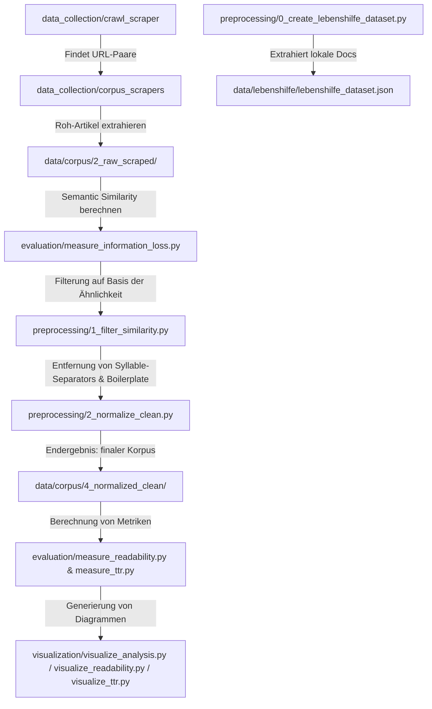

# Masterarbeit: Entwicklung domänenspezifischer Datensätze und automatisierter Evaluation für ein Framework zur neuronalen Textvereinfachung in leichte Sprache

Dieses Repository enthält den Quellcode, die Web-Scraper, die Analyse-Tools, die Machine-Learning-Pipelines, die Web-Applikation (FastAPI/Next.js) sowie die LaTeX-Dokumentation für die Masterarbeit von **Fiete Scheel**.

Das Ziel dieser Arbeit ist die Entwicklung und Evaluierung eines Übersetzungssystems, das deutsche Alltagssprache (AS) in Leichte Sprache (LS) übersetzt. Der Fokus liegt dabei auf der Erstellung eines robusten, parallelen Textkorpus, der SBERT-basierten Bewertung semantischer Ähnlichkeit zur Qualitätsmessung, der anschließenden Optimierung von Übersetzungsmodellen mittels Reward-Guided Fine-Tuning und der Evaluation durch spezialisierte Klassifikations- und Regressormodelle.

---

## Inhaltsverzeichnis
1. [Projektstruktur](#projektstruktur)
2. [Installation & Setup](#installation--setup)
3. [Die Daten- & Analyse-Pipeline](#die-daten---analyse-pipeline)
4. [Web-Applikation (Frontend & Backend)](#web-applikation-frontend--backend)
5. [Masterarbeit (LaTeX-Dokumentation)](#masterarbeit-latex-dokumentation)
6. [Detaillierte Skript-Referenz](docs/scripts.md) (Zusammenfassung siehe [unten](#detaillierte-skript-referenz))
7. [Notebook-Referenz](docs/notebooks.md) (Zusammenfassung siehe [unten](#notebook-referenz))
8. [Remote Jupyter Server](#remote-jupyter-server)

---

## Projektstruktur

Das Projekt ist wie folgt organisiert:

```text
├── data/
│   └── texts_lebenshilfe/         # Rohdaten der Lebenshilfe (docx, rtf, odt) aufgeteilt in /as und /ls
├── docs/
│   ├── scripts.md                 # Detaillierte Dokumentation aller Python-Skripte
│   └── notebooks.md               # Detaillierte Dokumentation aller Jupyter Notebooks
├── scripts/
│   ├── data_collection/          # Stufe 1 & 2: Crawler und Content-Extraction
│   ├── preprocessing/            # Datenbereinigung und Datensatzerstellung
│   ├── evaluation/               # Linguistische & semantische Metriken
│   ├── modeling/                 # LLM-Synthese & Modellklassifikation
│   ├── visualization/            # Generierung von Abbildungen
│   └── README.md                 # Dokumentation der Skripte und Pipeline
├── results/
│   ├── aligned_urls/             # Gefundene URL-Paare der Webseiten (.json)
│   ├── corpus/                   # Roh-Scraping-Ergebnisse pro Quelle (.json)
│   ├── corpus_cleaned/           # Gefilterte Artikelpaare (.json)
│   ├── corpus_final/             # Post-prozessierte & bereinigte Artikelpaare (.json)
│   ├── models/                   # Trainierte Modelle (LSTM, Seq2Seq DPO)
│   └── *.csv / *.json            # Analyseergebnisse, Metriken und Trainingsdaten
├── notebooks/
│   └── *.ipynb                   # Jupyter Notebooks für Modelltraining & Experimente
├── research/
│   ├── img/analysis/             # Generierte Abbildungen und Grafiken
│   └── *.md                      # Analyseberichte, Statistiken und Zusammenfassungen
├── thesis/
│   ├── chapters/                 # Die Kapitel der Arbeit (Latex)
│   ├── options/                  # Konfigurationsdateien und Packages
│   ├── main.tex                  # Haupt-Dokument der Masterarbeit
│   └── bibliography.bib          # Literaturverzeichnis
├── web/
│   ├── app.py                    # FastAPI-Backend für Text-Evaluation & Übersetzung
│   └── frontend/                 # Next.js-Frontend für die interaktive Nutzung
└── requirements.txt              # Python-Abhängigkeiten
```

---

## Installation & Setup

### 1. Virtuelle Umgebung erstellen und aktivieren
Es wird empfohlen, eine virtuelle Python-Umgebung zu nutzen:

```bash
# Virtuelle Umgebung erstellen
python3 -m venv .venv

# Aktivieren (macOS / Linux)
source .venv/bin/activate

# Aktivieren (Windows PowerShell)
# .venv\Scripts\Activate.ps1
```

### 2. Abhängigkeiten installieren
Installiere die benötigten Python-Pakete:

```bash
pip install -r requirements.txt
```

Für die Web-Applikation werden zusätzlich `fastapi` und `uvicorn` benötigt:
```bash
pip install fastapi uvicorn pydantic
```

### 3. SpaCy Sprachmodelle herunterladen
Das Projekt nutzt SpaCy zur linguistischen Analyse und Named Entity Recognition (NER). Installiere die deutschen Sprachmodelle:

```bash
# Großes Modell für genaue Analysen (NER, POS-Tagging)
python3 -m spacy download de_core_news_lg

# Kleines Modell für schnellere Sentence-Analysen
python3 -m spacy download de_core_news_sm
```

---

## Die Daten- & Analyse-Pipeline

Die Verarbeitung und Evaluierung der Daten läuft in mehreren aufeinanderfolgenden Schritten ab:



---

## Web-Applikation (Frontend & Backend)

Die Web-Applikation bietet eine intuitive Schnittstelle, um Texte bezüglich ihrer sprachlichen Komplexität zu evaluieren und diese mithilfe der feingetunten Modelle in Leichte Sprache zu übersetzen.

### 1. FastAPI-Backend starten
Das Backend lädt die trainierten Regressor-Modelle (MixUp & Synthetic) sowie die Übersetzungsmodelle und stellt entsprechende API-Endpunkte zur Verfügung.

```bash
# Aus dem Hauptverzeichnis ausführen
uvicorn web.app:app --host 127.0.0.1 --port 8000 --reload
```

- **API-Status:** `http://127.0.0.1:8000/api/status`
- **Evaluation:** `/api/evaluate` (Berechnet Einfachheits-Scores)
- **Übersetzung:** `/api/translate` (Übersetzt AS in LS)

### 2. Next.js-Frontend starten
Das moderne UI ermöglicht die Eingabe von Alltagssprache, zeigt die berechneten Komplexitätsmetriken und liefert die Übersetzung.

```bash
cd web/frontend
npm install
npm run dev
```
Das Frontend ist anschließend unter `http://localhost:3000` erreichbar.

---

## Masterarbeit (LaTeX-Dokumentation)

Die schriftliche Ausarbeitung der Arbeit befindet sich im Ordner `thesis/` und basiert auf der Dokumentenklasse `scrreprt` (KOMA-Script).

### Kapitelstruktur
- `chapters/01_einleitung.tex` - Einleitung
- `chapters/02_background.tex` - Theoretical Background & Stand der Forschung
- `chapters/03_datenbasis.tex` - Themenblock 1: Datenbasis & Korpus-Erstellung
- `chapters/04_metrik.tex` - Themenblock 2: Metrik & Bewerten von Sprachkomplexität
- `chapters/05_modellierung.tex` - Themenblock 3: Modellierung der Übersetzung & Reward-Guided Fine-Tuning
- `chapters/06_diskussion.tex` - Diskussion & Gesamtevaluation
- `chapters/07_fazit.tex` - Fazit & Ausblick
- `chapters/99_appendix.tex` - Anhang

### Kompilieren der Arbeit
Das Dokument verwendet `biber` als Literatur-Backend. Stelle sicher, dass TeX Live oder eine andere LaTeX-Distribution installiert ist.

```bash
cd thesis
# Kompilieren mit latexmk (empfohlen)
latexmk -pdf main.tex

# Alternativ manuell kompilieren:
pdflatex main.tex
biber main
pdflatex main.tex
pdflatex main.tex
```

---

## Detaillierte Skript-Referenz

Führe alle Befehle aus dem Hauptverzeichnis des Projekts aus. Wenn die virtuelle Umgebung aktiviert ist, reicht `python` statt `.venv/bin/python`.

### 1. Scraping & URL-Alignment

Die Erstellung des parallelen Web-Korpus erfolgt in zwei Schritten für jede der 12 Quellen (Apotheken, Behindertenbeauftragter, BrandEins, Hamburg, Hannover, Köln, Main-Taunus, MDR, Sozialpolitik, Stuttgart, Taz, Wiesbaden):

#### Stufe 1: URL Alignment (`scripts/data_collection/crawl_scraper/`)
Sucht auf den Webseiten nach Artikeln in Leichter Sprache (LS) und versucht, die entsprechende alltagssprachliche (AS) version zu finden. Speichert die URL-Paare in `data/corpus/1_aligned_urls/<quelle>_aligned_urls.json`.
* **Beispiel-Befehl:**
  ```bash
  .venv/bin/python scripts/data_collection/crawl_scraper/apotheken_scraper.py
  ```

#### Stufe 2: Content Extraction (`scripts/data_collection/corpus_scrapers/`)
Liest die URL-Paare ein, lädt den HTML-Inhalt herunter, extrahiert den Fließtext (ohne Navigation/Footer) und zählt die Token. Speichert die Ergebnisse in `data/corpus/2_raw_scraped/<quelle>_articles.json`.
* **Beispiel-Befehl:**
  ```bash
  .venv/bin/python scripts/data_collection/corpus_scrapers/apotheken_scraper.py
  ```

---

### 2. Lokale Datensatzerstellung

#### `scripts/preprocessing/0_create_lebenshilfe_dataset.py`
Sammelt Dokumente im Format `.docx`, `.rtf` und `.odt` aus `data/lebenshilfe/texts_lebenshilfe/as` und `data/lebenshilfe/texts_lebenshilfe/ls`, führt ein Alignment auf Basis von Dateinamen oder manuell definierten Mappings durch und speichert das Ergebnis.
* **Input:** `data/lebenshilfe/texts_lebenshilfe/`
* **Output:** `data/lebenshilfe/lebenshilfe_dataset.json`
* **Befehl:**
  ```bash
  .venv/bin/python scripts/preprocessing/0_create_lebenshilfe_dataset.py
  ```

---

### 3. Datenbereinigung & Post-Processing

#### `scripts/preprocessing/1_filter_similarity.py`
Filtert den Roh-Korpus auf Basis der semantischen Ähnlichkeit (Jina 8192 score), der minimalen Token-Anzahl und filtert Platzhalter (Lorem Ipsum) aus.
* **Filterregeln:** Ähnlichkeit $0.60 \leq \text{Sim} \leq 0.99$, Mindestlänge LS-Artikel: 10 Tokens.
* **Input:** `data/analysis/information_loss_analysis_cleaned.csv` & `data/corpus/2_raw_scraped/`
* **Output:** `data/corpus/3_filtered_similarity/`
* **Befehl:**
  ```bash
  .venv/bin/python scripts/preprocessing/1_filter_similarity.py
  ```

#### `scripts/preprocessing/2_normalize_clean.py`
Führt quellenspezifische Textreinigungen durch (Entfernen von Mediopunkten `·`, Beseitigung von Datums- und Autorenzeilen bei *BrandEins*, Entfernen von Standard-Boilerplates bei *MDR* und *TAZ*).
* **Input:** `data/corpus/3_filtered_similarity/`
* **Output:** `data/corpus/4_normalized_clean/`
* **Befehl:**
  ```bash
  .venv/bin/python scripts/preprocessing/2_normalize_clean.py
  ```

---

### 4. Analyse von Informationsverlust & Ähnlichkeit

#### `scripts/evaluation/measure_information_loss.py`
Nutzt ein deutsches SBERT-Modell (`jinaai/jina-embeddings-v2-base-de` mit 8192 Tokens Kontext) und SpaCy (`de_core_news_lg`), um die semantische Ähnlichkeit (Cosine Similarity) sowie bidirektionale Named Entity Recognition (NER) Recall-Werte zu berechnen.
* **Argumente:**
  * `--input_dir`: Pfad zum Eingabeverzeichnis (Standard: `data/corpus/2_raw_scraped`)
  * `--output_csv`: Pfad für die Ergebnis-Tabelle (Standard: `data/analysis/information_loss_analysis.csv`)
* **Befehl (für Rohdaten):**
  ```bash
  .venv/bin/python scripts/evaluation/measure_information_loss.py --input_dir data/corpus/2_raw_scraped --output_csv data/analysis/information_loss_analysis.csv
  ```
* **Befehl (für finalen Korpus):**
  ```bash
  .venv/bin/python scripts/evaluation/measure_information_loss.py --input_dir data/corpus/4_normalized_clean --output_csv data/analysis/information_loss_analysis_cleaned.csv
  ```

#### `scripts/evaluation/info_loss_stats.py`
Gibt eine Zusammenfassung der Token-Statistiken (AS vs. LS) aus und vergleicht Mittelwert, Standardabweichung und Perzentile.
* **Input:** `data/analysis/information_loss_analysis.csv`
* **Befehl:**
  ```bash
  .venv/bin/python scripts/evaluation/info_loss_stats.py
  ```

#### `scripts/evaluation/calculate_sbert_coverage.py`
Analysiert, wie viel Prozent des Textkorpus bei einer maximalen SBERT-Kontextlänge (z.B. 512 Tokens) vollständig erfasst oder abgeschnitten werden.
* **Input:** `data/analysis/information_loss_analysis.csv`
* **Befehl:**
  ```bash
  .venv/bin/python scripts/evaluation/calculate_sbert_coverage.py
  ```

#### `scripts/evaluation/count_total_tokens.py`
Zählt die linguistischen Tokens (Wörter und Satzzeichen separat) über alle Rohdateien im Korpus und gibt eine tabellarische Zusammenfassung aus.
* **Input:** `data/corpus/2_raw_scraped/*.json`
* **Befehl:**
  ```bash
  .venv/bin/python scripts/evaluation/count_total_tokens.py
  ```

#### `scripts/visualization/generate_review_report.py`
Findet extreme Artikelpaare (Ähnlichkeit $< 0.6$ oder $> 0.98$) für ein manuelles Audit. So werden fehlerhafte Alignments (zu niedrige Ähnlichkeit) oder identische, nicht-übersetzte Texte (zu hohe Ähnlichkeit) leicht identifizierbar.
* **Input:** `data/analysis/information_loss_analysis.csv`
* **Output:** `results/reports/outlier_review.md`
* **Befehl:**
  ```bash
  .venv/bin/python scripts/visualization/generate_review_report.py
  ```

---

### 5. Qualitätsmetriken & Lesbarkeit

#### `scripts/evaluation/corpus_stats.py`
Generiert eine Markdown-Tabelle aller Quellen mit Paaren, Wörtern, Tokens (via `tiktoken`), Sätzen, Vokabulargrößen, Type-Token-Ratio (TTR) sowie Wörtern pro Satz.
* **Argumente:**
  * `--input_dir`: Eingabepfad (Standard: `data/corpus/2_raw_scraped`)
  * `--output_file`: Ausgabepfad (Standard: `research/corpus_statistics.md`)
* **Befehl (für finalen Korpus):**
  ```bash
  .venv/bin/python scripts/evaluation/corpus_stats.py --input_dir data/corpus/4_normalized_clean --output_file research/corpus_statistics_cleaned.md
  ```

#### `scripts/evaluation/measure_readability.py`
Analysiert die Lesbarkeit von alltagssprachlichen und leichtsprachlichen Texten anhand des Flesch Reading Ease (Amstad-Formel für Deutsch), der Wiener Sachtextformel und des LIX-Indexes.
* **Input:** `data/corpus/4_normalized_clean/`
* **Output:** `data/analysis/readability_analysis.csv`
* **Befehl:**
  ```bash
  .venv/bin/python scripts/evaluation/measure_readability.py
  ```

#### `scripts/evaluation/measure_ttr.py`
Berechnet die lexikalische Vielfalt mithilfe der klassischen Type-Token-Ratio (TTR) sowie der Moving Average Type-Token-Ratio (MATTR, Window=50) auf Basis lemmatisierter Wörter.
* **Input:** `data/corpus/4_normalized_clean/`
* **Output:** `data/analysis/ttr_analysis.csv`
* **Befehl:**
  ```bash
  .venv/bin/python scripts/evaluation/measure_ttr.py
  ```

---

### 6. Modellevaluierung & Klassifikation

Diese Skripte evaluieren trainierte Klassifikationsmodelle (BiLSTM), die darauf trainiert wurden, Alltagssprache (Klasse 0) von Leichter Sprache (Klasse 1) zu unterscheiden.

#### `scripts/modeling/evaluate_article_model.py`
Evaluiert das Artikel-Klassifikationsmodell auf dem Lebenshilfe-Testdatensatz.
* **Befehl:**
  ```bash
  .venv/bin/python scripts/modeling/evaluate_article_model.py
  ```

#### `scripts/modeling/evaluate_sentence_model.py`
Evaluiert das Satz-Klassifikationsmodell auf dem Lebenshilfe-Testdatensatz auf Satzebene.
* **Befehl:**
  ```bash
  .venv/bin/python scripts/modeling/evaluate_sentence_model.py
  ```

#### `scripts/modeling/check_length_bias.py`
Prüft, ob das Klassifikationsmodell einen systematischen Fehler (Bias) bezüglich der Textlänge aufweist – also längere Texte automatisch als alltagssprachlich und kürzere als leichtsprachlich einstuft.
* **Befehl:**
  ```bash
  .venv/bin/python scripts/modeling/check_length_bias.py
  ```

---

### 7. Synthetische Datengenerierung (LLM)

#### `scripts/modeling/generate_synthetic_regression_steps.py`
Generiert künstliche Zwischenstufen der Komplexität (z. B. 0.25, 0.50, 0.75) zwischen Leichter Sprache (0.0) und Alltagssprache (1.0) über eine OpenAI-kompatible API. Unterstützt inkrementelles Speichern und Fortsetzen.
* **Argumente:**
  * `--input`: Eingabedatei mit Artikelpaaren (Standard: `data/lebenshilfe/lebenshilfe_dataset.json`)
  * `--output`: Ausgabedatei für generierte Stufen (Standard: `data/lebenshilfe/lebenshilfe_dataset_with_steps.json`)
  * `--url`: HTTP-Endpunkt der LLM Chat-Completion-API (Erforderlich)
  * `--model`: Name des LLM-Modells
  * `--token`: API-Token zur Autorisierung
  * `--steps`: Komma-separierte Liste der Zwischenstufen (Standard: `0.25,0.50,0.75`)
  * `--limit`: Anzahl der zu verarbeitenden Artikel (hilfreich für Tests)
* **Befehl (Beispiel):**
  ```bash
  .venv/bin/python scripts/modeling/generate_synthetic_regression_steps.py \
      --url http://193.175.180.196:8000/v1/chat/completions \
      --limit 1 \
      --token RrI6y403jAlUm8v \
      --model "FlensGen-GPT-OSS120B"
  ```

---

### 8. Visualisierung

Generiert aus den CSV-Ergebnisdateien aussagekräftige Grafiken und Diagramme für die Arbeit und speichert sie im Ordner `research/img/analysis/`.

#### `scripts/visualization/visualize_analysis.py`
Generiert Diagramme zur semantischen Ähnlichkeit, dem Einfluss der SBERT-Kontextlänge sowie NER-Vergleiche und Längenverteilungen.
* **Befehl (alle Grafiken):**
  ```bash
  .venv/bin/python scripts/visualization/visualize_analysis.py --plots all
  ```

#### `scripts/visualization/visualize_readability.py`
Erzeugt Vergleichs-Boxplots und Violinen-Diagramme für die Lesbarkeitsmetriken (Flesch, Wiener Sachtextformel, LIX) und aktualisiert den Bericht `research/readability_summary.md`.
* **Befehl:**
  ```bash
  .venv/bin/python scripts/visualization/visualize_readability.py
  ```

#### `scripts/visualization/visualize_ttr.py`
Visualisiert die Type-Token-Ratio-Analysen und MATTR-Mittelwerte der verschiedenen Quellen.
* **Befehl:**
  ```bash
  .venv/bin/python scripts/visualization/visualize_ttr.py
  ```

---

## Remote Jupyter Server

Ausführliche Details zum Ausführen von Jupyter-Notebooks auf GPU-Servern oder Remote-Windows-Maschinen sowie zur Behebung von CUDA-Treiber-Fehlern findest du im separaten Guide:
👉 [run_jupyter_server.md](file:///Users/fietescheel/Documents/Master%20Thesis/run_jupyter_server.md)
