# Scraping Alignment Visualisierungs-Report

Dieses Verzeichnis enthält hochauflösende Screenshots aller 12 Korpusquellen zur visuellen Erklärung des Ausrichtungs- und Extraktionsprozesses (Alignment zwischen Leichter Sprache und Standardsprache).

## Übersicht der Quellen & Alignment-Strategien

| Quelle | Kategorie | Alignment-Mechanismus | Screenshots |
| :--- | :--- | :--- | :--- |
| **Apotheken Umschau** | Healthcare / Medical | In-Text Cross-Reference Link | [Zu den Bildern](#apotheken) |
| **Behindertenbeauftragter** | Federal Government / Official | Header-Servicenavigation Sprachwechsler | [Zu den Bildern](#behindertenbeauftragter) |
| **brand eins** | Journalism / Economy (Archive) | In-Page Parallele Textblöcke & Farbcodierung | [Zu den Bildern](#brandeins) |
| **Hamburg.de** | Municipality / Portal | Dedizierte Language-Bar ('Originaltext') | [Zu den Bildern](#hamburg) |
| **Hannover.de** | Municipality / Portal | Button 'Zur Seite in Alltagssprache' & Canonical Link | [Zu den Bildern](#hannover) |
| **Stadt Köln** | Municipality / Portal (Archive) | In-Content Switch Link ('Alltags-Sprache lesen') | [Zu den Bildern](#koeln) |
| **Lebenshilfe Main-Taunus** | NGO / Inclusion (Archive) | Header-Sprachumschalter mit Tooltip/Icon | [Zu den Bildern](#main_taunus) |
| **MDR (Mitteldeutscher Rundfunk)** | Public Broadcasting / News | Teaser-Box 'In schwerer Sprache lesen' | [Zu den Bildern](#mdr) |
| **Sozialpolitik.com** | Educational / Federal Ministry (BMAS) | Header Quick-Switch 'Standardsprache' | [Zu den Bildern](#sozialpolitik) |
| **Stuttgart.de** | Municipality / Portal | Content-Button 'Artikel in Alltags-Sprache' / URL-Parameter | [Zu den Bildern](#stuttgart) |
| **taz (die tageszeitung)** | Journalism / News | Redaktioneller In-Text Quellverweis ('schwerer Text') | [Zu den Bildern](#taz) |
| **Wiesbaden.de** | Municipality / Portal | Sprachleisten-Toggle 'Leichte Sprache' / 'Alltagssprache' | [Zu den Bildern](#wiesbaden) |

---

### Apotheken Umschau 
**Strategie**: `In-Text Cross-Reference Link`  
**Beschreibung**: Am Ende des Leichte-Sprache-Artikels verlinkt die Apotheken Umschau mit Texten wie 'Hier finden Sie noch mehr Informationen über...' oder 'Informationen' auf den standardsprachlichen Fachartikel.  
- **LS URL**: [https://www.apotheken-umschau.de/einfache-sprache/krankheiten/weitsichtigkeit-753261.html](https://www.apotheken-umschau.de/einfache-sprache/krankheiten/weitsichtigkeit-753261.html)
- **AS URL**: [https://www.apotheken-umschau.de/krankheiten-symptome/augenkrankheiten/wie-kann-man-weitsichtigkeit-behandeln-733661.html](https://www.apotheken-umschau.de/krankheiten-symptome/augenkrankheiten/wie-kann-man-weitsichtigkeit-behandeln-733661.html)

#### 1. Leichte Sprache mit hervorgehobenem Alignment-Element
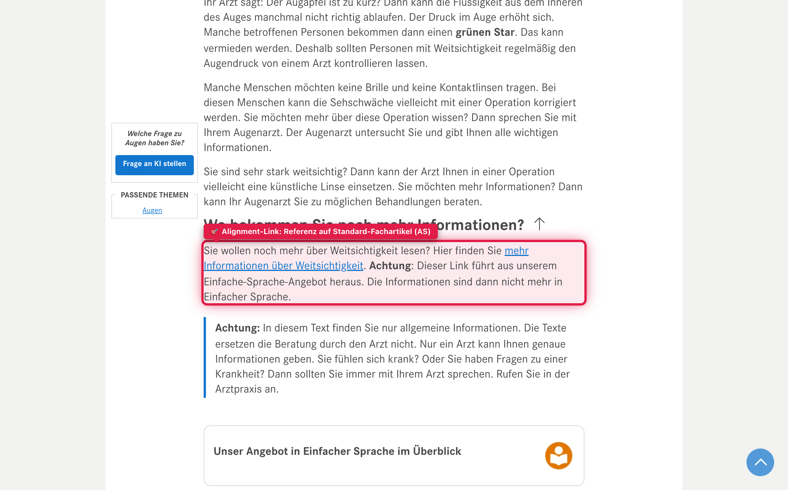

#### 2. Detailansicht des Alignment-Elements
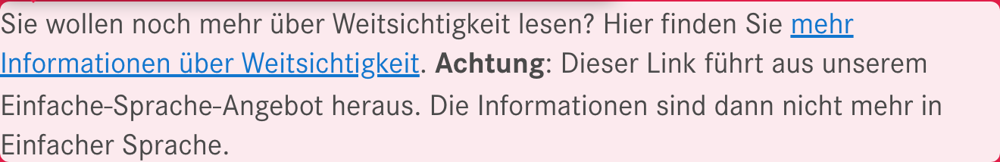

#### 3. Standardsprachlicher Gegenstück-Artikel (AS)
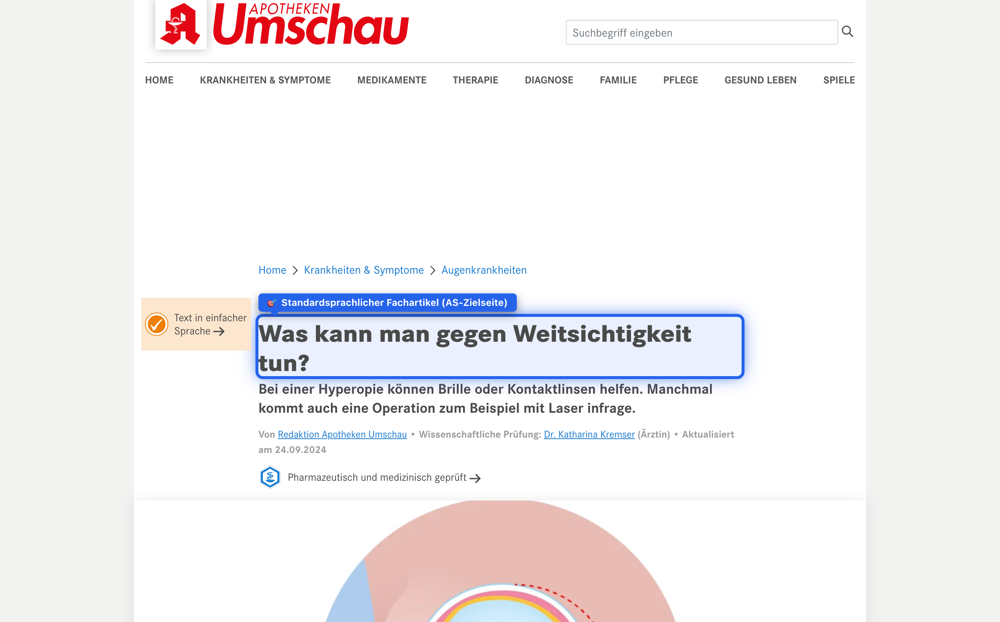

#### 4. Paarweiser Vergleich (LS vs. AS)
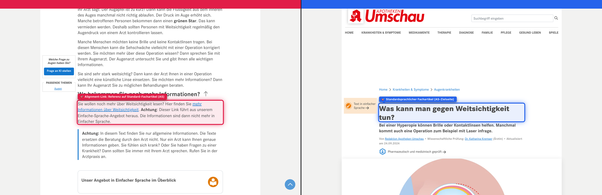

---

### Behindertenbeauftragter 
**Strategie**: `Header-Servicenavigation Sprachwechsler`  
**Beschreibung**: In der oberen Metanavigation existiert ein Sprachumschalter (navServiceAS / Alltagssprache-Icon), der den direkten Wechsel zur Alltagssprache ermöglicht.  
- **LS URL**: [https://www.behindertenbeauftragter.de/DE/LS/presse-und-aktuelles/veranstaltungen/sonderseiten/BRKKonferenz/FactSheet_07.html](https://www.behindertenbeauftragter.de/DE/LS/presse-und-aktuelles/veranstaltungen/sonderseiten/BRKKonferenz/FactSheet_07.html)
- **AS URL**: [https://www.behindertenbeauftragter.de/DE/AS/startseite/startseite-node.html](https://www.behindertenbeauftragter.de/DE/AS/startseite/startseite-node.html)

#### 1. Leichte Sprache mit hervorgehobenem Alignment-Element
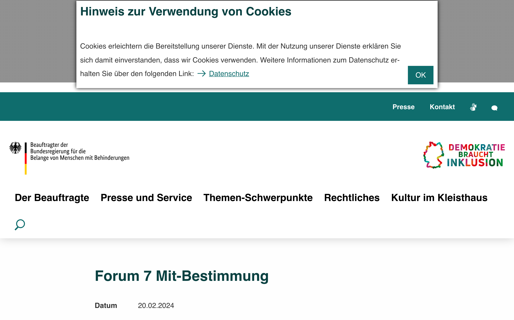

#### 3. Standardsprachlicher Gegenstück-Artikel (AS)
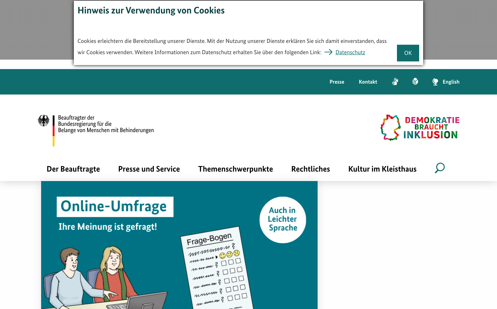

#### 4. Paarweiser Vergleich (LS vs. AS)
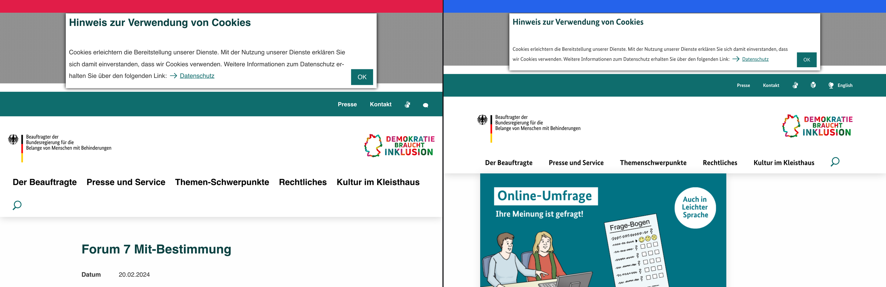

---

### brand eins 
**Strategie**: `In-Page Parallele Textblöcke & Farbcodierung`  
**Beschreibung**: brand eins stellt LS- und AS-Versionen direkt im selben Artikel gegenüber: Absätze in Alltagssprache (blau umrahmt) werden durch farbcodierte Absätze in Leichter Sprache (grün umrahmt) paarweise ergänzt.  
- **LS URL**: [https://web.archive.org/web/20240528075943/https://www.brandeins.de/magazine/brand-eins-wirtschaftsmagazin/2022/abo-wirtschaft/leichte-sprache-hauptsache-es-stand-in-irgendeiner-liste](https://web.archive.org/web/20240528075943/https://www.brandeins.de/magazine/brand-eins-wirtschaftsmagazin/2022/abo-wirtschaft/leichte-sprache-hauptsache-es-stand-in-irgendeiner-liste)

#### 1. Leichte Sprache mit hervorgehobenem Alignment-Element
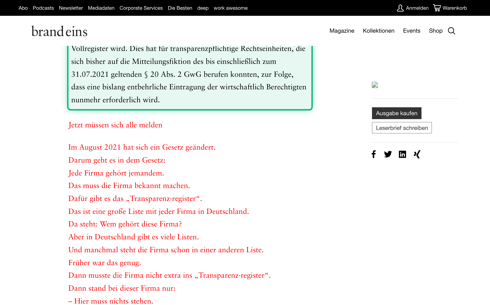

#### 2. Detailansicht des Alignment-Elements
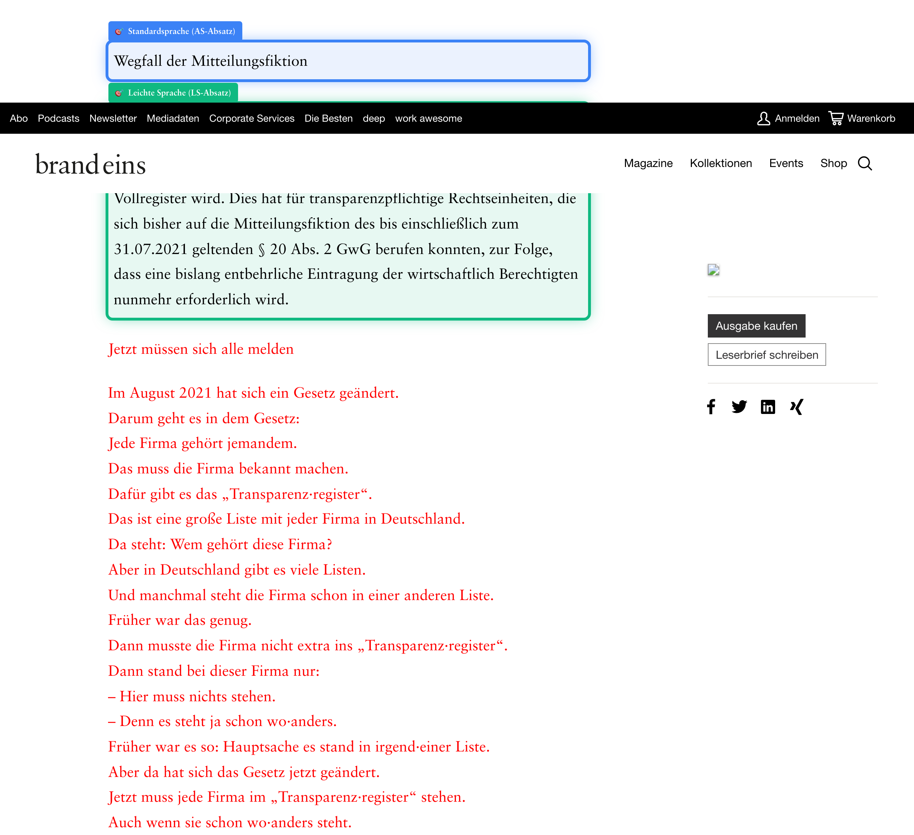

---

### Hamburg.de 
**Strategie**: `Dedizierte Language-Bar ('Originaltext')`  
**Beschreibung**: Jedem Leichte-Sprache-Artikel ist eine strukturierte Sprachleiste (.km1-language-bar) mit dem Button 'Originaltext / Alltagssprache' vorangestellt.  
- **LS URL**: [https://www.hamburg.de/barrierefrei/leichte-sprache/polizei-feuerwehr/ls-starkregen-1019916](https://www.hamburg.de/barrierefrei/leichte-sprache/polizei-feuerwehr/ls-starkregen-1019916)
- **AS URL**: [https://www.hamburg.de/politik-und-verwaltung/behoerden/bukea/themen/klima/starkregen-946792](https://www.hamburg.de/politik-und-verwaltung/behoerden/bukea/themen/klima/starkregen-946792)

#### 1. Leichte Sprache mit hervorgehobenem Alignment-Element
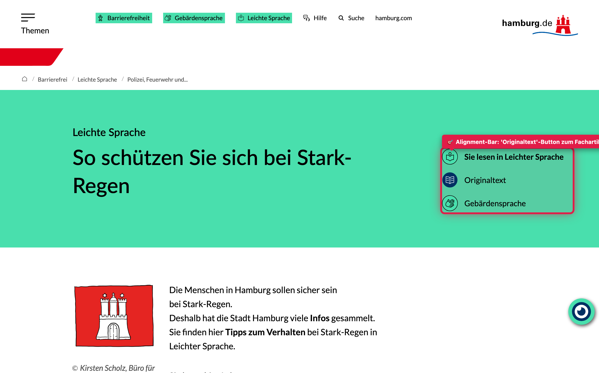

#### 2. Detailansicht des Alignment-Elements
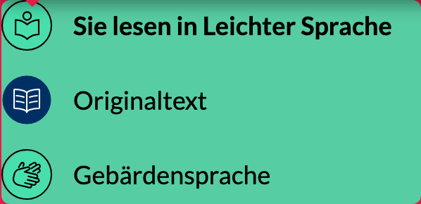

#### 3. Standardsprachlicher Gegenstück-Artikel (AS)
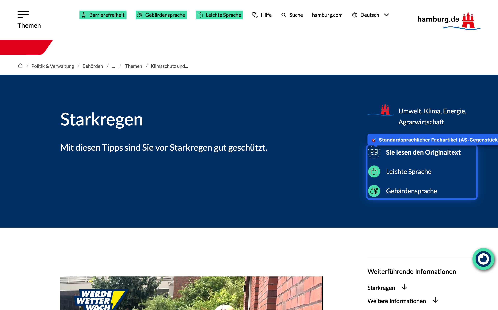

#### 4. Paarweiser Vergleich (LS vs. AS)
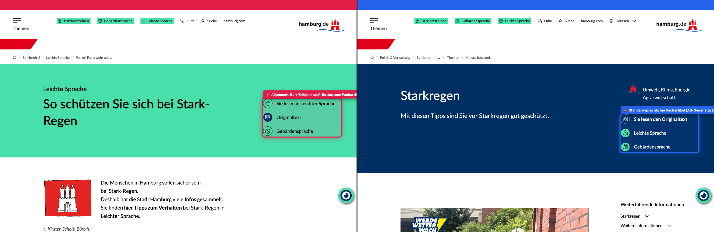

---

### Hannover.de 
**Strategie**: `Button 'Zur Seite in Alltagssprache' & Canonical Link`  
**Beschreibung**: Hannover.de platziert am Artikelanfang einen auffälligen Button 'Zur Seite in Alltagssprache' (.schwer.icon) und referenziert die AS-Version im Canonical Link.  
- **LS URL**: [https://www.hannover.de/Leichte-Sprache/Hannover-und-Region/Politik/Wahlen/Kommunal∙wahlen-2026-in-der-Region-Hannover](https://www.hannover.de/Leichte-Sprache/Hannover-und-Region/Politik/Wahlen/Kommunal∙wahlen-2026-in-der-Region-Hannover)
- **AS URL**: [https://www.hannover.de/Leben-in-der-Region-Hannover/Politik/Wahlen-Statistik/Kommunalwahlen-2026-in-der-Region-Hannover](https://www.hannover.de/Leben-in-der-Region-Hannover/Politik/Wahlen-Statistik/Kommunalwahlen-2026-in-der-Region-Hannover)

#### 1. Leichte Sprache mit hervorgehobenem Alignment-Element
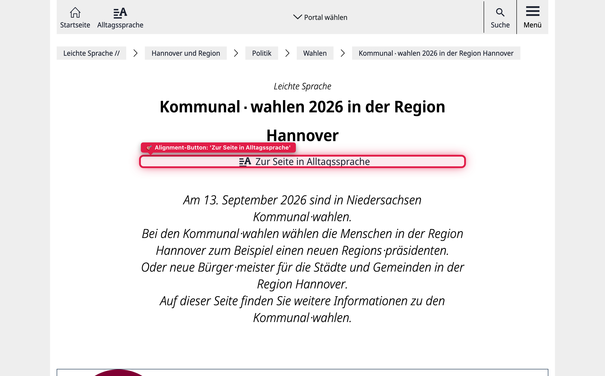

#### 2. Detailansicht des Alignment-Elements

#### 3. Standardsprachlicher Gegenstück-Artikel (AS)
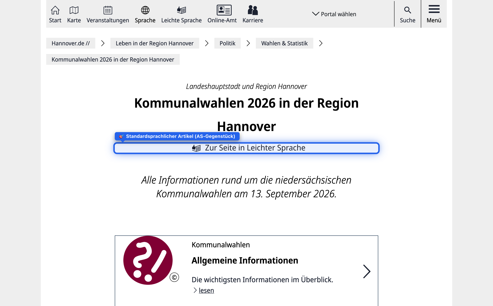

#### 4. Paarweiser Vergleich (LS vs. AS)
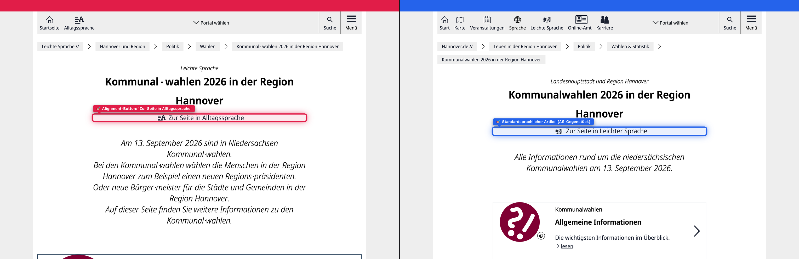

---

### Stadt Köln 
**Strategie**: `In-Content Switch Link ('Alltags-Sprache lesen')`  
**Beschreibung**: Im Hauptinhalt jedes LS-Dokuments führt der Navigationslink 'Alltags-Sprache lesen' direkt zur regulären Dienstleistungsseite.  
- **LS URL**: [https://web.archive.org/web/20220804230818/https://www.stadt-koeln.de/leben-in-koeln/soziales/unterhalts-vorschuss](https://web.archive.org/web/20220804230818/https://www.stadt-koeln.de/leben-in-koeln/soziales/unterhalts-vorschuss)
- **AS URL**: [https://web.archive.org/web/20220401090142/https://www.stadt-koeln.de/service/produkt/unterhaltsvorschuss-1](https://web.archive.org/web/20220401090142/https://www.stadt-koeln.de/service/produkt/unterhaltsvorschuss-1)

#### 1. Leichte Sprache mit hervorgehobenem Alignment-Element
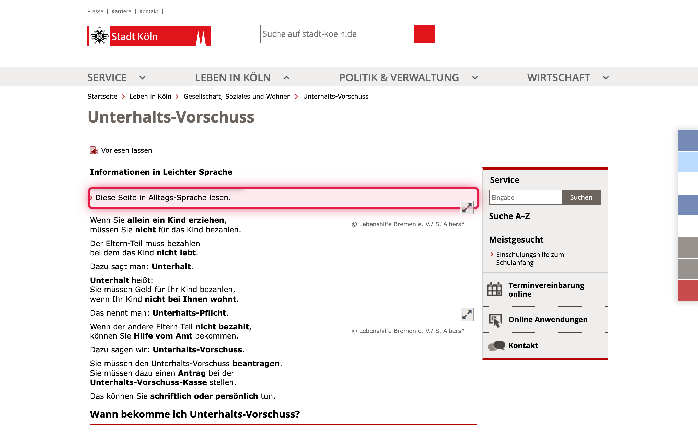

#### 2. Detailansicht des Alignment-Elements

#### 3. Standardsprachlicher Gegenstück-Artikel (AS)
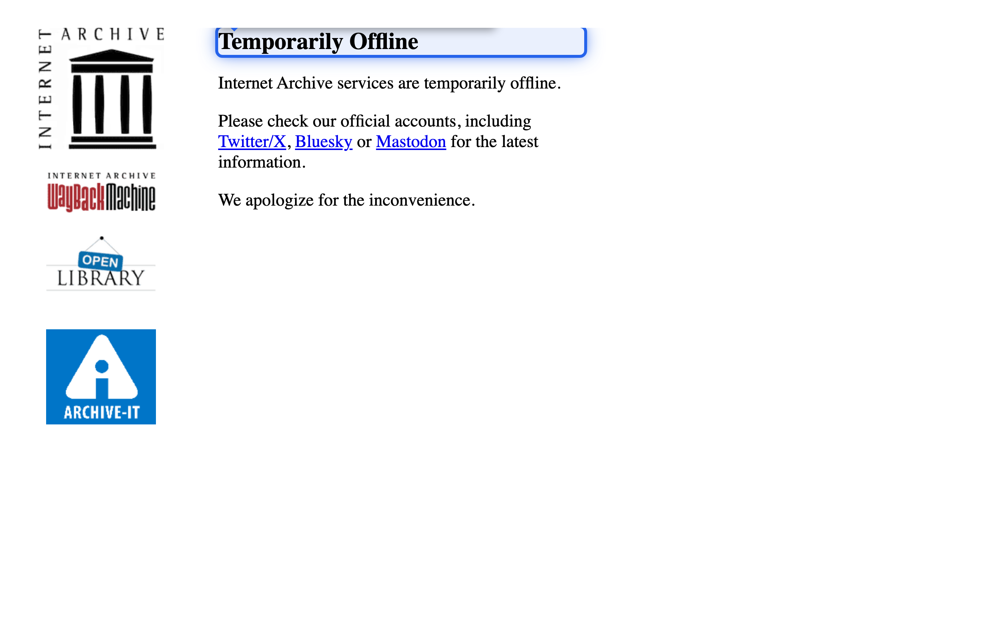

#### 4. Paarweiser Vergleich (LS vs. AS)
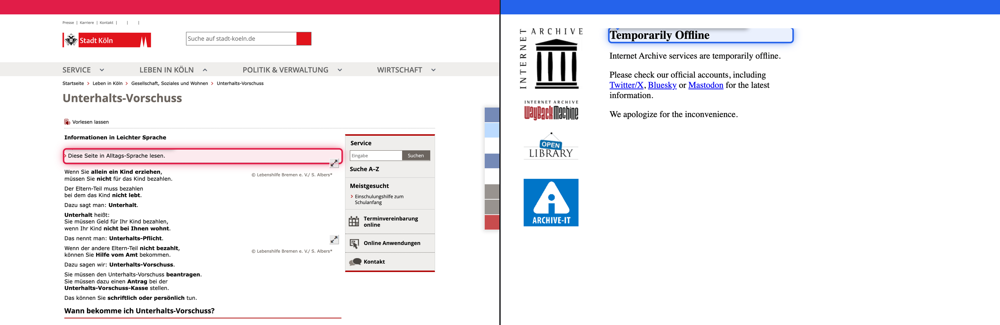

---

### Lebenshilfe Main-Taunus 
**Strategie**: `Header-Sprachumschalter mit Tooltip/Icon`  
**Beschreibung**: Ein verankerter Header-Button mit dem Attribut title='Auf Alltags-Sprache umstellen' und dem Text 'Alltags-Sprache' dient als Umschaltpunkt.  
- **LS URL**: [https://web.archive.org/web/20210122220843/https://www.lebenshilfe-main-taunus.de/ls/reisen.html](https://web.archive.org/web/20210122220843/https://www.lebenshilfe-main-taunus.de/ls/reisen.html)
- **AS URL**: [https://web.archive.org/web/20210225194538/https://www.lebenshilfe-main-taunus.de/reisen.html](https://web.archive.org/web/20210225194538/https://www.lebenshilfe-main-taunus.de/reisen.html)

#### 1. Leichte Sprache mit hervorgehobenem Alignment-Element
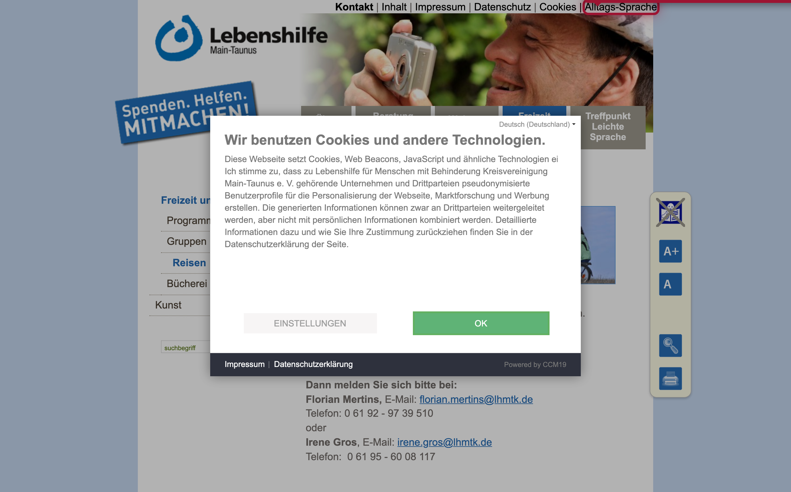

#### 2. Detailansicht des Alignment-Elements

#### 3. Standardsprachlicher Gegenstück-Artikel (AS)
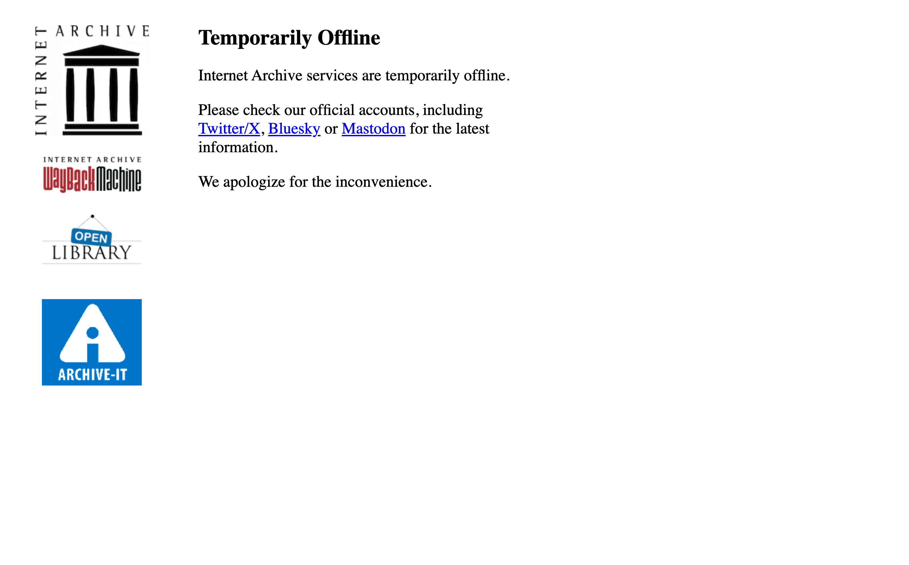

#### 4. Paarweiser Vergleich (LS vs. AS)
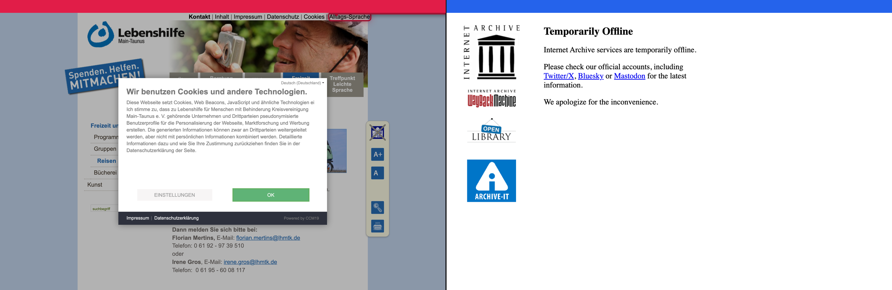

---

### MDR (Mitteldeutscher Rundfunk) 
**Strategie**: `Teaser-Box 'In schwerer Sprache lesen'`  
**Beschreibung**: Unterhalb des LS-Textes bindet der MDR eine Teaser-Box mit der Überschrift 'HIER KÖNNEN SIE DIESE NACHRICHT AUCH IN SCHWERER SPRACHE LESEN:' ein, die zum redaktionellen Fachartikel führt.  
- **LS URL**: [https://www.mdr.de/nachrichten-leicht/leichte-sprache-sachsen-sachsenforst-waldbrand-saison-100.html](https://www.mdr.de/nachrichten-leicht/leichte-sprache-sachsen-sachsenforst-waldbrand-saison-100.html)
- **AS URL**: [https://www.mdr.de/nachrichten/sachsen/wetter-fruehling-wochenende-waldbrand-gefahr-102.html](https://www.mdr.de/nachrichten/sachsen/wetter-fruehling-wochenende-waldbrand-gefahr-102.html)

#### 1. Leichte Sprache mit hervorgehobenem Alignment-Element
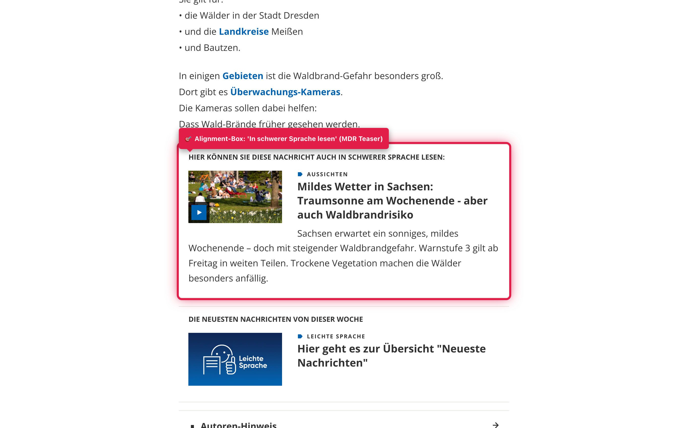

#### 2. Detailansicht des Alignment-Elements
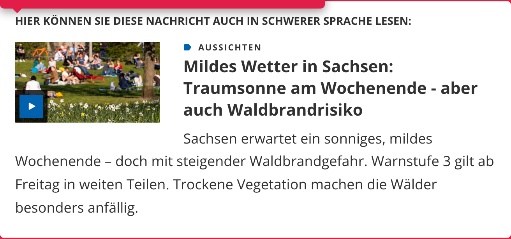

#### 3. Standardsprachlicher Gegenstück-Artikel (AS)
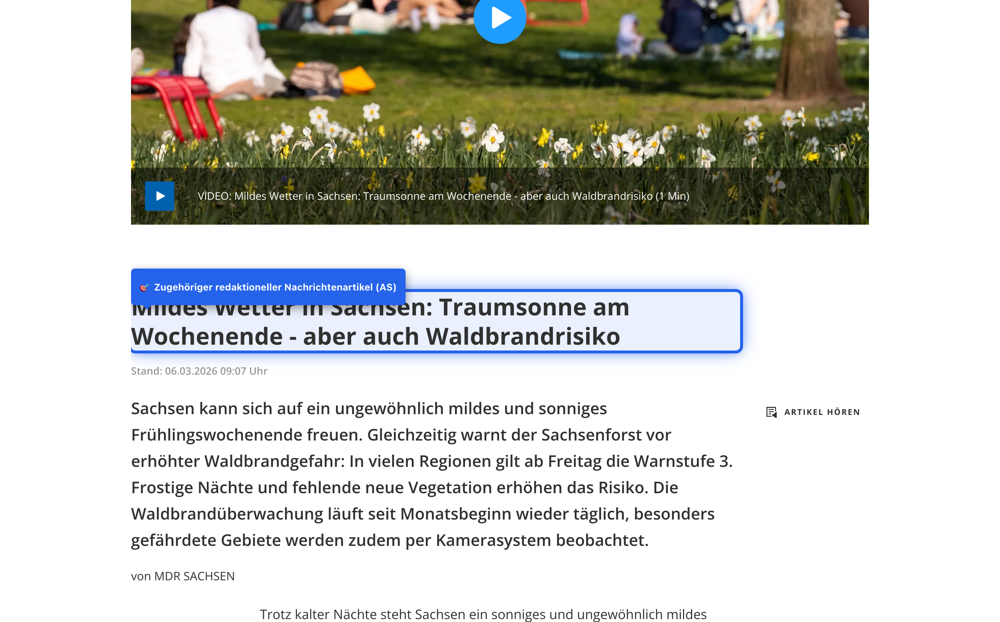

#### 4. Paarweiser Vergleich (LS vs. AS)
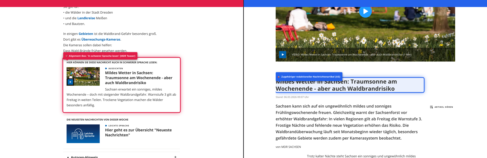

---

### Sozialpolitik.com 
**Strategie**: `Header Quick-Switch 'Standardsprache'`  
**Beschreibung**: In der oberen Leiste ermöglicht der Button 'Standardsprache' (.underline.easy) das direkte Hin- und Herschalten zur Standardfassung der Bildungseinheit.  
- **LS URL**: [https://www.sozialpolitik.com/es/auswirkungen-der-coronavirus-epidemie](https://www.sozialpolitik.com/es/auswirkungen-der-coronavirus-epidemie)
- **AS URL**: [https://www.sozialpolitik.com/auswirkungen-der-coronavirus-epidemie](https://www.sozialpolitik.com/auswirkungen-der-coronavirus-epidemie)

#### 1. Leichte Sprache mit hervorgehobenem Alignment-Element
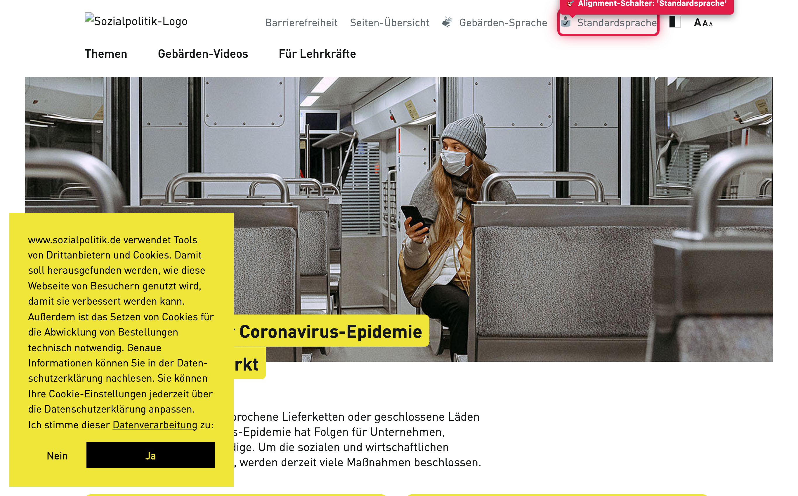

#### 2. Detailansicht des Alignment-Elements

#### 3. Standardsprachlicher Gegenstück-Artikel (AS)
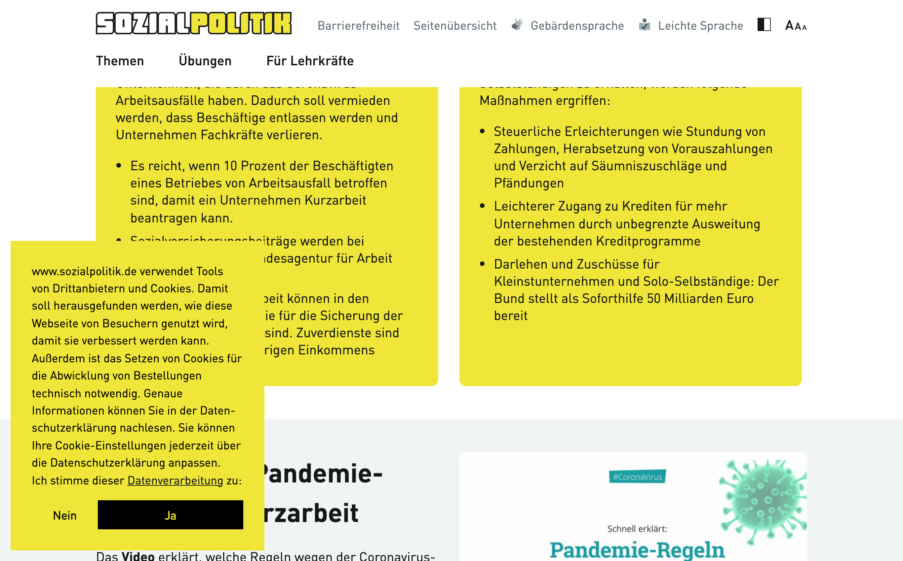

#### 4. Paarweiser Vergleich (LS vs. AS)
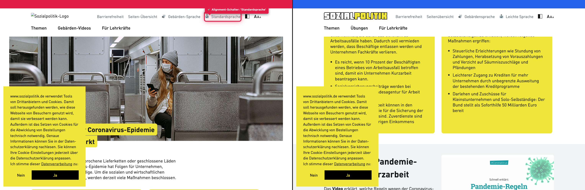

---

### Stuttgart.de 
**Strategie**: `Content-Button 'Artikel in Alltags-Sprache' / URL-Parameter`  
**Beschreibung**: Stuttgart.de verwendet einen Aktionsbutton 'Artikel in Alltags-Sprache' (.SP-Link) und steuert die Barrierefreiheit über den URL-Parameter ?sp:out=easy.  
- **LS URL**: [https://www.stuttgart.de/leben/gesundheit/vorsorge/suchtpraevention?sp%3Aout=easy](https://www.stuttgart.de/leben/gesundheit/vorsorge/suchtpraevention?sp%3Aout=easy)
- **AS URL**: [https://www.stuttgart.de/leben/gesundheit/vorsorge/suchtpraevention](https://www.stuttgart.de/leben/gesundheit/vorsorge/suchtpraevention)

#### 1. Leichte Sprache mit hervorgehobenem Alignment-Element
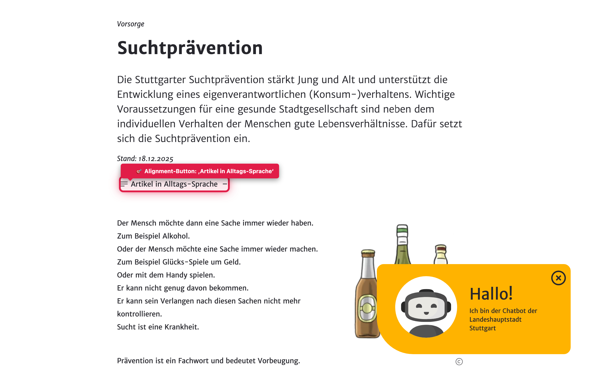

#### 2. Detailansicht des Alignment-Elements

#### 3. Standardsprachlicher Gegenstück-Artikel (AS)
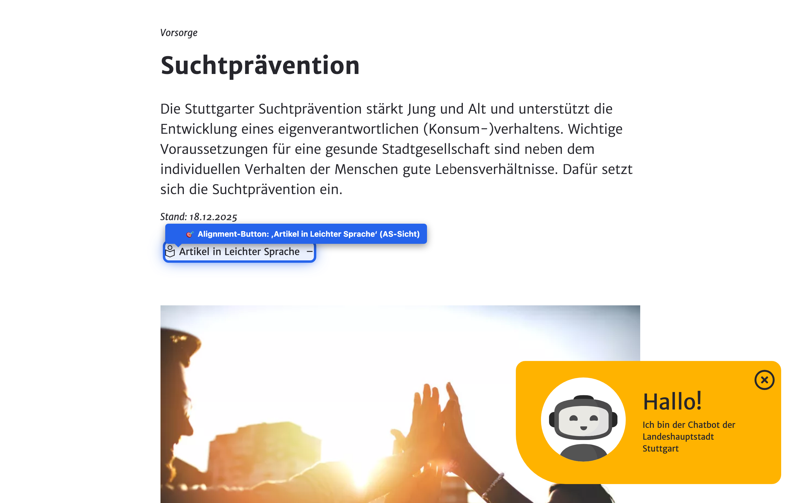

#### 4. Paarweiser Vergleich (LS vs. AS)
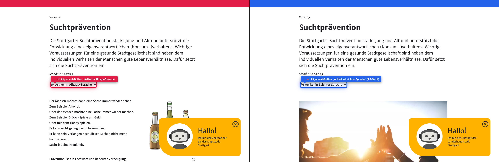

---

### taz (die tageszeitung) 
**Strategie**: `Redaktioneller In-Text Quellverweis ('schwerer Text')`  
**Beschreibung**: Die taz-Redaktion verlinkt im Text mit redaktionellen Hinweisen wie 'aus diesem „schweren“ Text' auf den originalen Hintergrundartikel.  
- **LS URL**: [https://taz.de/Leichte-Sprache/!5590875/](https://taz.de/Leichte-Sprache/!5590875/)
- **AS URL**: [https://taz.de/Wahlzulassung-fuer-Betreute/!5588713/](https://taz.de/Wahlzulassung-fuer-Betreute/!5588713/)

#### 1. Leichte Sprache mit hervorgehobenem Alignment-Element
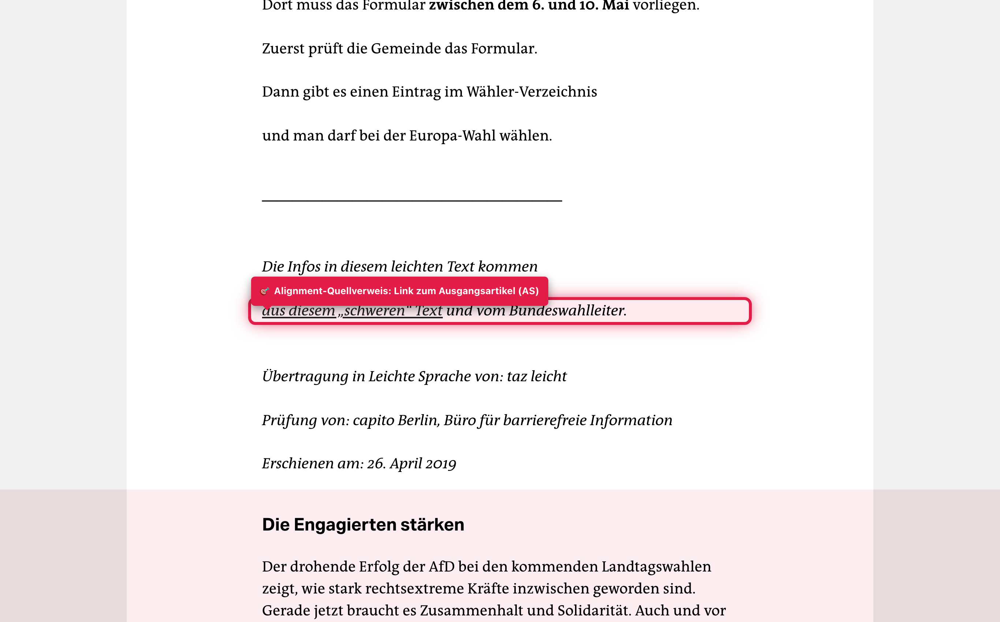

#### 2. Detailansicht des Alignment-Elements

#### 3. Standardsprachlicher Gegenstück-Artikel (AS)
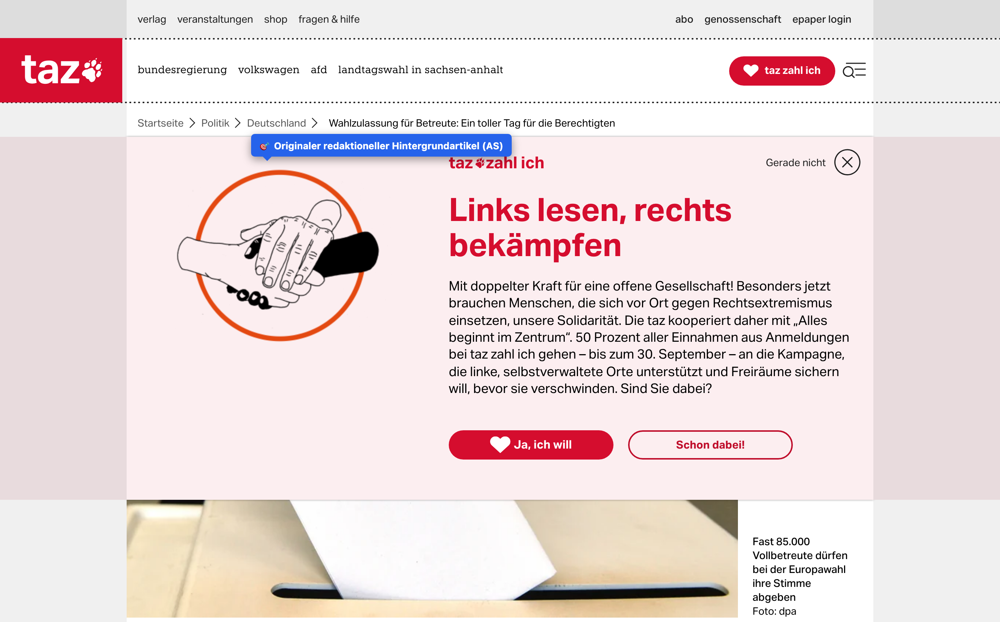

#### 4. Paarweiser Vergleich (LS vs. AS)
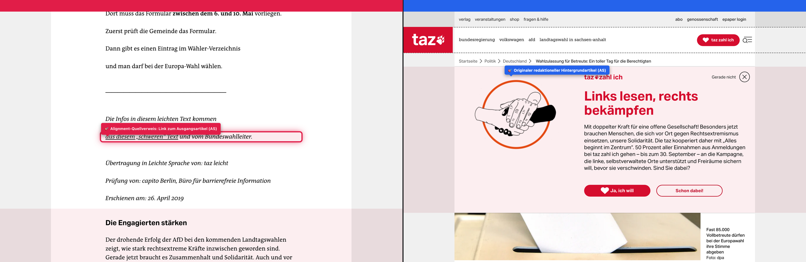

---

### Wiesbaden.de 
**Strategie**: `Sprachleisten-Toggle 'Leichte Sprache' / 'Alltagssprache'`  
**Beschreibung**: Wiesbaden.de besitzt in der Funktionsleiste einen Umschaltlink (.SP-Link--simple-language) mit Parameter ?sp:easylanguage=1, der direkt zwischen Normalfassung und barrierefreier Fassung wechselt.  
- **LS URL**: [https://www.wiesbaden.de/vv/produkte/31/Fuehrerschein-umtauschen-online-beantragen?sp%3Aeasylanguage=1](https://www.wiesbaden.de/vv/produkte/31/Fuehrerschein-umtauschen-online-beantragen?sp%3Aeasylanguage=1)
- **AS URL**: [https://www.wiesbaden.de/vv/produkte/31/Fuehrerschein-umtauschen-online-beantragen](https://www.wiesbaden.de/vv/produkte/31/Fuehrerschein-umtauschen-online-beantragen)

#### 1. Leichte Sprache mit hervorgehobenem Alignment-Element
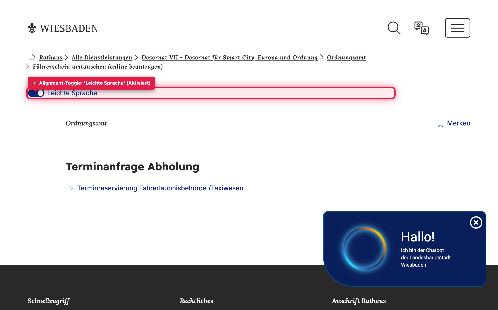

#### 2. Detailansicht des Alignment-Elements

#### 3. Standardsprachlicher Gegenstück-Artikel (AS)
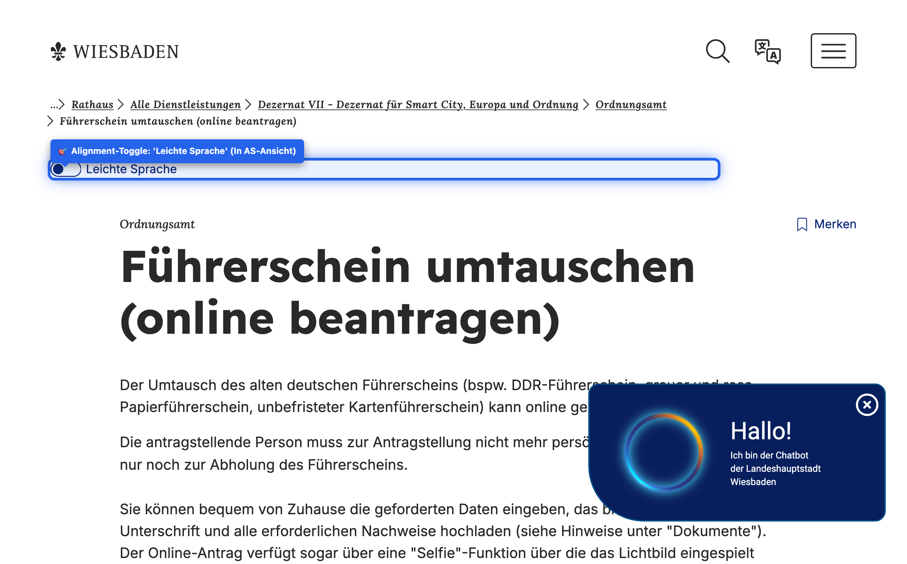

#### 4. Paarweiser Vergleich (LS vs. AS)
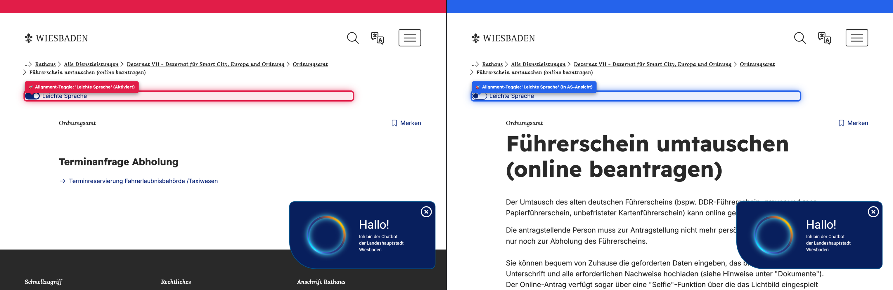

---
