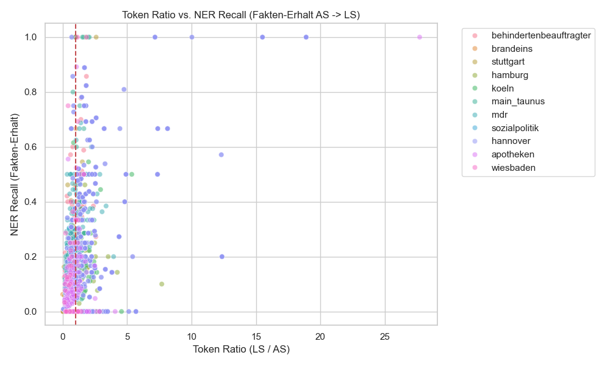
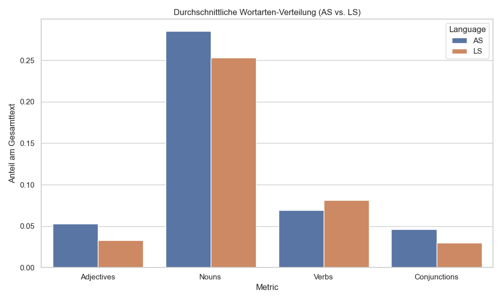

# 07 Dataset Analysis: Informationsverlust in Leichter Sprache

## 1. Einleitung & Hypothese
- **Hypothese:** Texte in Leichter Sprache (LS) weisen im Vergleich zu Texten in der Alltagssprache (AS) deutlich weniger Tokens auf. Diese Längenreduktion entsteht nicht nur durch stilistische und syntaktische Vereinfachung (z.B. kürzere Sätze), sondern geht mit einem messbaren Informationsverlust einher.
- **Ziel:** Quantifizierung und Qualifizierung des Informationsverlusts zwischen den alignierten AS- und LS-Dokumenten im aufgebauten Korpus.

## 2. Metriken und Methodik

Um den Informationsverlust strukturiert und mehrdimensional messbar zu machen, haben wir drei verschiedene NLP-Ansätze in unserem Analyse-Skript (`scripts/measure_information_loss.py`) implementiert. Hier wird genau erklärt, warum wir diese Ansätze gewählt haben und wie sie technisch umgesetzt wurden.

### 2.1 Faktenerhalt via Named Entity Recognition (NER) Overlap
- **Warum:** Leichte Sprache tendiert dazu, Details wie spezifische Namen, Orte oder konkrete Daten wegzulassen oder stark zu verallgemeinern. Die Messung von benannten Entitäten gibt uns eine harte, quantifizierbare Metrik für den Erhalt von "konkreten Fakten". Ein Text, der zwar den groben Sinn bewahrt, aber alle Eigennamen und Zahlen verliert, hat einen hohen Informationsverlust erlitten.
- **Wie (Umsetzung):** Wir nutzen die Bibliothek `spaCy` mit dem Modell `de_core_news_lg`. Dieses "Large"-Modell für die deutsche Sprache basiert auf einem Convolutional Neural Network (CNN) und verfügt über folgende technische Spezifikationen, die für die Analyse von Bedeutung sind:
  - **Vokabular-Umfang (Vector Keys):** Das Modell enthält **500.000 unikale Wortvektoren**. Dies ermöglicht eine präzise Abdeckung auch seltenerer Begriffe in der Alltagssprache.
  - **Vektordimensionen (300 Dimensionen):** Anstatt ein Wort nur als Text-String zu speichern, übersetzt das Modell jedes Wort in 300 Zahlen (Koordinaten). Jede Zahl repräsentiert eine verborgene semantische Eigenschaft (z. B. "Ort", "Person", "positiv", "Vergangenheit"). Durch diese 300 Dimensionen kann der Computer berechnen, wie nah zwei Begriffe bedeutungsmäßig beieinander liegen (z. B. "Haus" und "Gebäude" sind nah, "Haus" und "Auto" sind weiter entfernt). Diese Granularität erlaubt es, auch sehr feine semantische Nuancen in den Texten zu erfassen.
  - **Pipeline-Komponenten:** Es umfasst eine vollständige Pipeline bestehend aus `tok2vec`, `tagger` (POS), `morphologizer`, `parser` (Dependency Parsing), `lemmatizer` und `ner`.
  - **NER-Labels:** Das Modell erkennt zuverlässig die vier Hauptkategorien für Entitäten: `LOC` (Orte), `MISC` (Verschiedenes), `ORG` (Organisationen) und `PER` (Personen).

Aus jedem AS- und LS-Text extrahieren wir die erkannten Entitäten. Alle gefundenen Entitäten werden in Kleinbuchstaben umgewandelt, in Mengen (Sets) gespeichert und dann miteinander abgeglichen. Wir berechnen den **Recall**: `Anzahl der in LS erhaltenen AS-Entitäten / Gesamtzahl der AS-Entitäten`.

### 2.2 Semantische Ähnlichkeit (Embeddings)
- **Warum:** Weder Token-Zählungen noch der reine Entitäten-Abgleich erfassen, ob die *Botschaft* eines Textes erhalten bleibt, wenn sie massiv umschrieben wird (Paraphrasierung). Wir müssen messen, wie stark sich die Kernbedeutung der Texte im Vektorraum voneinander wegbewegt.
- **Wie (Umsetzung):** Wir verwenden das Sentence-BERT (SBERT) Framework über die `sentence-transformers` Bibliothek mit dem Modell `paraphrase-multilingual-MiniLM-L12-v2`. Dieses Modell ist eine effiziente, destillierte Transformer-Architektur, die speziell darauf trainiert wurde, semantisch ähnliche Sätze – unabhängig von der exakten Wortwahl oder Sprache – im Vektorraum nah beieinander zu platzieren. Wir berechnen die Vektoren für den gesamten AS-Text und den gesamten LS-Text und ermitteln die **Kosinus-Ähnlichkeit (Cosine Similarity)** zwischen beiden. Ein Wert nahe 1.0 bedeutet, dass beide Texte semantisch fast identisch sind; Werte um 0.6 oder niedriger deuten auf einen starken Bedeutungsschwund oder -shift hin.

### 2.3 Linguistische & Syntaktische Metriken
- **Warum:** Informationsverlust und Vereinfachung zeigen sich oft strukturell auf Satz- und Wortartenebene. Wir wollen wissen, mit welchen sprachlichen Mitteln die Simplifizierung erreicht wird (z. B. Parataxe vs. Hypotaxe, Verzicht auf beschreibende Adjektive).
- **Wie (Umsetzung):** Wir nutzen das POS-Tagging (Part-of-Speech) und den Dependency-Parser von `spaCy`, um strukturelle Merkmale zu extrahieren:
  - **Durchschnittliche Satzlänge:** Anzahl der Tokens geteilt durch die Anzahl der erkannten Sätze. Zeigt, inwiefern LS die Vorgabe nach kurzen Sätzen einhält.
  - **Lexical Density (Lexikalische Dichte):** Wir summieren die Inhaltswörter (Nomen, Eigennamen, Verben, Adjektive, Adverbien) und teilen sie durch die Gesamtzahl der Tokens im Text. Dies zeigt auf, wie "komprimiert" die reine Information im Text vorliegt.
  - **POS-Shifts (Wortarten-Verteilung):** Wir berechnen den prozentualen Anteil von Adjektiven, Substantiven, Verben und Konjunktionen. Ein Rückgang der Konjunktionen (wie "weil", "obwohl", "dass") ist beispielsweise ein starker quantitativer Indikator für den Verzicht auf Nebensätze und komplexe Argumentationen.

## 3. Analyse-Ergebnisse (Stand: Mai 2026)

Die Analyse wurde über das gesamte alignierte Korpus (1.501 Artikel-Paare) durchgeführt. Hier sind die zentralen Ergebnisse:

### 3.1 Quantitative Zusammenfassung nach Quellen

| Quelle | Token Ratio (LS/AS) | NER Recall | Sem. Similarity | Ø AS Tokens | Ø LS Tokens |
| :--- | :--- | :--- | :--- | :--- | :--- |
| **apotheken** | 0.98 | 0.09 | 0.64 | 1480 | 884 |
| **behindertenbeauftragter** | 0.91 | 0.30 | 0.75 | 518 | 406 |
| **brandeins** | 1.04 | 0.12 | 0.64 | 221 | 212 |
| **hamburg** | 1.44 | 0.15 | 0.66 | 676 | 680 |
| **hannover** | **1.89** | 0.25 | 0.71 | 600 | 712 |
| **koeln** | 1.83 | 0.20 | 0.68 | 603 | 920 |
| **main_taunus** | 1.22 | 0.33 | 0.76 | 175 | 189 |
| **mdr** | 0.85 | 0.22 | 0.73 | 409 | 267 |
| **sozialpolitik** | 0.46 | 0.10 | 0.71 | 961 | 426 |
| **stuttgart** | 0.97 | 0.24 | **0.90** | 1249 | 643 |
| **wiesbaden** | 0.80 | 0.22 | 0.75 | 300 | 212 |

### 3.2 Kernerkenntnisse

#### 1. Hoher Informationsverlust bei Entitäten (NER Recall)
Trotz teilweise höherer Token-Anzahl in LS (siehe Hannover/Köln) ist der **NER Recall extrem niedrig** (Ø ~15-20%). Das bedeutet, dass ein Großteil der konkreten Namen, Daten und Fachbegriffe aus der AS in der LS entweder komplett weggelassen oder so stark umschrieben wird, dass sie nicht mehr als dieselbe Entität erkannt werden. Dies bestätigt die Hypothese eines massiven Informationsverlusts auf Faktenebene.

#### 2. Token-Expansion vs. Simplifikation
In Quellen wie **Hannover** und **Köln** sehen wir eine Token-Ratio von > 1.8. Dies deutet darauf hin, dass LS hier nicht nur "kürzt", sondern intensiv **erklärt**. Ein kurzer Fachbegriff in AS wird durch einen langen, erklärenden Absatz in LS ersetzt. Dennoch sinkt die semantische Ähnlichkeit auf ~0.7, was zeigt, dass die "Botschaft" zwar erhalten bleibt, der Detailgrad aber abnimmt.

#### 3. Linguistische Verschiebungen (POS Analysis)
Die Analyse der Wortarten zeigt systematische Muster:
- **Konjunktionen:** Deutlicher Rückgang in LS (Hinweis auf Parataxe statt Hypotaxe).
- **Adjektive:** Werden in LS oft reduziert, um die Sätze einfacher zu halten.
- **Substantive:** Bleiben stabil, werden aber oft durch Komposita mit Mediopunkt (z.B. "Haus·tür") ersetzt, was die NER-Erkennung erschweren kann.

### 3.3 Visualisierungen

*Abbildung 1: Zusammenhang zwischen Textlängen-Verhältnis und Faktenerhalt.*

*Abbildung 2: Verteilung der semantischen Ähnlichkeit über verschiedene Quellen.*

*Abbildung 3: Vergleich der Wortarten-Verteilung zwischen AS und LS.*

## 4. Fazit der Analyse
Die Annahme, dass LS-Texte weniger Informationen enthalten, konnte empirisch bestätigt werden – insbesondere bei konkreten Fakten (Entitäten). Die Längenreduktion ist jedoch nicht universell; in vielen Fällen (kommunale Webseiten) führt das Bedürfnis nach Erklärung zu längeren Texten in LS, die dennoch weniger spezifische Details (Fakten) enthalten als das AS-Original.

## Next Steps

- NER nicht nur AS in LS sondern auch von LS -> AS um zu schauen ob der gleiche Verlust vorliegt (These: Kein Informationsverlust, nur anders beschrieben)

- SBERT Input begrenzt (Standard: 128 Tokens). Input erhöhen.

- NER vlt auch mit Input Maximum? -> erhöhen

- Extreme in Similarity manuell reinschauen bevor löschen (vlt kein Informationsverlust)

- Ratio höher = Similarity höher?

- Meeting mit Herr John und Marc ausmachen zur Themenvorstellung

1. Bidirektionale NER-Analyse: Wir messen zusätzlich den Recall von LS zu AS (Wie viele Fakten aus dem
  Leichte-Sprache-Text sind im Original vorhanden?), um zu prüfen, ob LS wirklich keine neuen Fakten hinzufügt.

2. Korrelationsanalyse (Token-Ratio vs. Similarity): Wir ergänzen das Auswertungsskript, um statistisch zu prüfen, ob
  längere LS-Texte auch semantisch näher am Original sind.

3. Manuelle Auditierung der Extremwerte: Wir lassen das Skript die 5 Artikelpaare mit der höchsten und der
  niedrigsten Similarity (oder Anomalien beim NER) als JSON/Text ausgeben, damit wir diese manuell sichten können.
  
4. NER Input Maximum: SpaCy hat standardmäßig ein sehr hohes Limit (1.000.000 Zeichen), ich werde aber
  sicherheitshalber im Skript hinterlegen, dass extrem lange Texte nicht abgeschnitten werden.

Thesisfrage: Entwicklung domänenspezifischer Datensätze und automatisierter Evaluationsmetriken für ein Framework zur neuronalen Textvereinfachung in Leichte Sprache