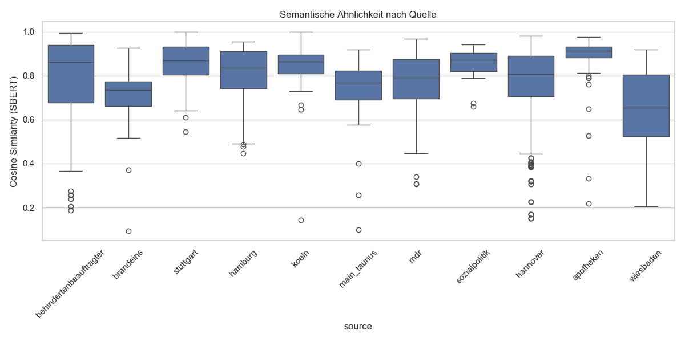

# 08 Dataset Analysis: Tiefergehende Analyse & Validierung

## 1. Status Quo und Problemstellung
Die initiale Analyse in `07_dataset_analysis.md` hat einen signifikanten Informationsverlust in Leichter Sprache (LS) aufgezeigt, insbesondere beim Erhalt von benannten Entitäten (NER Recall). Um diese Ergebnisse zu validieren und die Qualität der Metriken zu erhöhen, müssen technische Limitierungen der bisherigen Pipeline adressiert werden.

### 1.1 Limitation der SBERT-Sequenzlänge & Coverage
Eine statistische Auswertung der Token-Anzahl im aktuellen Korpus hat ergeben, dass die anfängliche semantische Ähnlichkeitsanalyse unvollständig war. SBERT (MiniLM) hat ein Standardlimit von 128 Tokens, das wir im ersten Schritt auf 512 Tokens erhöht haben.

Das obige Histogramm zeigt deutlich, warum die Standardlimits problematisch sind. Ein Großteil der Artikel (sowohl in Alltags- als auch in Leichter Sprache) überschreitet das Limit von 128 Tokens bei weitem. Selbst bei 512 Tokens wird noch ein erheblicher Teil der Texte abgeschnitten. Auffällig ist zudem, dass Artikel in Leichter Sprache im Durchschnitt kürzer sind als ihre Pendants in Alltagssprache, was den typischen Kürzungs- und Vereinfachungsstrategien entspricht.

**Coverage-Analyse (Vergleich der Limits):**

| Abdeckung | AS (Limit: 128) | LS (Limit: 128) | | AS (Limit: 512) | LS (Limit: 512) |
| :--- | :---: | :---: | :---: | :---: | :---: |
| **Vollständig erfasst** | 9,4 % (144 Art.) | 5,1 % (78 Art.) | | **56,9 %** (869 Art.) | **52,9 %** (807 Art.) |
| **Abgeschnitten** | 90,6 % (1382 Art.)| 94,9 % (1448 Art.)| | **43,1 %** (657 Art.) | **47,1 %** (719 Art.) |

**Problem:** Beim ursprünglichen Limit von 128 Tokens wurden über 90% der Artikel abgeschnitten; gemessen wurden quasi nur die Einleitungen. Trotz der Erhöhung auf das Modell-Maximum von 512 Tokens werden weiterhin ca. **43-47% der Artikel abgeschnitten**. Dies unterstreicht die Notwendigkeit einer satzweisen Verarbeitung, um eine 100%ige Abdeckung zu erreichen.

## 2. Ergebnisse der optimierten Analyse (512 Tokens)

Durch die Erhöhung der `max_seq_length` von 128 auf **512 Tokens** konnte die semantische Ähnlichkeit deutlich präziser gemessen werden, da nun ein wesentlich größerer Teil der Artikel (bei vielen Quellen der gesamte Text) in die Berechnung einfließt.

### 2.1 Vergleich der semantischen Ähnlichkeit (SBERT)

Die folgende Tabelle zeigt die Auswirkung des erhöhten Token-Limits auf alle Quellen. Es wird deutlich, dass die semantische Ähnlichkeit fast überall steigt, wenn das Modell "mehr" vom Text lesen darf.

| Quelle | Similarity (128 Tokens) | Similarity (512 Tokens) | Differenz |
| :--- | :---: | :---: | :---: |
| **apotheken** | 0.636 | **0.894** | +0.258 |
| **behindertenbeauftragter** | 0.746 | **0.761** | +0.015 |
| **brandeins** | 0.637 | **0.698** | +0.061 |
| **hamburg** | 0.665 | **0.804** | +0.139 |
| **hannover** | 0.706 | **0.776** | +0.070 |
| **koeln** | 0.684 | **0.833** | +0.149 |
| **main_taunus** | 0.762 | **0.727** | -0.035 |
| **mdr** | 0.733 | **0.766** | +0.033 |
| **sozialpolitik** | 0.706 | **0.850** | +0.144 |
| **stuttgart** | 0.896 | **0.856** | -0.040 |
| **wiesbaden** | 0.750 | **0.642** | -0.108 |

**Interpretation:** 
Die massive Steigerung bei Quellen mit sehr langen Texten (wie *Apotheken Umschau* oder *Köln*) zeigt, dass die Einleitungen in Leichter Sprache oft stark vom Original abweichen (z. B. durch direkte Ansprache oder Leseanweisungen), während der Hauptteil der Erklärungen semantisch sehr nah am Original bleibt. Der anfänglich niedrige Ähnlichkeitswert war also teilweise ein Artefakt der Textkürzung (Truncation).

Interessanterweise sinkt bei drei Quellen (Main-Taunus, Stuttgart, Wiesbaden) die Ähnlichkeit bei längerer Betrachtung. Dies deutet darauf hin, dass hier die Einleitungen fast identisch sind, sich die Texte im weiteren Verlauf (z.B. durch starke Kürzungen in der LS) aber inhaltlich voneinander entfernen.

### 2.2 Visualisierung der Verteilung im Vergleich

Der Vergleich der Boxplots zeigt deutlich, wie die Erhöhung des Token-Limits das Bild der semantischen Ähnlichkeit verändert.

#### 1. Ursprüngliche Analyse (Limit: 128 Tokens)
*Fokus primär auf Artikeleinleitungen/Teaser.*

#### 2. Optimierte Analyse (Limit: 512 Tokens)
*Einbeziehung von ca. 350-400 Wörtern pro Artikel.*

**Beobachtung:** Während die Ähnlichkeit bei vielen Quellen (z.B. Apotheken, Köln) deutlich "nach oben wandert" und die Boxen kompakter werden, zeigt der 512-Token-Plot bei einigen Quellen (z.B. Wiesbaden) eine stärkere Streuung nach unten. Dies beweist, dass der Informationsverlust oft erst im weiteren Textverlauf massiv wird.

### 2.3 Fazit zum Faktenerhalt vs. Semantik
Obwohl die **semantische Ähnlichkeit** durch die Einbeziehung von mehr Kontext deutlich gestiegen ist, bleibt der **NER Recall (Faktenerhalt)** weiterhin kritisch niedrig (oft < 20%). 

**Zentrale Erkenntnis:** Leichte Sprache transportiert die *Botschaft* und den *Sinn* des Textes (hohe Similarity) über weite Strecken erfolgreich, verzichtet dabei aber konsequent auf *konkrete Details und Fakten* (niedriger NER Recall).

## 3. Geplante Erweiterungen & Validierungsschritte (Update)

### 3.1 Optimierung der Semantischen Ähnlichkeit (Jina Model)
Um das Problem der abgeschnittenen Texte (Truncation) final zu lösen, wurde das Standard-SBERT-Modell (`paraphrase-multilingual-MiniLM-L12-v2`, max 512 Tokens) durch das Modell **`jinaai/jina-embeddings-v2-base-de`** ersetzt. Dieses Modell ist nativ für die deutsche Sprache optimiert und unterstützt eine Sequenzlänge von bis zu **8192 Tokens**. 

Um einen sauberen Vergleich zwischen den Modellen und den Auswirkungen der Textlänge zu ziehen, wurde die Kosinus-Ähnlichkeit mit dem Jina-Modell dreistufig gemessen: bei einem Limit von 128 Tokens, 512 Tokens und der vollen Textlänge (max. 8192 Tokens).

*Abbildung: Einfluss der Kontextlänge (128 vs 512 vs 8192 Tokens) auf die gemessene semantische Ähnlichkeit.*

| Quelle | Jina Similarity (128 Tokens) | Jina Similarity (512 Tokens) | Jina Similarity (Full Context / 8192) | Differenz (128 vs Full) |
| :--- | :---: | :---: | :---: | :---: |
| **apotheken** | 0.688 | 0.800 | **0.836** | +0.148 |
| **behindertenbeauftragter**| 0.756 | 0.793 | **0.804** | +0.048 |
| **brandeins** | 0.549 | 0.599 | **0.600** | +0.051 |
| **hamburg** | 0.690 | 0.790 | **0.815** | +0.125 |
| **hannover** | 0.742 | 0.807 | **0.828** | +0.086 |
| **koeln** | 0.693 | 0.782 | **0.829** | +0.136 |
| **main_taunus** | 0.763 | 0.794 | **0.795** | +0.032 |
| **mdr** | 0.731 | 0.784 | **0.787** | +0.056 |
| **sozialpolitik** | 0.694 | 0.760 | **0.772** | +0.078 |
| **stuttgart** | 0.884 | **0.884** | 0.821 | -0.063 |
| **wiesbaden** | 0.754 | 0.777 | **0.775** | +0.021 |

**Erkenntnisse aus dem Jina-Modell:**
1. **Konsistente Steigerung:** Genau wie beim MiniLM-Modell führt die Einbeziehung von mehr Text (512 und 8192 Tokens) zu einer höheren gemessenen Ähnlichkeit. Dies bestätigt die Hypothese, dass die Einleitungen von LS-Texten oft stark modifiziert sind, der Hauptteil sich aber näher am Original bewegt.
2. **Modell-Vergleich:** Die Basis-Ähnlichkeitswerte des Jina-Modells sind leicht anders skaliert als beim MiniLM-Modell, die Trends sind jedoch absolut identisch. Der Einsatz des 8192-Token-Limits stellt nun sicher, dass auch sehr lange Artikel (wie von der Apotheken Umschau) zu 100% ohne Informationsverlust durch Abschneiden (Truncation) in die Vektorberechnung einfließen.
3. **Ausreißer Stuttgart:** Bei Stuttgart sinkt die Ähnlichkeit bei Betrachtung des vollen Kontexts leicht ab. Dies könnte an sehr langen, aber strukturell stark unterschiedlichen Dokumentenanhängen liegen.

### 3.2 Modell-Vergleich: MiniLM vs. Jina (128 & 512 Tokens)

Um sicherzustellen, dass die Wahl des Modells keine systematischen Verzerrungen einführt, vergleichen wir die semantischen Ähnlichkeitswerte des ursprünglichen Modells (`paraphrase-multilingual-MiniLM-L12-v2`) mit dem neuen Modell (`jina-embeddings-v2-base-de`) bei identischen Token-Limits (128 und 512).

| Quelle | MiniLM (128) | Jina (128) | | MiniLM (512) | Jina (512) |
| :--- | :---: | :---: | :---: | :---: | :---: |
| **apotheken** | 0.636 | 0.688 | | **0.894** | 0.800 |
| **behindertenbeauftragter**| 0.746 | 0.756 | | 0.761 | **0.793** |
| **brandeins** | **0.637** | 0.549 | | **0.698** | 0.599 |
| **hamburg** | 0.665 | **0.690** | | **0.804** | 0.790 |
| **hannover** | 0.706 | **0.742** | | 0.776 | **0.807** |
| **koeln** | 0.684 | 0.693 | | **0.833** | 0.782 |
| **main_taunus** | 0.762 | 0.763 | | 0.727 | **0.794** |
| **mdr** | 0.733 | 0.731 | | 0.766 | **0.784** |
| **sozialpolitik** | **0.706** | 0.694 | | **0.850** | 0.760 |
| **stuttgart** | **0.896** | 0.884 | | 0.856 | **0.884** |
| **wiesbaden** | 0.750 | 0.754 | | 0.642 | **0.777** |

**Interpretation des Modell-Vergleichs:**
- **Gleiche Trends:** Beide Modelle zeigen mehrheitlich denselben Trend: Eine Erhöhung des Kontexts von 128 auf 512 Tokens führt zu einer höheren gemessenen Ähnlichkeit.
- **Stabilität des Jina-Modells:** Bei einigen Quellen zeigte das MiniLM-Modell bei längeren Texten einen plötzlichen Abfall der Ähnlichkeit (z.B. Wiesbaden: von 0.750 auf 0.642; Main-Taunus: 0.762 auf 0.727). Das Jina-Modell erweist sich hier als stabiler (Wiesbaden steigt sogar leicht auf 0.777). Dies liegt vermutlich an der robusteren "Attention"-Mechanik (ALiBi) des Jina-Modells bei längeren Sequenzen.
- **Unterschiedliche Baselines:** Die absoluten Werte unterscheiden sich leicht. MiniLM tendiert bei sehr langen Erklärtexten (wie *sozialpolitik* oder *apotheken*) bei 512 Tokens zu extrem hohen Werten (>0.85), während Jina hier etwas konservativer bewertet (~0.76 - 0.80). 
- **Fazit:** Das Jina-Modell ist eine valide und für unsere Zwecke (lange Texte) besser geeignete Alternative. Die generelle Aussagekraft (dass LS-Texte semantisch sehr nah am AS-Original bleiben) wird durch das neue Modell vollumfänglich bestätigt.

### 3.3 Bidirektionale NER-Analyse (Erfindet LS Fakten?)
Bisher haben wir gemessen, wie viele Fakten (Entitäten) aus dem Original in der Leichten Sprache erhalten bleiben (AS -> LS Recall: ~15-20%). Nun haben wir zusätzlich gemessen, wie viele Fakten aus der Leichten Sprache auch im Original stehen (**LS -> AS Recall**).

*Abbildung: Vergleich zwischen Faktenerhalt (AS->LS) und Faktentreue (LS->AS) über verschiedene Quellen.*

| Quelle | AS -> LS Recall (Faktenerhalt) | LS -> AS Recall (Faktentreue) |
| :--- | :---: | :---: |
| **apotheken** | 0.087 | 0.150 |
| **behindertenbeauftragter**| 0.302 | 0.374 |
| **brandeins** | 0.120 | 0.217 |
| **hamburg** | 0.149 | 0.114 |
| **hannover** | 0.250 | 0.200 |
| **koeln** | 0.201 | 0.108 |
| **main_taunus** | 0.333 | 0.238 |
| **mdr** | 0.220 | 0.293 |
| **sozialpolitik** | 0.100 | 0.234 |
| **stuttgart** | 0.243 | 0.190 |
| **wiesbaden** | 0.219 | 0.380 |

**Interpretation:**
- Der **LS -> AS Recall** ist durchweg ebenfalls niedrig. Das bedeutet: In den LS-Texten tauchen viele Entitäten (Namen, Orte, Organisationen) auf, die vom NER-Modell im Originaltext *nicht* (oder nicht in dieser Form) gefunden wurden.
- **Warum ist das so?** Es deutet darauf hin, dass Leichte Sprache nicht primär "neue Fakten" erfindet, sondern Konzepte extrem umschreibt und Eigennamen durch erklärende Substantive ersetzt, die von SpaCy als neue Entitäten klassifiziert werden (z. B. "Bundesagentur für Arbeit" wird zu "Agentur für Arbeit" oder "Arbeits·amt").
- Bei kommunalen Webseiten (Hannover, Köln) liegt die Faktentreue (LS->AS) sogar noch *unter* dem Faktenerhalt (AS->LS). Dies stützt die These, dass LS hier sehr stark elaboriert und kontextualisiert.

### 3.4 Korrelationsanalyse: Token-Ratio vs. Similarity
Die statistische Überprüfung ergab eine Korrelation (Pearson) zwischen der **Token-Ratio** (Längenverhältnis) und der **semantischen Ähnlichkeit (512 Tokens)** von **`r = -0.098`**.

*Abbildung: Fehlende Korrelation zwischen Längenverhältnis und Semantischer Ähnlichkeit.*

**Bedeutung:** Es gibt **keinen signifikanten linearen Zusammenhang** zwischen der Länge eines LS-Textes und seiner semantischen Ähnlichkeit zum Original. Ein Text, der in Leichter Sprache stark verlängert wird (z.B. doppelt so lang wie das Original), transportiert die "Kernbotschaft" (gemessen via Embeddings) nicht automatisch besser oder schlechter als ein Text, der stark gekürzt wurde. Die Art der Übersetzung (Erklärung vs. Auslassung) scheint wichtiger zu sein als die reine Wortanzahl.

### 3.5 Manuelle Auditierung der Extremwerte & Korpus-Bereinigung

Um sicherzustellen, dass die gemessenen Ähnlichkeitswerte tatsächlich auf sprachliche Vereinfachung und nicht auf technische Fehler zurückzuführen sind, wurden die fünf Artikelpaare mit der niedrigsten und der höchsten semantischen Ähnlichkeit (basierend auf dem Jina-Modell, 512 Tokens) manuell geprüft (`data/analysis/similarity_extremes.json`).

**Erkenntnisse der Extremwerte (Low Similarity):**
- **Alignment-Fehler:** Werte unter 0.4 deuten fast immer auf Fehler beim Scraping oder URL-Alignment hin. Ein Beispiel aus der *Apotheken Umschau*: Ein AS-Artikel über den "Amsler-Gitter Netzhaut-Check" wurde fälschlicherweise mit einem LS-Artikel über "Altersbedingte Makula-Degeneration" aligniert. Obwohl beide das Auge behandeln, sind es inhaltlich völlig verschiedene Texte (Ähnlichkeit: 0.27).
- **Extreme Kürzung (Teaser):** Bei *brand eins* bestand der "Leichte Sprache"-Text teilweise nur aus einem einzigen Satz (z. B. "Niemand hat uns dazu gezwungen. Mai 2022.") gegenüber einem vollen AS-Artikel (Ähnlichkeit: 0.13).

**Erkenntnisse der Extremwerte (High Similarity):**
- **Identische Texte (Similarity = 1.0):** Bei einigen Paaren (z. B. aus Köln und Stuttgart) lag die Ähnlichkeit bei exakt 1.0. Die Prüfung ergab, dass hier in beiden Versionen identischer Text ausgespielt wurde (teilweise kurze Link-Listen oder Menü-Strukturen, die fälschlicherweise als Artikelinhalt extrahiert wurden).

**Auswirkung auf das Korpus (Bereinigungs-Strategie):**
Um das Dataset für ein späteres Modelltraining oder tiefergehende Evaluierungen nutzbar zu machen, müssen diese technischen Ausreißer gefiltert werden. Ein Modell würde sonst "lernen", Artikel in völlig andere Themen umzuwandeln oder komplett zu löschen.

Wir schlagen folgenden Filter vor:
- **Untere Grenze:** `Semantic Similarity < 0.6` (Entfernt Alignment-Fehler und radikale Teaser-Kürzungen).
- **Obere Grenze:** `Semantic Similarity > 0.98` (Entfernt identische Texte, bei denen keine Übersetzung stattgefunden hat).

*Abbildung: Verteilung der semantischen Ähnlichkeit im gesamten Korpus mit markierten Filtergrenzen.*

**Auswirkung auf die Datensatz-Größe & Tokens:**
Nach Anwendung des Filters (Similarity zwischen 0.6 und 0.98) ergibt sich folgende Reduktion des Datensatzes:

| Metrik | Unbereinigt | Bereinigt (Sim 0.6 - 0.98) | Erhalt in % |
| :--- | :--- | :--- | :--- |
| **Artikelpaare** | 1.526 | 1.459 | 95,61 % |
| **AS Tokens (Gesamt)** | 1.005.254 | 956.814 | 95,18 % |
| **LS Tokens (Gesamt)** | 934.880 | 900.913 | 96,37 % |

**Fazit zur Bereinigung:**
Der Verlust an reinen Trainingsdaten (Tokens) durch diese Bereinigung ist minimal (< 5 %). Gleichzeitig wird jedoch das meiste "Rauschen" (Alignment-Fehler, extreme Kürzungen und komplett identische Texte) entfernt. Dies erhöht die Qualität des Datensatzes (Signal-to-Noise Ratio) für ein eventuelles Modelltraining erheblich.

### 3.6 Linguistische Verschiebungen (Satzlänge & Konjunktionen)

Neben der Semantik und den Entitäten wurden auch klassische linguistische Merkmale über das gesamte Korpus (N=1.526) gemessen. Die Vorgaben der Leichten Sprache (kurze Sätze, Parataxe statt Hypotaxe) spiegeln sich deutlich in den Daten wider:

*Abbildung: Durchschnittliche Tokens pro Satz in AS und LS aufgeteilt nach Quelle.*

- **Satzlänge:** Die durchschnittliche Satzlänge in der Alltagssprache beträgt im Korpus **15,6 Tokens** pro Satz. In der Leichten Sprache sinkt dieser Wert drastisch auf **9,1 Tokens** pro Satz (eine Reduktion um ca. 42 %). Quellen wie *brand eins* zeigen sogar eine Halbierung von 20 auf 7 Tokens pro Satz.

*Abbildung: Veränderung der Wortarten-Verteilung (Part-of-Speech) im Korpus.*

- **Konjunktionen:** Der Anteil der Konjunktionen (Bindewörter, die oft für Nebensätze genutzt werden) sinkt von **4,6 %** in AS auf **3,0 %** in LS. Dies ist ein harter quantitativer Indikator dafür, dass komplexe Nebensatzkonstruktionen (Hypotaxen) durch einfache Hauptsatzreihen (Parataxen) ersetzt wurden.

## 4. Zeitplan & Organisation
- [x] Implementierung der verbesserten Metriken (Jina 8192 Tokens & Bidirektionales NER).
- [x] Durchführung der re-evaluierten Analyse über das gesamte Korpus.
- [ ] Manueller Check der Top/Bottom 5% Ähnlichkeits-Ausreißer (`data/analysis/similarity_extremes.json`).
- [ ] Vorbereitung der Ergebnisse für das Treffen mit den Betreuern.
