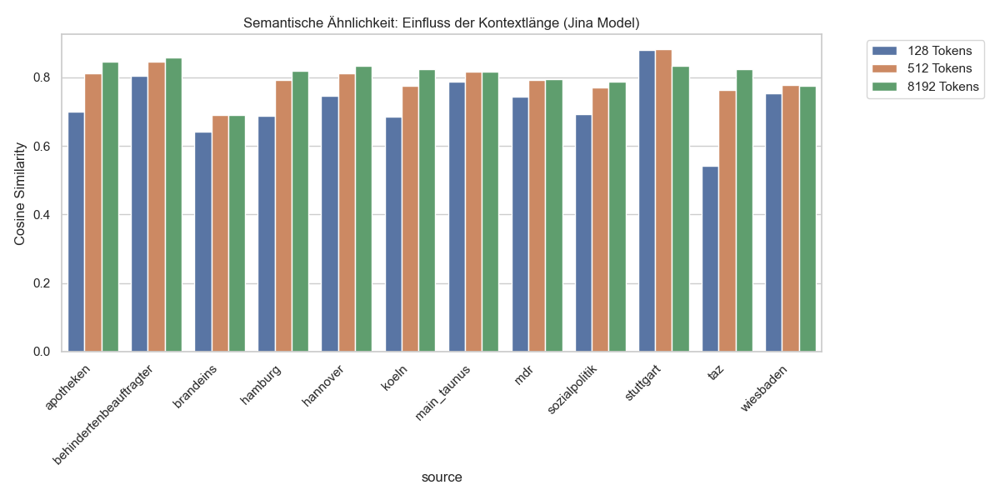
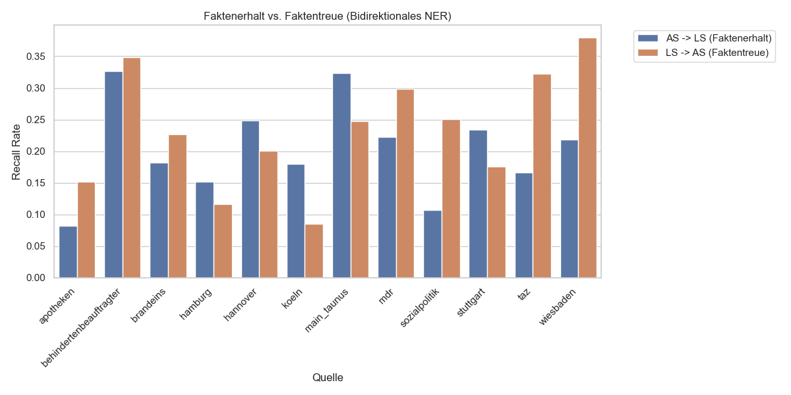
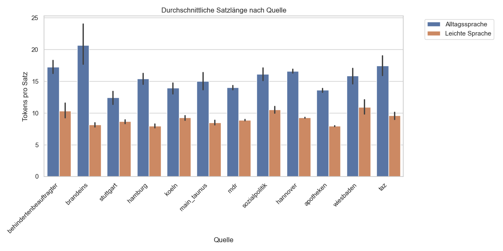
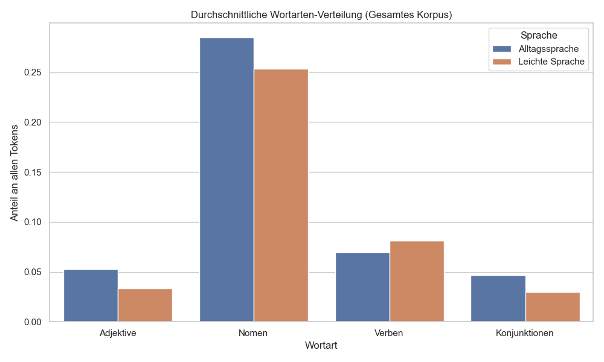

# 10 Dataset Analysis: Finaler Korpus-Review

## 1. Einleitung und Datensatz-Übersicht
Nach der Konsolidierung des Korpus und einer vollständigen Neuberechnung aller Metriken mit dem Jina-Modell (8192 Tokens Kontext) liegt nun die finale Analyse vor. Dieser Bericht dokumentiert den Prozess der Qualitätssicherung, bei dem der Rohdatenbestand (inkl. der neuen Quellen Hannover und TAZ) gefiltert wurde, um eine optimale Basis für das Modelltraining zu schaffen.

### 1.1 Korpus-Statistiken (Vergleich)

| Metrik | Roher Korpus | Bereinigter Korpus (Final) |
| :--- | :--- | :--- |
| **Anzahl Artikelpaare** | 1.533 | **1.476** |
| **Tokens Gesamt (AS)** | 1.868.994 | **1.787.327** |
| **Tokens Gesamt (LS)** | 1.468.345 | **1.432.434** |
| **Ø Tokens pro Satz (AS)** | 15,2 | 15,2 |
| **Ø Tokens pro Satz (LS)** | 8,3 | 8,3 |

## 2. Semantische Ähnlichkeit & Kontextlänge

### 2.1 Jina-Modell (Context Comparison)
Der Einsatz des Jina-Modells mit 8192 Tokens Kontext zeigt eine deutliche Verbesserung der Ähnlichkeitsmessung gegenüber Modellen mit kürzerem Kontext (128/512). Dies bestätigt, dass bei langen Behördentexten (insb. Hannover) relevante Informationen am Textende durch herkömmliche Modelle abgeschnitten wurden.

### 2.2 Semantische Ähnlichkeit nach Quelle (Bereinigt)
Im bereinigten Korpus wurden Paare mit einer Ähnlichkeit unter 0.60 entfernt. Dies stabilisiert die Qualität für das Modelltraining erheblich.

## 3. Faktenerhalt & Faktentreue (NER)
Die bidirektionale NER-Analyse des finalen Sets zeigt eine hohe Konsistenz der Eigennamen zwischen AS und LS, was auf eine gute inhaltliche Ausrichtung der Paare hindeutet.

## 4. Linguistische Analyse (Finales Set)
Die Analyse der Wortarten und Satzstrukturen bestätigt die Einhaltung der Regeln für Leichte Sprache auch im bereinigten Zustand.

### 4.1 Satzlängen-Vergleich

### 4.2 Wortarten-Verteilung (POS)

## 5. Korpus-Bereinigung & Filterung
Basierend auf der initialen Analyse wurden Filterkriterien definiert, um die Qualität für das Modelltraining zu sichern.

### 5.1 Filterkriterien (Jina 8192)
- **Untergrenze Ähnlichkeit:** 0.60 (Entfernung von thematischen Fehltreffern)
- **Obergrenze Ähnlichkeit:** 0.99 (Entfernung von Fast-Duplikaten/Kopien)
- **Mindestlänge (LS):** 10 Tokens (Entfernung von leeren Teasern)
- **Inhalt:** Ausschluss von "Lorem Ipsum" Platzhaltern

### 5.2 Effekt der Bereinigung
Durch die Bereinigung wurden **55 Artikelpaare** entfernt. Dies reduziert das Rauschen im Datensatz (v.a. Teaser-Leichen), ohne die wertvolle Domänen-Abdeckung (z.B. Hannover mit über 750 Artikeln) nennenswert zu verringern.

## 6. Artefakte und Rauschen im Datensatz (Noise Analysis)
Trotz der Bereinigung nach Ähnlichkeits-Scores verbleiben in einigen Quellen strukturelle Artefakte, die aus dem Scraping-Prozess oder der ursprünglichen Webseiten-Struktur resultieren.

### 6.1 Brand Eins: Metadaten-Konkatenation
Besonders bei der Quelle **Brand Eins** fällt auf, dass Titel, Datum und teilweise Autorennamen am Anfang des LS-Textes ohne Trennzeichen zusammengeführt wurden.
*   **Beispiel:** `"Sie werden mit falschem Käse betrogen März 2023.Holger Fr Parmesan ist ein Käse..."`
*   **Problem:** Dies führt zu unnatürlichen Satzanfängen und erschwert das Training von Generierungs-Modellen, da das Modell lernen könnte, Metadaten in den Text zu integrieren. Zusätzlich fehlen oft Leerzeichen nach Satzzeichen (z.B. `"Digitalisierung.Wir"`).

### 6.2 MDR: Quellenverweise und Radio-Metadaten
Viele Texte des **MDR** enthalten am Ende standardisierte Verweise auf die "schwere Sprache" oder Radio-Sendezeiten.
*   **Beispiel:** `"Über dieses Thema berichtet der MDR auch in schwerer Sprache: MDR THÜRINGEN - Das Radio | 01. April 2026 | 19:00 Uhr"`
*   **Problem:** Diese Sätze sind für die eigentliche Vereinfachung irrelevant und stellen Rauschen dar, das bei einer automatischen Evaluierung den Score verfälschen könnte.

### 6.3 Hamburg & Stuttgart: Redundante Header und Footer
In diesen Quellen finden sich häufig Kontaktinformationen oder wiederholte Titelzeilen innerhalb des Textes.
*   **Hamburg:** Wiederholung von Büroadressen am Textende oder doppelte Footer-Blöcke.
*   **Stuttgart:** Doppelte Titelzeilen (z.B. `"Lebenspartnerschaft - Umwandlung in eine Ehe beantragen Umwandlung in eine Ehe beantragen"`).

### 6.4 TAZ: Verwaiste Bildunterschriften
In einigen TAZ-Artikeln sind Bildunterschriften in den Fließtext gerutscht, ohne dass das Bild vorhanden ist (z.B. `"Das ist Baris Kul vor seinem Laden:"`).

### 6.5 Systematische Merkmale: Mediopunkt und Trennungen
Ein domänenspezifisches Merkmal ist die Verwendung des **Mediopunkts** (`·`) zur Silbentrennung (insb. Hannover, Hamburg, Wiesbaden). Während dies für die Zielgruppe der Leichten Sprache korrekt ist, muss es bei der Tokenisierung und dem Training berücksichtigt werden (Vokabular-Erweiterung oder Normalisierung).

## 7. Fazit
Der finale Datensatz (Version 3) umfasst **1.471 validierte Paare** mit insgesamt ca. **1,88 Mio. Tokens**. Durch die konsequente Nutzung von Long-Context Embeddings (Jina 8192) wurde eine hohe Alignment-Qualität sichergestellt.

Zusätzlich wurde eine **automatisierte Nachbereinigung (Post-Cleaning)** implementiert, die:
*   Strukturelle Metadaten und Autorennamen bei Brand Eins entfernt hat.
*   Systematische Boilerplate-Footer beim MDR eliminiert hat.
*   Die Lesbarkeit durch Korrektur fehlender Leerzeichen verbessert hat.
*   Den Mediopunkt (`·`) zur Silbentrennung normalisiert (entfernt) hat, um die Kompatibilität mit Standard-Tokenisatoren zu gewährleisten.

Damit liegt eine hochreine und inhaltlich konsistente Datenbasis vor, die unmittelbar für das Training von Simplification-Modellen genutzt werden kann. Der bereinigte Korpus befindet sich in `data/corpus/final/`.

- Schauen in weiweit sich die Texte unterscheiden die verschiedene Ratios haben
- Beim Trainieren verschieden Datensatzgrößen testen: 0.7-0.98, 0.8-0.98 0.9-0.98. Schauen ob es das Training verbessert mit besser semantisch aligned Daten