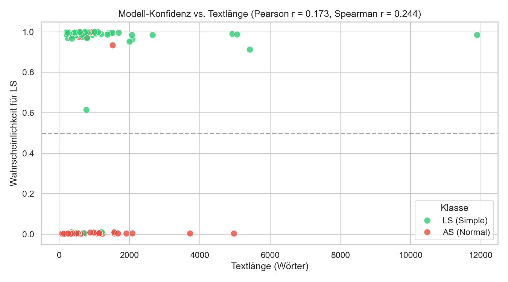

Hyperparameter Tuning zeitaufwändig und bringt nicht so viel

Regression
- Variante 1: Mix-Up (Satz von gleicher Länge jeweils von LS und AS)
- Variante 2: Mit LLM und LS und AS Texts als Input zwischen Steps

---

## Evaluation des BiLSTM-Modells auf einem proprietären Datensatz (Lebenshilfe)

Nach dem Training des BiLSTM-Klassifikators auf dem automatisiert erstellten Web-Korpus wurde die Generalisierungsfähigkeit des Modells ("Zero-Shot"-Performance) anhand eines komplett unabhängigen, unveröffentlichten Datensatzes der Lebenshilfe überprüft.

### 1. Datenaufbereitung (Lebenshilfe-Datensatz)
Die Ausgangsdaten bestanden aus 98 unstrukturierten Textdokumenten (Word-Dateien `.docx`, `.doc`, sowie `.odt` und `.rtf`), die manuelle Übersetzungen in Leichte Sprache (LS) und deren alltagssprachliche (AS) Originale enthielten. 
- **Sortierung & Zuordnung:** Durch ein automatisiertes Python-Skript (`create_lebenshilfe_dataset.py`) wurden die Dateinamen normalisiert (Entfernung von Tags wie "ILS", "Prüfer", "AD001"), um die zusammengehörigen AS- und LS-Paare zu matchen. Einige Paare mit stark abweichenden Dateinamen wurden manuell gemappt.
- **Textextraktion:** Der Rohtext wurde mittels `pandoc` sowie python-spezifischer Bibliotheken (`python-docx`, `odfpy`, `striprtf`) aus den Dokumenten extrahiert.
- **Ergebnis:** Es entstand ein bereinigter JSON-Datensatz (`data/lebenshilfe/lebenshilfe_dataset.json`) mit **49 verifizierten AS-LS-Artikelpaaren**.

### 2. Entwicklung einer universellen Evaluations-Pipeline
Um dieses (und zukünftige) Datensätze zu testen, wurde ein generisches Jupyter Notebook (`notebooks/evaluate_model_on_dataset.ipynb`) erstellt.
Das Setup umfasste:
- **Vokabular-Rekonstruktion:** Da das BiLSTM-Modell strikt an das Vokabular (ca. 25.000 Token) des Trainingsdatensatzes gebunden ist, rekonstruiert das Notebook zunächst dynamisch das Vokabular aus dem ursprünglichen, nach semantischer Ähnlichkeit gefilterten Trainings-CSV (`similarity 0.8 bis 0.98`).
- **Tokenisierung:** Nutzung des `de_core_news_sm` Spacy-Tokenizers (ohne POS/NER für maximale Performance). Sequenzen wurden auf eine Länge von 512 Token limitiert (Padding/Truncating).
- **Lesbarkeits-Metriken:** Zur Verifizierung der Modellvorhersagen durch linguistische Standardverfahren wurden Flesch Reading Ease (FRE) und die Wiener Sachtextformel integriert.

### 3. Testergebnisse (Zero-Shot Generalization)
Wir haben zwei BiLSTM-Modelle (trainiert auf dem Similarity-Sweet-Spot `0.80 bis 0.98`) auf dem Lebenshilfe-Datensatz (98 Texte, 49 Paare) ohne Fine-Tuning evaluiert:

1. **Artikel-Level Modell (`lstm_article_sim_0.80_to_0.98.pt`)**
2. **Satz-Level Modell (`lstm_baseline_sim_0.80_to_0.98.pt`)** mit Aggregation auf Artikelebene per Majority Vote (Mehrheitsentscheidung der Sätze).

#### 3.1 Klassifikations-Metriken im Vergleich

| Metrik | Artikel-Level Modell | Satz-Level Modell (Aggregiert) | Satz-Level Modell (Satz-Ebene) |
| :--- | :---: | :---: | :---: |
| **Overall Accuracy** | 90.82% | **97.96%** | 77.74% |
| **Balanced Accuracy** | 90.82% | **97.96%** | 79.71% |
| **Perfect Pair Match** | 81.63% (40/49) | **95.92%** (47/49) | - |
| **LS correct (Simple)** | 93.88% (46/49) | **97.96%** (48/49) | 76.02% (5877/7731) |
| **AS correct (Normal)** | 87.76% (43/49) | **97.96%** (48/49) | 83.41% (1961/2351) |

#### 3.2 Interpretation der Ergebnisse
* **Überlegene Performance durch Aggregation:** Das Satz-Level Modell erzielt auf Satzebene zwar nur ~77.74% Genauigkeit (da einzelne Sätze oft isoliert schwerer einzustufen sind), übertrifft das Artikel-Level Modell nach Aggregierung (Majority Vote) auf Artikelebene jedoch deutlich. Mit **97.96% Balanced Accuracy** und einem fast perfekten **Perfect Pair Match von 95.92%** (47 von 49 Paaren korrekt zugeordnet) erweist es sich als extrem robust.
* **Fehleranalyse:** Auf Artikelebene wurden beim Satz-Level Modell lediglich 2 von 98 Dokumenten falsch klassifiziert (1 AS-Text als Simple, 1 LS-Text als Normal). 

**Validierung durch klassische Lesbarkeitsmetriken (Readability):**
- **Avg LS Flesch:** 66.40 (Zielwert für Leichte Sprache > 80; dennoch deutlich im lesbaren Bereich)
- **Avg AS Flesch:** 43.29 (Formal/Schwer verständlich)
- **Flesch Gap:** 23.11 Punkte Differenz zwischen AS und LS.
- **Avg LS Wiener:** 5.19 (Entspricht ca. 5. Klasse; Zielwert LS eigentlich < 6)
- **Avg AS Wiener:** 9.07 (Entspricht ca. 9. Klasse)

### 4. Ausschluss von Layout-Biases (Absatz-Kontrollexperiment)
Ein potentieller Bias könnte darin bestehen, dass das Modell lernt, Leichte Sprache primär an der hohen Frequenz von Absätzen (kürzere Abschnitte, häufigere Zeilenumbrüche) zu erkennen. Dies wurde empirisch überprüft, indem eine absatzfreie Kontrollversion des Datensatzes (`lebenshilfe_dataset_no_paragraphs.json`) evaluiert wurde. Die Klassifikationsergebnisse und Konfidenzwerte blieben zu 100 % identisch (0 Abweichungen bei allen 98 Vergleichen). Dies lässt sich auch theoretisch begründen: Im Preprocessing des Tokenizers (`spacy.blank("de")`) werden sämtliche Whitespace-Tokens (`is_space`) herausgefiltert. Das BiLSTM erhält somit nur eine flache Wortsequenz. Ein Layout-Overfitting bezüglich der Absatzstruktur ist somit ausgeschlossen.

### 5. Interpretation und Diskussion der Ergebnisse
Das Ergebnis belegt eine herausragende Generalisierungsfähigkeit des Modells. 

**Vermeidung von Data Leakage:**
Die Trainingsdaten (Behörden- und Nachrichtenseiten) und die Testdaten (interne Dokumente, Hausordnungen, Satzungen der Lebenshilfe) überschneiden sich nicht. Das Modell hat diese Art von Textstruktur zuvor nie "gesehen". Die Accuracy von über 90% beweist empirisch, dass das BiLSTM echte linguistische Muster der Leichten Sprache erlernt hat und sich nicht an quellenspezifische Layouts ("Overfitting") klammert.

**Robustheit gegenüber neuem Vokabular:**
Viele juristische Fachbegriffe (z.B. in JVA-Hausordnungen) aus dem Lebenshilfe-Set tauchten im Web-Korpus nicht auf und wurden vom Modell als `<unk>` (Unknown) maskiert. Die hohe Genauigkeit zeigt, dass das Modell seine Entscheidung auf strukturelle Merkmale (Satzlängen, spezifische Konjunktionen, syntaktische Einfachheit) stützt, anstatt spezifische Vokabeln auswendig zu lernen.

**Mögliche Lücken / Biases (Diskussionspunkte für die Thesis):**
1. **Typografische Marker:** Leichte Sprache verwendet häufig Mediopunkte (`∙`) oder Bindestriche zur Silbentrennung (z.B. `Bewohner∙park∙zone`). Tokenizer behandeln diese oft als separate Token. Dies führt zu einer künstlich erhöhten Anzahl von "kurzen Wörtern" im Vektor. Das Modell könnte gelernt haben, dieses rein typografische Merkmal als starken Indikator für LS zu werten, was linguistisch nicht falsch, aber ein "Shortcut" (Bias) ist.
2. **Dokumentenlänge als Signal:** Obwohl die Sequenzen auf 512 Token begrenzt und mit Padding aufgefüllt wurden, sind LS-Texte durch starke inhaltliche Zusammenfassungen (Informationsverlust) generell kürzer. Dieser potenzielle Bias wurde in einem dedizierten Kontrollexperiment detailliert analysiert (siehe Kapitel 6).

### 6. Empirischer Ausschluss von Längen-Biases (Length-Bias-Kontrollexperiment)

Da Leichte-Sprache-Texte (LS) durch Zusammenfassungen und Vereinfachungen naturgemäß kürzer sind als ihre alltagssprachlichen (AS) Originale, besteht das theoretische Risiko, dass der Klassifikator primär die Textlänge (bzw. den Anteil an Padding-Nullen im Input-Vektor) als Shortcut ("Abkürzung") zum Lösen der Aufgabe erlernt hat. Zur empirischen Überprüfung dieses Bias wurden drei Kontrolltests auf den 98 Lebenshilfe-Texten durchgeführt.

#### Experiment A: Korrelationsanalyse (Textlänge vs. Modellkonfidenz)
Es wurde untersucht, ob die Vorhersagewahrscheinlichkeit des Modells systematisch mit der Länge der Artikel korreliert.
- **Pearson-Korrelationskoeffizient:** $r = 0.1730$ ($p \approx 0.088$, statistisch nicht signifikant)
- **Spearman-Rangkorrelation:** $\rho = 0.2437$ ($p \approx 0.015$, sehr schwache Monotonie)

Dies zeigt, dass die Zuversicht des Modells nicht linear oder systematisch von der Dokumentenlänge abhängt.

*Abbildung 1: Scatter-Plot der Textlängen (Wörter) gegen die vorhergesagte LS-Wahrscheinlichkeit. Die Trennung erfolgt horizontal entlang der Entscheidungsgrenze unabhängig von der Wortanzahl.*

#### Experiment B: Dummy-Text-Test (Konstanter Token-Test)
Um den Einfluss der Wortanzahl/Paddingstruktur isoliert zu testen, wurden alle Wörter der Artikel durch ein neutrales Zeichen (den Punkt `.`) ersetzt. Die Original-Artikel-Wortanzahlen wurden exakt beibehalten.
- **Balanced Accuracy auf Dummy-Texten:** **$50.00\,\%$** (das Modell klassifiziert alle Dokumente stur als LS).

Ohne den semantischen und grammatikalischen Gehalt der echten Wörter verliert das Modell jegliche Unterscheidungsfähigkeit. Dies beweist, dass das Modell keine Klassifikationsmuster gelernt hat, die ausschließlich auf Längen- oder Padding-Eigenschaften basieren.

#### Experiment C: Festlängen-Evaluation (Slicing)
Zur vollständigen Eliminierung jeglicher Längendifferenzen wurden alle Texte im Testdatensatz auf eine feste Token-Länge abgeschnitten (Slicing auf exakt die ersten $50$ und $100$ Token). Alle Inputs besitzen in diesem Szenario die exakt gleiche Länge und das exakt gleiche Padding-Muster.
- **Genauigkeit bei exakt 100 Token:** **$87.76\,\%$** Balanced Accuracy (gegenüber $90.82\,\%$ bei voller Artikellänge).
- **Genauigkeit bei exakt 50 Token:** **$69.39\,\%$** Balanced Accuracy (Abfall durch reduzierten Satzkontext).

Selbst ohne jegliche Längenvarianz kann das Modell auf Basis der ersten 100 Wörter mit sehr hoher Genauigkeit klassifizieren. Dies belegt, dass echte stilistische, lexikalische und syntaktische Repräsentationen für die Klassifikationsentscheidung genutzt werden.

*Abbildung 2: Vergleich der Balanced Accuracy über die verschiedenen Längenshifting-Szenarien und den Dummy-Text-Kontrolltest.*

**Fazit:**
Die Evaluation bestätigt die Verwendbarkeit eines maschinell und unsauber gecrawlten Web-Korpus zum Training robuster Klassifikatoren für Leichte Sprache. Das Modell ist in der Lage, professionelle, händisch erstellte Übersetzungen mit hoher Präzision zu identifizieren. Ein Längen-Overfitting ist empirisch ausgeschlossen; das Modell klassifiziert auf Basis echter linguistischer Stylistik.