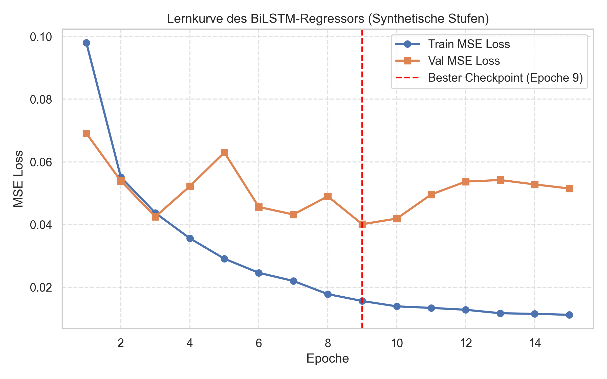
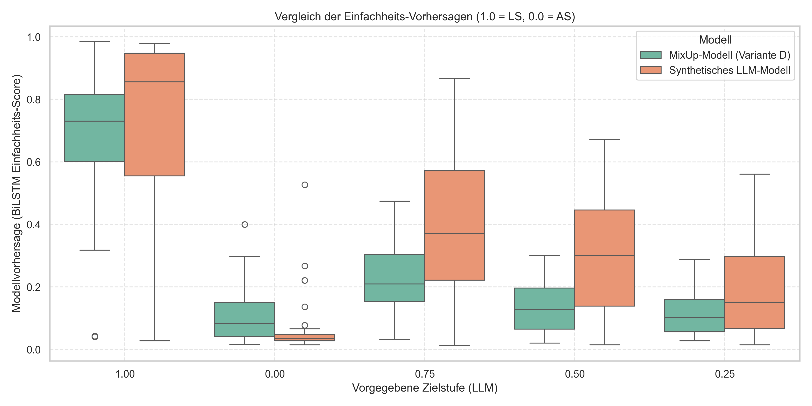
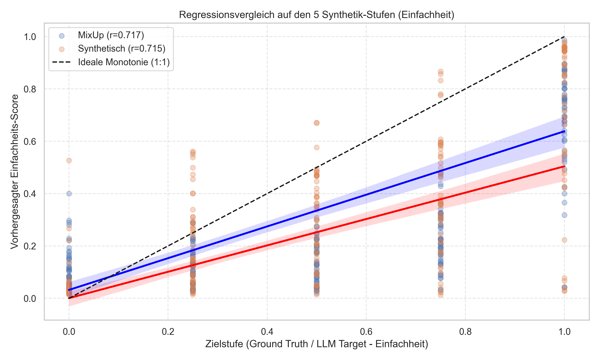

# Woche 19: Vergleich MixUp-Regressor vs. Synthetischer Regressor

In dieser Woche wurde die synthetische Generierung kontinuierlicher Sprachkomplexitätsstufen abgeschlossen und das zugehörige Regressionsmodell evaluiert. Zudem wurde ein systematischer Vergleich mit dem bisherigen **Sentence-Level MixUp (Ansatz 1)** durchgeführt, um das beste Metrikmodell als Reward-Funktion für die Übersetzungs-Pipeline (Step 3) festzulegen.

---

## 1. Synthetische Datengenerierung (LLM-Stufen)

Für die Generierung semantisch konsistenter und grammatikalisch flüssiger Zwischenstufen wurde das Skript [`generate_synthetic_regression_steps.py`](file:///Users/fietescheel/Documents/Master%20Thesis/scripts/modeling/generate_synthetic_regression_steps.py) auf dem remote GPU-Server ausgeführt.

* **Modell:** `FlensGen-GPT-OSS-120B` (über VPN-Zugang)
* **Ziel-Stufen:** `0.25` (Nahe an Leichter Sprache), `0.50` (Einfache Sprache), `0.75` (Nahe an Alltagssprache)
* **Erzeugte Datensätze:**
  1. **Lebenshilfe-Evaluierungsset:** [`lebenshilfe_dataset_with_steps.json`](file:///Users/fietescheel/Documents/Master%20Thesis/data/lebenshilfe/lebenshilfe_dataset_with_steps.json) (49 Artikelpaare $\times$ 5 Stufen = 245 Samples)
  2. **Haupt-Trainingskorpus (Web-Daten):** [`corpus_final_with_steps.json`](file:///Users/fietescheel/Documents/Master%20Thesis/data/corpus/final_with_steps.json) (1.476 Artikelpaare $\times$ 5 Stufen = 7.380 Samples)

---

## 2. Modelltraining auf den synthetischen Stufen

Das Notebook [`1_synthetic_bilstm_regression.ipynb`](file:///Users/fietescheel/Documents/Master%20Thesis/notebooks/synthetic/1_synthetic_bilstm_regression.ipynb) wurde erstellt, um den `BiLSTMRegressor` auf den ausgeflachten Text-Target-Paaren zu trainieren.

* **Trainingsdaten:** 5.900 Samples (auf Artikel-Ebene gesplittet, um Daten-Leaks zu vermeiden)
* **Validierungsdaten:** 1.480 Samples
* **Vokabular-Umfang:** 52.603 Wörter (`synthetic_vocab.json`)
* **Konvergenz:** Der Validation MSE erreichte in **Epoche 9** das Minimum von **`0.0401`** (Train MSE: `0.0156`).
* **Out-of-Domain Generalisierung auf dem Lebenshilfe-Set:**
  * **MSE (Mean Squared Error):** `0.0195`
  * **MAE (Mean Absolute Error):** `0.1042` (Durchschnittliche Abweichung von $\approx 10\,\%$ auf der Skala $[0.0, 1.0]$)
  * **Pearson-Korrelation ($r$):** `0.9238` ($p < 0.0001$)
  * **Spearman-Rangkorrelation ($\rho$):** `0.9169` ($p < 0.0001$)

### Lernkurve:

---

## 3. Systematischer Vergleich: MixUp vs. Synthetisches LLM-Modell

Im Notebook [`2_compare_mixup_vs_synthetic.ipynb`](file:///Users/fietescheel/Documents/Master%20Thesis/notebooks/synthetic/2_compare_mixup_vs_synthetic.ipynb) wurden beide Modelle auf dem exakt selben Test-Set (Lebenshilfe mit 5 Stufen) evaluiert. 

> [!IMPORTANT]
> **Skalen-Harmonisierung:**  
> Da das MixUp-Modell darauf trainiert war, das Verhältnis von Leichter Sprache vorherzusagen ($1.0 = \text{LS}$, $0.0 = \text{AS}$), das synthetische Modell hingegen die Komplexität misst ($0.0 = \text{LS}$, $1.0 = \text{AS}$), wurde die Vorhersage des synthetischen Modells auf die Einfachheits-Skala harmonisiert ($1.0 - \text{Pred}$).

### Evaluierungsdaten (Harmonisiert auf $1.0 = \text{Leichte Sprache}$ und $0.0 = \text{Alltagssprache}$):

| Metrik | MixUp-Modell (Variante D) | Synthetisches LLM-Modell | Gewinn durch Synthetik-Ansatz |
| :--- | :---: | :---: | :---: |
| **MSE** | `0.1388` | **`0.0786`** | **-43,4 %** |
| **MAE** | `0.3079` | **`0.1816`** | **-41,0 %** |
| **Pearson r** | `0.6626` | **`0.7412`** | **+11,9 %** |
| **Spearman rho** | `0.5885` | **`0.7391`** | **+25,6 %** |

### Boxplot-Vergleich:

### Regressions-Vergleich:

---

## 4. Schlussfolgerungen & Nächste Schritte

1. **Linguistischer Vorteil:** Synthetische Stufen aus dem LLM spiegeln echte Grammatik- und Wortschatz-Komplexität wider. Der Satz-MixUp (Ansatz 1) misst primär die *Häufigkeit isolierter LS-Sätze*, vernachlässigt jedoch den Satzfluss.
2. **Auswahl des Metrikmodells:**  
   Das synthetisch trainierte Modell `bilstm_synthetic_regression.pt` ist der klare Gewinner und wird als **Reward-Modell** in Step 3 integriert.
3. **Nächster Schritt:**  
   Beginn mit Step 3 (Übersetzungsmodell), d. h. Datenaufbereitung für Seq2Seq/LLM Fine-Tuning und SFT-Modellauswahl.
