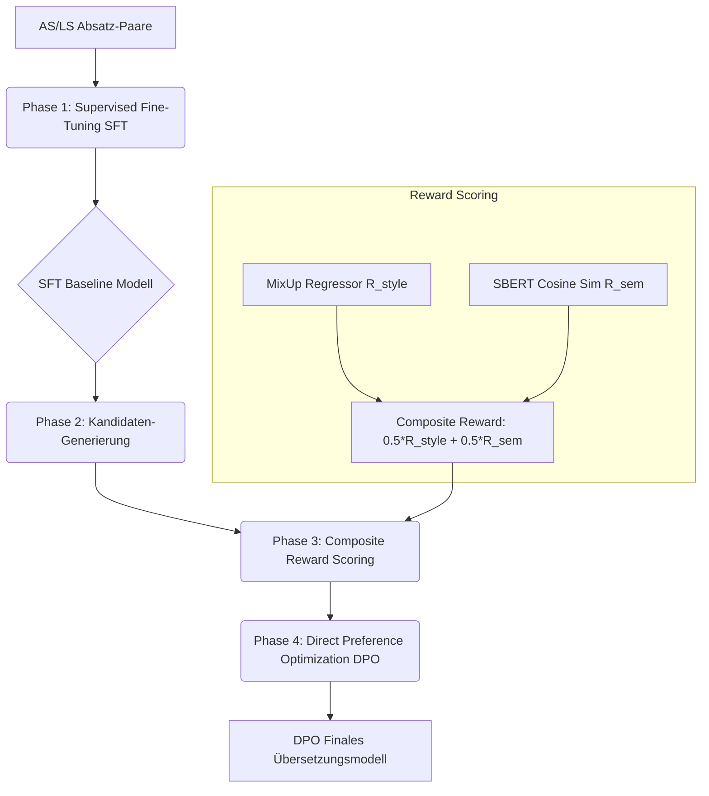

# Translation Model: Seq2Seq Fine-Tuning & DPO Pipeline

Dieses Dokument dokumentiert die Entwicklung, Pipeline-Struktur und Zwischenergebnisse des Übersetzungsmodells von Alltagssprache (AS) in Leichte Sprache (LS).

---

## 1. Pipeline-Design & Trainingsschritte

Die Übersetzungs-Pipeline kombiniert ein Sequence-to-Sequence (Encoder-Decoder) Modell mit Direct Preference Optimization (DPO), geleitet von unseren in den Schritten 1 & 2 entwickelten Evaluierungs-Modellen.

### A. Architektur & Datensatz
- **Basismodell:** `google/mt5-small` (~300M Parameter) als recheneffizienter Proof-of-Concept.
- **Trainingsdaten:** 1.471 aligned Absatz-Paare aus `results/corpus_final/`.
  * *Split:* 85% Train (1.250 Paare) | 15% Validation (221 Paare).
- **Out-of-Domain Testdatensatz:** Unabhängiger Lebenshilfe-Datensatz (`results/lebenshilfe_dataset.json`, 49 Artikel-Paare).

### B. Trainingsphasen

1. **Phase 1: Supervised Fine-Tuning (SFT):**
   * Das Basismodell lernt das grundlegende Übersetzungs- und Textgenerierungs-Verhalten auf den parallelen Korpuspaaren mittels standardmäßigem Cross-Entropy-Loss.
   * Optimierung mit Validation-Loss Tracking und Early Stopping auf den ungesehenen Validierungsdaten.
2. **Phase 2 & 3: Composite Reward Scoring:**
   * Für DPO generiert das Modell zwei Übersetzungsvarianten ($y_1, y_2$) pro Quelltext.
   * **Stil-Reward ($R_{\text{style}}$):** Der trainierte *BiLSTM MixUp Regressor* bewertet den Vereinfachungsgrad $\lambda \in [0, 1]$.
   * **Semantischer Reward ($R_{\text{sem}}$):** *Sentence-BERT* misst den Erhalt des Inhalts zwischen AS-Quelle und LS-Kandidat.
   * **Kombinierter Reward:** $R = 0.5 \cdot R_{\text{style}} + 0.5 \cdot R_{\text{sem}}$.
3. **Phase 4: Direct Preference Optimization (DPO):**
   * Das SFT-Modell wird basierend auf den Rewards für `Chosen` (bessere Übersetzung) und `Rejected` (schlechtere Übersetzung) verfeinert, um bevorzugt vereinfachte, aber inhaltlich treue Texte zu generieren.

---

## 2. Bisherige Ergebnisse & Meilensteine

Das Modell wird auf dem unabhängigen Out-of-Domain Lebenshilfe-Datensatz (49 Artikel-Paare) evaluiert.

### Ergebnis 1: Baseline SFT (1 Epoche, keine Decoding-Constraints)
* **Setup:** SFT für genau 1 Epoche. Standard-Textgenerierung (Greedy).
* **Train Loss:** 9.3095 (Keine Konvergenz).
* **Beobachtungen:** 
  * Das Modell war extrem untertrainiert.
  * Jede Generierung begann mit dem mT5-Vortrainierungs-Token `<extra_id_0>`.
  * Das Modell verfiel in endlose Wiederholungsschleifen (*„Die Landesregierung hat die Landesregierung...“*).
* **Metriken (Lebenshilfe Testset):**
  * Ø MixUp-Score ($R_{\text{style}}$): $0.7551 \pm 0.1981$
  * Ø SBERT-Similarity zur AS-Quelle ($R_{\text{sem}}$): $0.7663 \pm 0.0810$
  * Ø SBERT-Similarity zur LS-Referenz: $0.7354 \pm 0.0896$
  * Ø Composite Reward: $0.7607 \pm 0.0914$
  *(Hinweis: Die Scores sind aufgrund der Repetitions künstlich verzerrt).*

### Ergebnis 2: Baseline SFT (5 Epochen, mit Decoding-Constraints)
* **Setup:** SFT für 5 Epochen. Integration von Generierungs-Strafen (`num_beams=4`, `repetition_penalty=2.5`, `no_repeat_ngram_size=3`).
* **Train Loss:** 3.2545 (Sehr gute Konvergenz).
* **Beobachtungen:**
  * **Vollständige Eliminierung der Wiederholungsschleifen.** Das Modell erzeugt flüssige, lesbare Absätze.
  * Das Token `<extra_id_0>` wurde in Stichproben eliminiert oder tritt nur noch isoliert am Satzanfang auf.
  * Das Modell bildet selbstständig kurze Sätze und Fragesätze (*„Wie kann ich mich für Inklusion beachten?“*), was den Richtlinien für Leichte Sprache entspricht.
* **Metriken (Lebenshilfe Testset):**
  * Ø MixUp-Score ($R_{\text{style}}$): **$0.8105 \pm 0.0955$** ($\mathbf{+5.5\%}$)
  * Ø SBERT-Similarity zur AS-Quelle ($R_{\text{sem}}$): **$0.8773 \pm 0.0584$** ($\mathbf{+11.1\%}$)
  * Ø SBERT-Similarity zur LS-Referenz: **$0.8428 \pm 0.0719$** ($\mathbf{+10.7\%}$)
  * Ø Composite Reward: **$0.8439 \pm 0.0565$** ($\mathbf{+8.3\%}$)

---

## 3. Aktueller Entwicklungsstand (DPO)

* Das SFT-Modell wurde nach 5 Epochen erfolgreich trainiert und als `../../results/best_sft_model_temp.pt` gesichert.
* Um CUDA Out of Memory (OOM) Errors auf der GPU (8 GB VRAM) zu verhindern, wird die DPO-Pipeline wie folgt optimiert:
  1. Offloading von SBERT und BiLSTM-Regressor auf die **CPU** (VRAM-Ersparnis: >1 GB).
  2. Absenken der Batch-Größe des DPO-Loaders auf `batch_size = 2`.
* Das DPO-Training läuft aktuell. Die Ergebnisse des DPO-Tuning-Verlaufs und der finalen Übersetzungsevaluierung folgen als nächster Meilenstein.
