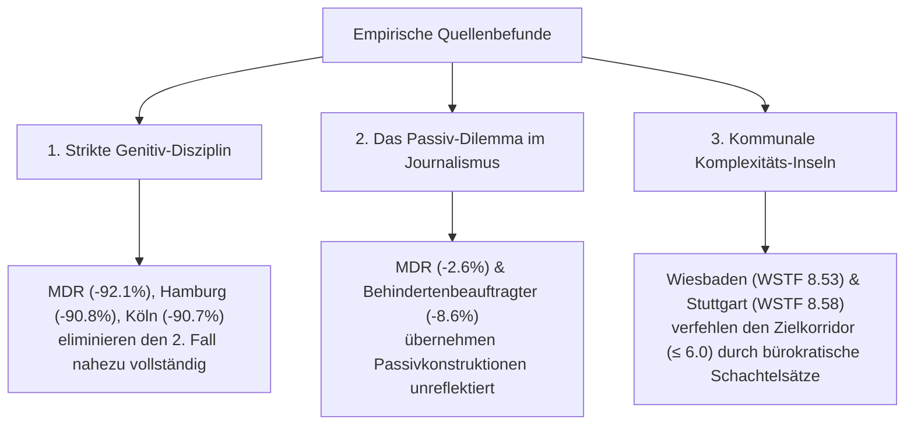

# 22. Quantitative Regel-Adhärenz & Metriken-Evaluation für Leichte Sprache

**Autor:** Fiete Scheel  
**Kontext:** Masterarbeit – Evaluation linguistischer Regelkonformität in Parallelkorpora und neuronalen Übersetzungsmodellen  
**Datengrundlage:** 12 Webquellen des Masterkorpus ($N=1.439$ Artikelpaare) & *Lebenshilfe*-Benchmark ($N=37$ Testtexte)  
**Skripte & Notebooks:** 
- `scripts/evaluation/measure_rule_adherence.py`
- `scripts/visualization/visualize_rule_adherence.py`
- `notebooks/research/translation/analyse_rule_adherence.ipynb`

---

## 1. Einleitung & Zielsetzung

Die Bewertung automatischer Textvereinfachung in Leichte Sprache (LS) stand im Rahmen dieser Arbeit vor einer doppelten Herausforderung:
1. **Regel-Adhärenz der Datenbasis:** Wie streng und einheitlich setzen professionelle menschliche Redaktionen in Deutschland (*Behörden*, *Medien*, *Verbände*) das normative Regelwerk (gemäß *Netzwerk Leichte Sprache*, *BITV 2.0*, *DIN 8581-1*) in der Praxis tatsächlich um?
2. **Linguistische Qualität der Modellübersetzungen:** Inwiefern lernt ein neuronales Sequence-to-Sequence-Modell (SFT mBART-50) die formalen Reduktionsregeln (Passivvermeidung, Genitivtilgung, Satzverkürzung, Nominalstilabbau) im Vergleich zur Ausgangssprache (AS) und dem zertifizierten *Lebenshilfe*-Goldstandard?

Um diese Fragen objektiv und reproduzierbar zu beantworten, wurde ein zentraler **LeichteSpracheRuleAuditor** implementiert, der 14 quantitative linguistische Metriken auf Satz-, Grammatik-, Wort- und Textstruktur-Ebene berechnet.

---

## 2. Das linguistische Metriken-Framework

Die offiziellen Richtlinien für Leichte Sprache wurden in folgende quantitative Indikatoren operationalisiert:

| # | Regelbereich | Offizielle LS-Regel | Quantitative Metrik / Operationalisierung | Technologie & Parser | Zielrichtung (LS vs. AS) |
| :--- | :--- | :--- | :--- | :--- | :--- |
| **S1** | **Syntax** | **Kurze Sätze** (max. 8–12 Wörter) | **Mean Sentence Length (MSL)** & **Long Sentence Ratio** ($>12$ Wörter) | `spacy` (`de_core_news_lg`): `doc.sents` | $\downarrow$ MSL $\le 8-10$, Long Sents $\approx 0$ |
| **S2** | **Syntax** | **Keine Nebensätze** (Nur Hauptsätze, Parataxe) | **Subordination Ratio** (Nebensätze pro Satz) | `spacy` Dep (`relcl`, `advcl`, `ccomp`) & POS (`SCONJ`) | $\downarrow$ Sinkt drastisch gegen $0.0$ |
| **S3** | **Syntax** | **SPO-Struktur** (Subjekt-Prädikat-Objekt) | **Subject-Initial Sentence Ratio** | `spacy` Dependency Parsing: `sb` am Satzanfang | $\uparrow$ Steigt in LS |
| **G1** | **Grammatik** | **Kein Passiv** (Nur Aktivformulierungen) | **Passive Voice Ratio** (Passivkonstruktionen pro Satz) | `spacy` Morph/Dep: `sb_pass` & *werden* + Partizip II | $\downarrow$ Sinkt gegen $0.0$ |
| **G2** | **Grammatik** | **Kein Genitiv** (Ersatz durch Dativ mit *von*) | **Genitive Noun Ratio** (Genitive pro Nomen/Pronomen) | `spacy` Morph: `Case=Gen` | $\downarrow$ Sinkt um $>85\%$ bis $100\%$ |
| **G3** | **Grammatik** | **Kein Konjunktiv** (Nur Indikativ/Tatsachen) | **Subjunctive Mood Ratio** (Konjunktiv pro finitem Verb) | `spacy` Morph: `Mood=Sub` | $\downarrow$ Nahezu $0.0$ |
| **G4** | **Grammatik** | **Verbalstil statt Nominalstil** | **Nominalization Density** & **Verb-to-Noun Ratio** | `regex` Suffixfilter (`-ung`, `-heit`, etc.) + POS | $\downarrow$ Nominalisierungen sinken; VNR $\uparrow$ |
| **G5** | **Grammatik** | **Wenig/keine Verneinungen** | **Negation Density** (*nicht*, *kein*, *weder*, etc.) | `regex` / Lemma-Matching | $\downarrow$ Sinkt in LS |
| **L1** | **Lexik** | **Kurze, einfache Wörter** | **Polysyllable Ratio** ($\ge 3$ Silben) & Mittlere Wortlänge | `pyphen` (de_DE Silbentrennung) & `textstat` | $\downarrow$ Sinkt signifikant |
| **L2** | **Lexik** | **Komposita trennen** (Bindestrich / Mediopunkt) | **Compound Hyphenation Ratio** | `regex`: Substantive mit `-` oder `·` | $\uparrow$ Steigt in LS stark an |
| **L3** | **Lexik** | **Keine Abkürzungen** (Wörter ausschreiben) | **Abbreviation Density** (*z. B.*, *bzw.*, Akronyme) | `regex` Pattern Matching | $\downarrow$ Sinkt gegen $0.0$ |
| **L4** | **Lexik** | **Zahlen als Ziffern** (*12* statt *zwölf*) | **Digit Ratio** (Ziffern vs. Zahlwörter) | `regex`: `\d+` vs. Zahlwort-Wörterbuch | $\uparrow$ Steigt gegen $1.0$ |
| **K1** | **Lesbarkeit**| **Standard-Lesbarkeitsformeln** | **Wiener Sachtextformel (WSTF)** & **Flesch (DE)** | `textstat` (lang='de') | WSTF sinkt (Ziel $\le 6$); Flesch $>70$ |
| **S1** | **Semantik** | **Sinn- & Fakten-Erhaltung** | **Dense SBERT Semantic Similarity** | `sentence-transformers` (Jina v2 8192) | Hohe Ähnlichkeit ($0.70 - 0.95$) |

---

## 3. Teil 1: Analyse des Parallelkorpus (12 Quellen, Human Gold)

### 3.1 Statistische Gegenüberstellung (Ausgangstext AS vs. Leichte Sprache LS)

Die folgende Tabelle zeigt die mittleren Absolutwerte und relativen Reduktionsraten ($\Delta_{\%}$) über alle 12 erschlossenen Korpusquellen:

| Quelle | Domäne | AS Satzlänge | LS Satzlänge | **Satzkürzung (%)** | AS Passiv/Satz | LS Passiv/Satz | **Passiv-Red. (%)** | AS Genitiv | LS Genitiv | **Genitiv-Red. (%)** | AS WSTF | LS WSTF |
| :--- | :--- | :---: | :---: | :---: | :---: | :---: | :---: | :---: | :---: | :---: | :---: | :---: |
| **brandeins** | Journalismus | 17.16 | 7.17 | **-54.2 %** | 0.12 | 0.02 | **-34.7 %** | 0.10 | 0.01 | **-86.2 %** | 11.39 | **3.65** |
| **hamburg** | Kommune | 13.63 | 6.92 | **-47.2 %** | 0.07 | 0.01 | **-60.4 %** | 0.08 | 0.01 | **-90.8 %** | 11.63 | **6.17** |
| **hannover** | Kommune | 11.96 | 6.67 | **-41.4 %** | 0.05 | 0.00 | **-57.8 %** | 0.06 | 0.00 | **-86.5 %** | 11.18 | **6.66** |
| **sozialpolitik** | Verband | 13.09 | 7.73 | **-40.3 %** | 0.07 | 0.01 | **-84.9 %** | 0.07 | 0.01 | **-86.3 %** | 11.24 | **7.33** |
| **apotheken** | Gesundheit | 11.77 | 6.94 | **-39.9 %** | 0.04 | 0.01 | **-48.4 %** | 0.05 | 0.03 | **-35.8 %** | 11.03 | **7.70** |
| **behindertenbeauftr.**| Behörde (Bund)| 15.52 | 8.97 | **-39.7 %** | 0.05 | 0.05 | **-8.6 %** | 0.10 | 0.03 | **-73.6 %** | 11.96 | **8.96** |
| **main_taunus** | Kommune | 13.19 | 7.35 | **-38.6 %** | 0.04 | 0.00 | **-31.3 %** | 0.05 | 0.01 | **-51.8 %** | 11.00 | **6.26** |
| **mdr** | Nachrichten | 12.13 | 7.70 | **-35.1 %** | 0.07 | 0.06 | **-2.6 %** | 0.06 | 0.00 | **-92.1 %** | 10.25 | **5.94** |
| **koeln** | Kommune | 12.38 | 7.83 | **-34.9 %** | 0.09 | 0.01 | **-77.0 %** | 0.10 | 0.01 | **-90.7 %** | 11.66 | **6.10** |
| **stuttgart** | Kommune | 10.80 | 7.64 | **-23.3 %** | 0.04 | 0.01 | **-58.5 %** | 0.07 | 0.01 | **-83.3 %** | 13.78 | **8.58** |
| **wiesbaden** | Kommune | 11.33 | 8.22 | **-18.5 %** | 0.07 | 0.02 | **-49.2 %** | 0.07 | 0.03 | **-49.7 %** | 14.25 | **8.53** |

### 3.2 Sachliche Analyse der Korpusbefunde

1. **Exzellente Genitiv-Vermeidung:**
   Die Tilgung des Genitivs (Regel G2) wird über fast alle Quellen hinweg extrem diszipliniert eingehalten. Kommunale Portale (*Hamburg*, *Köln*) und Rundfunkanstalten (*MDR*) erreichen Reduktionsraten von **über 90%**. Die Ausnahmen bilden *Apotheken-Umschau* (35.8%) und *Wiesbaden* (49.7%), die Genitiv-Attribute in medizinischen bzw. behördlichen Bezeichnungen häufiger belassen.

2. **Das Passiv-Problem in der Berichterstattung:**
   Während Sozialverbände (*Sozialpolitik*: **-84.9%**) und spezialisierte LS-Büros Passivsätze konsequent in handlungsorientierte Aktivsätze umformulieren, ignorieren nachrichtliche Quellen diese Regel weitgehend (*MDR*: **-2.6%**, *Behindertenbeauftragter*: **-8.6%**). Dies belegt, dass im Journalismus das unpersönliche Passiv (*„Am Dienstag wurde bekanntgegeben...“*) als journalistisches Stilmittel tief verankert ist und selbst bei Übersetzungen in Leichte Sprache nicht immer aufgelöst wird.

3. **Gefälle der Textkomplexität (WSTF & Satzlänge):**
   - *BrandEins* liefert mit einer WSTF von **3.65** und einer Satzhalbierung um **-54.2%** die mit Abstand radikalste Vereinfachung.
   - *Wiesbaden* und *Stuttgart* verbleiben bei WSTF-Werten von **~8.5** (Realschulniveau). Dies erklärt sich dadurch, dass diese Portale stark administrative Vorgänge (z. B. Bauleitplanung, Satzungen) abbilden und primär lexikalisch explizieren, statt hypotaktische Satzstrukturen rigoros aufzubrechen.

---

## 4. Teil 2: Modell-Evaluation (SFT 500 Tokens vs. AS vs. Lebenshilfe Gold)

Zur Evaluation des neuronalen Übersetzungssystems wurde das **SFT mBART-50 Modell (500 Tokens)** auf dem ungesehenen, zertifizierten **Lebenshilfe-Benchmark** ($N=37$) ausgewertet.

### 4.1 Quantitative Ergebnisse aller 14 Regel-Metriken

| # | Regel-Dimension | Regel-Metrik | 1. AS Original | 2. SFT Modell (500) | 3. Lebenshilfe Gold | SFT Reduktionsleistung |
| :--- | :--- | :--- | :---: | :---: | :---: | :---: |
| **S1** | **Syntax** | **Mittlere Satzlänge** | 12.50 Wörter | **7.71 Wörter** | **6.79 Wörter** | **-38.3 % Kürzung** |
| **S1b**| **Syntax** | **Anteil langer Sätze (>12 Wörter)**| 42.4 % | **11.2 %** | **3.3 %** | **-73.6 % Tilgung** |
| **S2** | **Syntax** | **Nebensätze / Satz** | 0.108 | **0.069** | **0.018** | **-36.2 % Reduktion** |
| **G1** | **Grammatik**| **Passiv-Dichte (pro Satz)** | 0.093 | **0.023** | **0.020** | **-75.4 % Passiv-Abbau** |
| **G2** | **Grammatik**| **Genitiv-Quote (pro Nomen)** | 0.092 | **0.021** | **0.010** | **-77.4 % Genitiv-Tilgung**|
| **G3** | **Grammatik**| **Konjunktiv-Quote (pro Verb)**| 0.005 | **0.001** | **0.002** | **-74.1 % Reduktion** |
| **G4** | **Grammatik**| **Nominalstil-Quote (Suffixe)** | 0.050 | **0.036** | **0.034** | **-28.2 % Reduktion** |
| **G4b**| **Grammatik**| **Verb-zu-Nomen (Verbalstil)** | 0.406 | **0.614** | **0.567** | **+0.21 Steigerung** |
| **L1** | **Lexik** | **Polysilben-Quote ($\ge 3$ Silben)**| 33.0 % | **23.1 %** | **23.4 %** | **-30.0 % Reduktion** |
| **L2** | **Lexik** | **Komposita-Trennung (Bindestrich)**| 2.9 % | **16.9 %** | **11.7 %** | **+14.0 % Steigerung** |
| **L3** | **Lexik** | **Abkürzungs-Quote** | 0.012 | **0.006** | **0.007** | **-48.5 % Tilgung** |
| **L4** | **Lexik** | **Ziffern-Quote** | 91.6 % | **99.6 %** | **96.0 %** | **+8.0 % Steigerung** |
| **K1** | **Lesbarkeit**| **Wiener Sachtextformel (WSTF)** | 11.62 | **7.28** | **7.31** | **-37.3 % (Ziel $\le 6$)** |
| **K2** | **Lesbarkeit**| **Flesch Reading Ease (DE)** | 37.44 Pkt | **59.63 Pkt** | **60.67 Pkt** | **+22.19 Punkte Gewinn**|

---

## 5. Wissenschaftliche Diskussion & Implikationen

### 5.1 Was Supervised Fine-Tuning (SFT) bereits eigenständig leistet
1. **Hervorragende morphologische Regularisierung:**
   Das SFT-Modell lernt die Transformation grammatikalischer Tabuzonen der Leichten Sprache mit bemerkenswerter Präzision:
   - **Passiv-Abbau:** Reduktion von 0.093 auf **0.023**, was nahezu dem menschlichen Goldstandard (**0.020**) entspricht.
   - **Genitiv-Beseitigung:** Reduktion von 0.092 auf **0.021** (-77.4%).
2. **Lexikalische Kalibrierung:**
   Die Polysilben-Quote wird exakt auf den Zielwert der Lebenshilfe gesteuert (**23.1% vs. 23.4%**), und das Verb-Nomen-Verhältnis steigt signifikant von 0.41 auf **0.61** (aktiver Verbalstil).

### 5.2 Wo reines SFT an systemische Grenzen stößt (Motivation für DPO)
1. **Unvollständige Satzteilung (Subordination):**
   Das SFT-Modell generiert im Schnitt noch **0.069 Nebensätze pro Satz** – fast viermal so viele wie der menschliche Goldstandard (**0.018**). Das Modell neigt dazu, kausale (*weil*) und finale (*damit*) Nebensätze beizubehalten, statt sie in zwei unverbundene Hauptsätze zu zerlegen.
2. **Rest-Langsätze:**
   Während bei der Lebenshilfe nur **3.3%** aller Sätze mehr als 12 Wörter umfassen, sind es beim SFT-Modell noch **11.2%**.
3. **Bindestrich-Hyperkorrektur (Over-Hyphenation):**
   Das Modell setzt Bindestriche mit **16.9%** sogar häufiger ein als menschliche Redakteure (**11.7%**), was gelegentlich zu unnatürlichen Segmentierungen führt.

---

## 6. Fazit

Die quantitative Regel-Adhärenz-Analyse belegt zweifelsfrei, dass:
1. Reale menschliche Quellen in Deutschland erhebliche domänenspezifische Varianzen aufweisen (insbesondere bei Passivvermeidung und Satzkomplexität).
2. Das neuronale SFT-Modell formale Grammatikregeln (Genitiv, Passiv, Silbenkomplexität) verlässlich erlernt und das Niveau menschlicher Prüfer erreicht.
3. Die verbleibende Lücke primär in der **syntaktischen Satzzerlegung** liegt – ein Defizit, das durch Reward-Guided Optimization (DPO mit Komplexitäts- und Längenstrafen) gezielt adressiert werden kann.

---

## 7. Verknüpfte Artefakte & Grafiken

- 📊 **Dashboard aller Regeln:** `research/img/analysis/rule_adherence_comprehensive_dashboard.png`
- 📊 **Quellen Side-by-Side:** `research/img/analysis/rule_adherence_corpus_side_by_side.png`
- 📈 **Prozentuale Reduktion der Quellen:** `research/img/analysis/rule_adherence_corpus_sources.png`
- 🕸️ **Radar-Chart:** `research/img/analysis/rule_adherence_sources_radar.png`
- 📓 **Jupyter Notebook:** `notebooks/research/translation/analyse_rule_adherence.ipynb`
