# 23. Korpus-Bereinigung, Listen-Normalisierung und Refactoring der Daten-Pipeline

**Thema:** Systematische Behebung von Scraping-Artefakten (Kicker-Präfixe, Interpunktionsverluste, Fake-Listen `•` / `*`, doppelte Satzzeichen) und Konsolidierung der Vorverarbeitungs- und Trainings-Pipeline  
**Datum:** 24. August 2026  
**Autor:** Fiete Scheel  
**Datengrundlage:** Master-Korpus [`data/analysis/corpus_master.json`](../data/analysis/corpus_master.json) ($N = 892$ Artikelpaare über 12 Webquellen)  
**Bezugsdokumente:** [`research/22_sft_qualitative_generation_analysis.md`](22_sft_qualitative_generation_analysis.md), [`research/06_corpus_extension.md`](06_corpus_extension.md), [`research/20_master_corpus_consolidation.md`](20_master_corpus_consolidation.md)

---

## 1. Motivation & Ausgangslage

Die qualitative Analyse der SFT- und DPO-Modellgenerierungen ([`research/22_sft_qualitative_generation_analysis.md`](22_sft_qualitative_generation_analysis.md)) deckte fundamentale Artefakte auf, die das Modell direkt aus dem Trainingskorpus memoriert hatte:
1. **Ortsmarken-Präfixe (*„Sachsen“*, *„Sachsen-Anhalt“*, *„Thüringen“*):** Autoregressive Decoderausgaben begannen unvermittelt mit geografischen Kicker-Wörtern, selbst wenn die Vorlage von Zürich, Wiesbaden oder dem Vatikan handelte.
2. **Interpunktionsverluste an Satzübergängen:** Neue Sätze fingen in über 22 % aller DPO-Generierungen ohne vorherigen Punkt mitten im Fließtext an.
3. **Listen- und Bullet-Point-Artefakte (`•`, `*`, `: •`):** Modelle generierten wahllose Aufzählungszeichen mitten im Textfluss.
4. **Satzzeichen-Dopplungen (`..`, `: ..`, `..;`):** Aus Teasern und unvollständigen Link-Strippings resultierten fehlerhafte Interpunktionshäufungen.
5. **Fragmentierte & redundante Vorverarbeitungs-Pipeline:** Die Datenverarbeitung war über 4 Zwischenstufen (`1_aligned_urls`, `2_raw_scraped`, `3_filtered_similarity`, `4_normalized_clean`), 24 redundante Scraper und verstreute Filter-Skripte verteilt.

Ziel dieses Refactorings war es, alle Text- und HTML-Artefakte an der Wurzel (beim Scraping und in der zentralen Normalisierung) zu eliminieren, den gesamten Master-Korpus vollständig sauber neu zu erzeugen und die Pipeline-Skripte drastisch zu verschlanken.

---

## 2. Technische Ursachenanalyse

| Schwachstelle | Betroffener Anteil | Ursprünglicher Entstehungsmechanismus |
| :--- | :--- | :--- |
| **Kicker-Präfixe (*„Sachsen...“*)** | **191 Dokumente** | Beim MDR-Scraping wurden `<h1>`-Header ausgelesen, in denen Rubriken/Dachzeilen (`<span>Sachsen</span>`) mit der Schlagzeile verschmolzen. |
| **Punctuation-Drop an Blockgrenzen** | **> 22 % aller Texte** | HTML-Blockelemente (`<h1>`–`<h6>`, `<p>`, `<li>`, `<div>`) wurden in Scrapern mit `" ".join(...)` verbunden. Da Web-Autoren in Leichter Sprache nach Überschriften und Listenpunkten keinen Punkt setzen, gingen Satzgrenzen verloren. |
| **Bullet-Points (`•` / `: •`)** | **1.333 Vorkommen in 186 Docs** | HTML-Listen (`<ul><li>`) wurden unaufbereitet mit `•` in eine Fließtextzeile konkateniert. |
| **Bildnachweis-Asterisks (`*`)** | **64 Vorkommen in 47 Docs** | Unbereinigte Fußnoten und Copyright-Verweise aus Köln (*„* Die Bilder gehören: Lebenshilfe...“*). |
| **Doppelte Satzzeichen (`..` / `. .`)** | **51 Dokumente** | Auslassungspunkte in Web-Teasern (*„Hier weiterlesen...“*) und Satzzeichenkollisionen beim HTML-Stripping. |

---

## 3. Umgesetzte Architektur & Lösungsmaßnahmen

```mermaid
flowchart LR
    subgraph Scraping_Ebene
        A1["12 Webquellen (HTML)"] --> A2["cleaner.py: Tag-Punctuation-Guard<br/>ensure_block_punctuation()"]
        A2 --> B["data/corpus/2_raw_scraped/<br/>(Sauber vorstrukturierte Texte)"]
    end

    subgraph Master_Building_Pipeline
        B --> C1["Kicker-Stripping: clean_header_kicker()"]
        C1 --> C2["Listen-Transformation: convert_bullets_and_lists()"]
        C2 --> C3["Typographie: normalize_typography()"]
        C3 --> C4["Längen- & Verhältnisfilter (min_words=30, 0.20-4.00)"]
        C4 --> C5["Jina SBERT Similarity Filter (0.60 - 0.99)"]
        C5 --> C6["Deduplizierung: (clean_ls, clean_as)"]
        C6 --> C7["SpaCy Metrics: NER Recall, Flesch, LIX, TTR, MATTR"]
        C7 --> D["data/analysis/corpus_master.json / .csv<br/>(N = 892 Paare)"]
    end
```



### 3.1 Das zentrale Reinigungsmodul [`scripts/data_collection/cleaner.py`](../scripts/data_collection/cleaner.py)
Alle Reinigungsfunktionen wurden modularisiert und in einer zentralen Bibliothek gebündelt:
* **Tag-Punctuation-Guard (`ensure_block_punctuation`):** Prüft vor dem Zusammenfügen von HTML-Tags, ob das Textende ein Satzzeichen (`.`, `!`, `?`, `:`) enthält. Fehlt dieses, wird automatisch ein Punkt `.` angehängt.
* **Kicker-Stripping (`clean_header_kicker`):** Entfernt führende Ortsmarken (`^(Sachsen-Anhalt|Sachsen|Thüringen|Mittel-Deutschland)\s+`).
* **Listen- & Bullet-Transformation (`convert_bullets_and_lists`):**
  * *Ganze Sätze:* `•` wird entfernt, Sätze bleiben durch Satzzeichen getrennt.
  * *Konjunktionen:* `• und`, `• oder` $\rightarrow$ Konjunktion verbindet flüssig.
  * *Stichpunktaufzählungen:* `•` wird durch Kommasetzung ersetzt.
  * *Köln-Asterisks:* Vollständige Entfernung des Bildnachweis-Paragraphs.
* **Typographie-Normalisierung (`normalize_typography`):**
  * Bereinigung von Mediopunkten (`·`, `∙`).
  * Kollabieren von Mehrfachpunkten (auch mit Leerzeichen wie `. .` oder `..` $\rightarrow$ `.`).
  * Einfügen fehlender Leerzeichen nach Punkten vor Großbuchstaben (`.([A-Z])` $\rightarrow$ `. \1`).

### 3.2 Konsolidierung in [`scripts/preprocessing/build_corpus_master.py`](../scripts/preprocessing/build_corpus_master.py)
Die ehemals getrennten Einzelschritte (`filter_similarity.py`, `normalize_clean.py`, `5_measure_information_loss.sh`) wurden in **einem einzigen, vollintegrierten Skript** vereint:
1. Einlesen der Rohdaten aus `2_raw_scraped`.
2. Vollständige Reinigung via `cleaner.py`.
3. Filterung nach Mindestlänge ($\ge 30$ Wörter), Längenverhältnis ($0.20 \le \frac{\text{len}(LS)}{\text{len}(AS)} \le 4.00$) und Ausschluss von Platzhaltern (*Lorem Ipsum*).
4. Berechnung der Jina-SBERT-Ähnlichkeit ($0.60 \le \text{sim} \le 0.99$).
5. Globale Deduplizierung über alle Quellen hinweg.
6. Berechnung linguistischer Metriken (SpaCy NER-Recall, Lesbarkeitsformeln, MATTR) auf dem final bereinigten Text.

### 3.3 Bereinigung der Slurm-Pipeline ([`scripts/sbatch/run_pipeline/`](../scripts/sbatch/run_pipeline/))
* Die Pipeline wurde von obsoleten Skripten befreit und lückenlos von **01 bis 13** durchnummeriert.
* Das **Glossar-Experiment (Hurraki)** wurde aus der Standard-Pipeline herausgelöst und in [`scripts/experiments/glossary/`](../scripts/experiments/glossary/) bzw. [`scripts/sbatch/experiments/glossary/`](../scripts/sbatch/experiments/glossary/) modular abgelegt.

---

## 4. Quantitative & Qualitative Validierung

### 4.1 Quantitative Fehlerbeseitigung im Gesamtkorpus

| Metrik / Fehlertyp | Alter Master-Korpus | **Neuer Master-Korpus (Refactort)** | Status |
| :--- | :---: | :---: | :---: |
| **Gesamtanzahl Dokumentenpaare** | 882 | **892** | Alle 12 Quellen vollständig integriert |
| **Bullet Points (`•`)** | 1.333 in 186 Docs | **0 (0,0 %)** | **100 % beseitigt** |
| **Führende MDR-Kicker (*„Sachsen...“*)** | 191 Docs | **0 (0,0 %)** | **100 % beseitigt** |
| **Doppelte Satzzeichen (`..` / `. .`)** | 51 Docs | **0 (0,0 %)** | **100 % beseitigt** |
| **Asterisks (`*` Bildnachweise)** | 64 Docs | **0 (0,0 %)** | **100 % beseitigt** |
| **Doppelpunkt-Artefakte (`: •` / `: .`)** | 179 Docs | **0 (0,0 %)** | **100 % beseitigt** |

### 4.2 Quellenverteilung des finalen Korpus ($N = 892$)

```
Hannover:                 229 Paare
MDR:                      219 Paare
Apotheken-Umschau:        153 Paare
Köln:                      53 Paare
Behindertenbeauftragter:   48 Paare
Hamburg:                   45 Paare
Stuttgart:                 37 Paare
Wiesbaden:                 37 Paare
Main-Taunus:               34 Paare
BrandEins:                 20 Paare
Sozialpolitik:             13 Paare
taz:                        4 Paare
```

---

### 4.3 Qualitative Textbeispiele im direkten Vergleich

#### Beispiel 1: MDR (Kicker-Entfernung, Listenauflösung, Punctuation-Guard)
* **Vorher (Alt):**  
  *`„Sachsen Jetzt kann es wieder Waldbrände im Sachsen-Forst geben Jetzt beginnt die Waldbrand - Saison. Das heißt: In dieser Zeit brennt der Wald öfter. Es gilt für: • die Wälder in Dresden • und die Landkreise Meißen“`*
* **Nachher (Neu):**  
  *`„Jetzt kann es wieder Waldbrände im Sachsen-Forst geben. Jetzt beginnt die Waldbrand - Saison. Das heißt: In dieser Zeit brennt der Wald öfter. Es gilt für: die Wälder in Dresden und die Landkreise Meißen.“`*

#### Beispiel 2: Köln (Asterisk- und Copyright-Bereinigung)
* **Vorher (Alt):**  
  *`„Information in Leichter Sprache Sie haben das Recht... Weitere Informationen * Die Bilder gehören: Lebenshilfe für Menschen mit geistiger Behinderung e.V.“`*
* **Nachher (Neu):**  
  *`„Information in Leichter Sprache. Sie haben das Recht, der Weitergabe von Ihren bei uns gemeldeten Daten zu widersprechen.“`*

#### Beispiel 3: Apotheken-Umschau (Doppelpunkt- und Listenbereinigung)
* **Vorher (Alt):**  
  *`„Dann können Sie selbst einiges tun: • Gehen Sie zur Vorsorgeuntersuchung. • Benutzen Sie Kondome. Rufen Sie in der Arztpraxis an.. Achtung“`*
* **Nachher (Neu):**  
  *`„Dann können Sie selbst einiges tun: Gehen Sie zur Vorsorgeuntersuchung. Benutzen Sie Kondome. Rufen Sie in der Arztpraxis an.“`*

---

## 5. Fazit & Ausblick für die Masterarbeit

1. **Vollständige Eliminierung von Bias- und Artefakt-Quellen:**  
   Die autoregressiven Fehlermuster der Vorgängermodelle (*„Sachsen-Anhalt-Präfixe“*, unvollständige Satzübergänge, Fake-Listen) können in zukünftigen Trainingsläufen nicht mehr auftreten, da ihre statistische Basis im Korpus vollständig beseitigt wurde.
2. **Reproduzierbare & wartbare Pipeline:**  
   Durch die Konsolidierung auf ein zentrales Reinigungsmodul ([`cleaner.py`](../scripts/data_collection/cleaner.py)) und den einstufigen Master-Builder ([`build_corpus_master.py`](../scripts/preprocessing/build_corpus_master.py)) ist die Datenaufbereitung nun vollständig deterministisch, wartbar und transparent nachvollziehbar.
3. **Optimale Trainingsgrundlage für SFT & DPO:**  
   Der bereinigte Master-Korpus ($N = 892$) bildet das stabile Fundament für die anstehenden Skalierungs- und Alignment-Experimente (LoRA SFT und Fact-Aware DPO).
