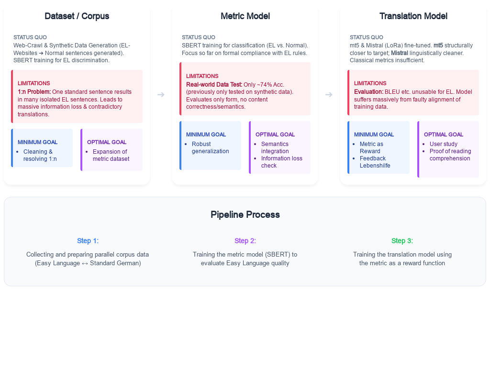
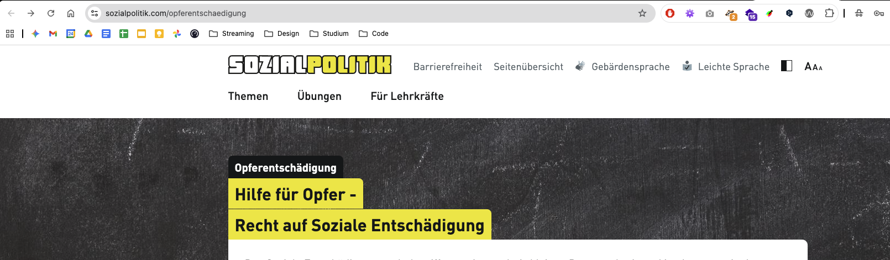
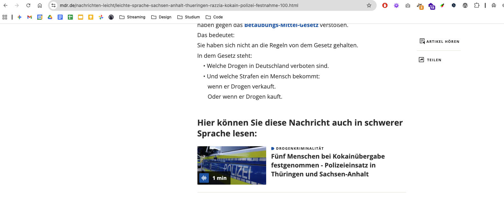
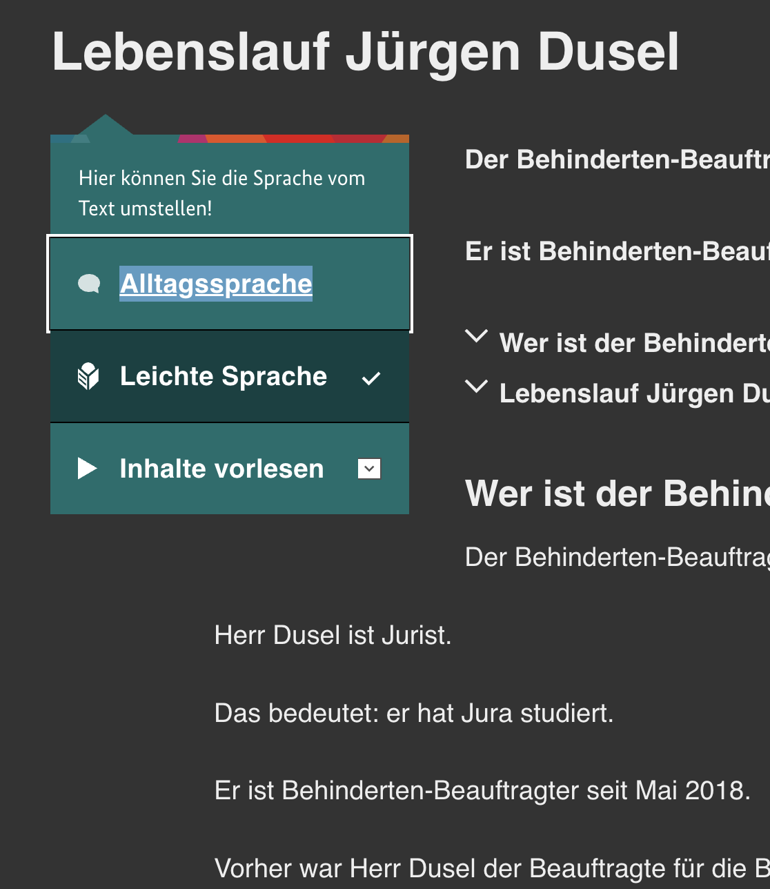

<!-- _class: title -->

# Master Thesis 

Fiete Scheel

---

### Automated Translation into Simple German 

Language as a barrier:  Complex texts exclude people from information and social participation.

High effort:  To date, the creation of simple german texts has been almost exclusively manual and time-consuming.

Research gap:

Lack of robust, data-driven methods for distinguishing between standard and simple language in German.

Lack of automated metrics  for the qualitative assessment of simplifications.

---

<!-- _class: image-caption -->

### Components of this work



---
<!-- _class: section-header -->

## Week 1 

---

### Data Research

Problem:

It is often very difficult to find exact parallel texts (such as news articles or blog posts) on the internet that are written in standard language (or "complex language") and simple language, and that can be systematically matched with one another.

---

### sozialpolitik.com  (Sloution with URL) 

Here, the blog posts have the same title in both language versions. 

The "Easy Language" version is easy to identify and access, as the URL simply has the  prefix  "ls-" added to the beginning. 

While the URLs for the blog posts differ, there is a  button  on each page that allows you to  switch between "Easy Language" and "Standard Language."

---

<!-- _class: image-caption -->

### sozialpolitik.com  (normal german)



---

<!-- _class: image-caption -->

### sozialpolitik.com  (simple german)


---

### mdr.de 

At Mitteldeutscher Rundfunk, the links aren't embedded in the URL, but the user guidance within the text is excellent. 

Below every article in Easy Language, there is a  direct link  to its counterpart in standard language and  vice versa.  

Not every article in standard language is translated into Easy Language, but  every article in Easy Language is translated into standard language  (as verified by random sampling).

---

<!-- _class: image-caption -->

### mdr.de  (normal german)


---

<!-- _class: image-caption -->

### mdr.de  (simple german)



---

### tagesschau.de 

Unfortunately, Tagesschau stands out negatively when it comes to integrating standard and simplified language, as it lacks a user-friendly and systematic structure:

-  Lack of links:  There is no button or direct link within the articles to easily switch back and forth between the different language levels.

-  Inconsistent URL structure:  While the basic structure of the URLs appears well-thought-out, in practice the articles are named inconsistently. There is no reliable pattern (such as a fixed prefix), making a systematic or even automated mapping of the texts impossible.

-  High manual effort:  To find parallel texts, the only option is a time-consuming manual search for the semantically matching counterpart.

-  Significant reduction in content:  Even if you have found the corresponding pair of articles, a direct text comparison is difficult because the version in Easy Language has been drastically shortened and greatly simplified in terms of content.

---

### Next Steps 

Researching additional sources:  Searching for other news portals or official government websites (e.g., bpb.de) that systematically provide LS texts.

Quantification of sources:  Determining the approximate number of available article pairs on  mdr.de  and  sozialpolitik.com .

\_\_\_\_\_\_\_\_

Scraper development:  Creating a prototype for the automated extraction of articles from sozialpolitik.com (using URL logic).

MDR crawler:  Investigation into whether the links between LS and standard language on mdr.de can be systematically crawled.

Matching strategy for Tagesschau:  Evaluation of whether semantic similarity analyses (e.g., via embeddings) can be used to automatically establish the missing links in Tagesschau.

---
<!-- _class: section-header -->

## Week 2-3 

---

### Evaluation of institutional and governmental websites. 

Observations:  Significant availability of \"Easy Language\" (Leichte Sprache) sections, but alignment Issue.

Alignment Issue:  Most institutional pages provide summaries or simplified overviews rather than 1:1 translations of standard articles.

Terminological Inconsistency:  Frequent overlap and confusion between \"Plain Language\" (Einfache Sprache) and \"Easy Language.\"

---

### Saarländischer Rundfunk (SR) 

Problem:  Standard language content is often video/audio (broadcast format), while the Easy Language version is a brief text summary.

Impact:  Automated 1:1 alignment is difficult due to the format mismatch.

Technical Workaround:  Using metadata (Open Graph/OG-Images) to verify if two different formats refer to the same news event + Date of Publishment

---

### Media Portals with High Alignment Potential 

MDR (Mitteldeutscher Rundfunk):  High suitability for scraping due to clear XML sitemaps and explicit \"linking mechanisms\" in the HTML structure.

taz:  Alignment is present but less systematic; links are often embedded manually in italicized paragraphs at the end of articles with word  "hier" .

Conclusion:  Media portals show significantly higher potential for 1:1 alignment than administrative/government portals.

---
<!-- _class: split -->

### Terminological Anchors: Dictionaries 

<div class="column-left">


</div>

<div class="column-right">

Objective: Establishing a "Ground Truth" for specific terminology.

Resources Analyzed: 

- **Hurraki**: A specialized Wiki for Easy Language.
- **Nachrichtenleicht**: A dictionary section providing definitions for complex terms.

Benefit: These provide direct 1:1 word/phrase mappings, essential for terminological consistency.


</div>

---

### Literature Review: Existing Corpora (Status 2023) 

Analysis of Klaper et al. (2013)

Pros:  High-quality 1:1 alignment; approx. 70,000 tokens.

Cons:  \"Source decay\"---many URLs from 2013 are no longer active.

Next Step:  Evaluating the reconstruction of this corpus using the Wayback Machine (Internet Archive).

---

### Literature Review: Existing Corpora (Status 2023) 

---

A New Aligned Simple German Corpus (ACL 2023)

Analysis:  Investigating provided crawler scripts and alignment logic.

Key Insight:  The project moves away from generic scraping toward source-specific extraction heuristics to ensure high-quality sentence alignment.

---

<!-- _class: split -->

<div class="column-left">

### Extraction Strategies

**Apotheken Umschau:**  Targeting specific link titles `title="hier"` for back-references.

**Behindertenbeauftragter:**  Identifying language switches via CSS class patterns `.c-language-switch`.

**Sozialpolitik.com:**  Filtering for links with the class `underline easy` and specific `hreflang` attributes.

```html
<a href="/es/die-arbeits-welt" 
   hreflang="de-DE" 
   class="underline easy">
   Leichte Sprache
</a>
```

</div>

<div class="column-right">



</div>

---

### Extraction Strategies

Brand Eins:  Unique case where both languages exist on the same URL; differentiation achieved through CSS color coding (Red text = Easy Language).

Stadt Köln:  Using exact string matching for navigational links (\"Diese Seite in Alltags-Sprache lesen\").

Summary:  Technical research confirms a \"one-size-fits-all\" scraper is ineffective; custom logic for each domain is required.

---

### Conclusion & Next Steps 

Current Activity:  Development of a quantification script to scan identified sources and calculate current token counts.

Pipeline Integration:  These counting scripts serve as \"pre-scrapers\" to validate data density before full extraction.

Literature & Expansion:  Systematic review of remaining papers from the \"Existing Corpora (Status 2023)\" list.

Identification  of additional  sources  and site-specific  scraping  mechanisms.

Goal:  Adaptation of the Toborek et al. crawler logic to the newly identified structures (MDR, taz, etc.).

---
<!-- _class: section-header -->

## Week 4 

---

### Initial Scraping for Token Count 

Goal:  Create a diverse, multi-domain corpus exceeding current benchmarks in quality and thematic breadth.

The Pipeline:

Discovery:  Crawling target websites for \"Simple Language\" (LS) sections.

Alignment:  Matching LS articles to their \"Standard Language\" (AS) originals.

Extraction:  Pulling raw content for initial analysis.

Target Scope:  News, Health, Administration, Social Policy, and Economy.

---

### Results: Media & News 

MDR  (Mitteldeutscher Rundfunk):

298 LS articles scanned → 242 successfully aligned.

Largest news source in the corpus (\~300k tokens total).

taz  (die tageszeitung):

Small but high-quality subset (7 pairs aligned).

Challenge: One LS text often summarizes multiple AS articles.

Brand Eins :

90 articles scanned → 34 pairs aligned.

Focus on economic and social narratives.

---

### Results: Public Sector & Administration 

Hamburg.de:

156 articles scanned → 155 initial pairs.

Broad coverage of city services and regulations.

Stadt Köln :

95 articles scanned → 57 pairs aligned.

Historical data recovered from archives.

Behindertenbeauftragter:

95 articles scanned → 73 pairs aligned.

Policy-focused content with technical terminology.

---

### Results: Specialized Topics 

Apotheken Umschau  (Health/Medical):

484 articles scanned → 161 pairs aligned.

Critical source for medical term simplification.

Sozialpolitik.com :

22 articles → 22 pairs (100% success rate).

Educational content on the German social system.

Lebenshilfe Main-Taunus :

59 articles scanned → 46 pairs aligned.

Community-level communication and event reporting.

---

### Global Scraping Statistics 

---

Metric                       Result
  ---------------------------- ----------
  Total Scanned LS Articles    1,347
  Successfully Aligned Pairs   797
  T otal Tokens (Simple)       411,540
  Total Tokens (Standard)      676,903
  Average Success Rate         \~59%
  Length Ratio (AS:LS)         1.65 : 1

Tokens: words and punctuation

### Findings & Lessons Learned 

Content Divergence:  Standard articles are significantly longer, suggesting that simplification involves heavy summarization, not just sentence splitting.

Alignment Gaps:  41% of simple language articles lack a direct 1:1 standard counterpart on the same site.

Scale:  With 797 pairs, the new corpus is already larger than most existing document-aligned German datasets.

---
<!-- _class: section-header -->

## Week 5 

---

### Focus: From Quantity to Quality 

The Noise Problem:  Raw scraping produced significant \"boilerplate\" (menus, ads, legal footers).

Implement source-specific minimal scripts to ensure that the tokens in the dataset are strictly editorial content (not menus, ads etc.).

---

### Case Study: Apotheken Umschau 

Issue:  Figcaptions (\"The image shows\...\"), internal table of contents (TOC), and \"Sign up now\" banners were polluting the text.

Solution:

Decomposition:  Stripped \<figcaption\>, \<figure\>, and .copyright elements.

TOC Filter:  Identified and removed \<ul\> blocks containing only internal anchor links.

Blacklist:  Regex filters for \"Das Bild zeigt\" and registration prompts. (extend in future)

---

### Case Study: Brand Eins 

Issue:  AS and LS content lived in the same HTML blocks; simple paragraph splitting failed due to irregular formatting.

Solution:

Deep-Color Inspection:  Scraper now analyzes inline CSS for the red color codes (#ff0000) used by Brand Eins to highlight simple language.

Tag-Based Extraction:  Using \<strong\> and span-styles as semantic markers for language levels rather than just structure.

---

### Case Study: Hamburg.de 

Issue:  Many articles were machine-translated (MT), marked by a \"Computer has translated this\" disclaimer. These are unsuitable for a gold-standard corpus.

Solution:

MT-Detection:  Automated scanning for MT-disclaimers; immediate exclusion of affected pairs.

Precision Alignment:  Restricted search for AS-links to the official .km1-language-bar, reducing \"Ghost Alignments\" from 155 down to 57 high-quality pairs.

---

### Case Study: MDR 

Issue:  \"The Echo Effect\" --- Nested \<div\> and \<p\> tags caused the same text to be extracted twice.

Solution:

Parent-Check Algorithm:  Elements are only extracted if none of their ancestors are already in the extraction list.

Idea: Length-Ratio Filter:  Pairs with a ratio \> 5.0 (e.g., a Live-Ticker vs. a short summary) are automatically discarded as \"Unbalanced.\"

---

### Case Study: Archival Sources 

Cities of Cologne & Main-Taunus:

Encoding Issues:  Resolved \"Umlaut\" errors (e.g., können) by forcing response.apparent_encoding.

Redundancy:  Content hashing introduced to prevent duplicate articles caused by multiple URL parameters (m-20, m-79) pointing to the same archive snapshot.

Truncation:  Automatically cutting off repetitive contact blocks (\"Ansprechpartner:\", \"Telefon:\").

---

### Automated Data Cleaning Pipeline 

HTML De-cluttering:  Remove non-article tags (nav, aside, footer).

Structural Extraction:  Map headers, lists, and paragraphs with proper spacing (\\n).

Regex Filtering:  Strip author credits, donation calls (taz), and radio-station promos (MDR).

Identity Filter:  Compare LS and AS strings; discard pairs where the content is identical (common in news sites).

Deduplication:  Hash-based check for uniqueness across the entire corpus.

---

### Resulting Quality Improvement 

Cleaner Data:  Average noise reduction of 15-20% per article.

Better Alignment:  Improved thematic coherence by filtering out \"Hub-pages\" and \"Tag-overviews.\"

Final Count:  A refined, manually verified collection of \~600-700 high-quality pairs (post-filtering).

---

### Slide 40

---

Source                    LS Tokens   AS Tokens   Total
  ------------------------- ----------- ----------- ---------
  apotheken                 147,539     249,790     397,329
  behindertenbeauftragter   27,822      34,113      61,935
  brandeins                 7,275       7,423       14,698
  hamburg                   44,358      40,063      84,421
  koeln                     40,868      24,182      65,050
  main_taunus               7,289       6,715       14,004
  mdr                       70,761      100,608     171,369
  sozialpolitik             6,654       14,651      21,305
  taz                       4,589       8,027       12,616
  TOTAL                     357,155     485,572     842,727

Summary of tokens (words and punctuation)

### Next Steps 

Apotheken Umschau:  Investigation into why so few URLs from this source could be successfully aligned (root cause analysis for low alignment rate).

Length Ratios:  Analysis of discrepancies between Plain Language (PL) and Everyday Language (EL) across various sources. Why do some sources systematically have more PL tokens than EL tokens, and others the reverse?

Historical data acquisition:  Evaluation of the Wayback Machine to achieve broader coverage of articles from different time periods (past and present) and thus expand the corpus.

Template Script:  Because of redundant code, build a template script with core functionalities

---
<!-- _class: section-header -->

## Week 6

---

## Weekly Focus: City and State Portals

*   **Strategy:** Systematic review of states and state capital portals (Stuttgart, Wiesbaden, Hannover).
*   **Findings:**
    *   High variance in the implementation of legal accessibility requirements.
    *   Hannover identified as the absolute "top performer".
    * All sites have the same entrypoint page for "Leichte Sprache"

---

## Legal Obligations

Why do many government sites offer so little parallel data?

1.  **BITV 2.0 Minimum Solution:** The law only requires LS for:
    *   Essential tasks (homepage)
    *   Navigation & Accessibility statements
2.  **No Full-Text Obligation:** News or technical articles do not legally have to be translated.

---

## Case Study: Hannover.de (The Gold Standard)

*   **Scale:** Over 800 article pairs – the largest single source in the corpus.
*   **Technical Features:**
    *   **Alignment:** URL logic - the AS version is primarily derived by removing the query parameter `?sp:out=easy` (or `?sp%3Aout=easy`) from the LS URL.
    *   **Quality:** High coherence between Easy-to-Read (LS) and Standard Language (AS).

---

## Technical Challenges: Surgical Cleaning

**Problem:** Standard extraction yields 10-20% boilerplate noise.
*   *UI Fragments:* "Print page", "In sign language", "Send email".
*   *Navigation:* "Back to overview", "Related topics".

**Solution:**
*   Implementation of CSS blacklists (decomposition of containers like `.SP-Tools`, `.header-ls`).
*   Regex-based filtering of repetitive standard sentences.
*   **Result:** Significant increase in token precision and cleaner vocabulary statistics.

---


## Problem: Wiesbaden Alignment

**Insight:** Technical alignment does not equal semantic alignment.
*   **Symptom:** URL parameters suggest a translation, but content varies significantly.
*   **Examples:**
    *   AS: History of the city forest vs. LS: General forest rules.
    *   AS: Press release on a poster campaign vs. LS: Explanation of "Smart City".
*   **Action:** Introduction of a manual audit step before the model training phase. Wiesbaden data may be excluded.

---

## Current Status (Metrics)

| Source | Pairs | Words (LS) | Words (AS) | Tokens (LS) | Tokens (AS) |
| :--- | :---: | :---: | :---: | :---: | :---: |
| **(...)** | 189 | 72,816 | 79,585 | 135,484 | 168,489 |
| MDR (prev.) | 235 | 53,869 | 83,487 | 98,780 | 173,765 |
| Apotheken (prev.) | 161 | 123,505 | 205,063 | 241,325 | 451,812 |
| Hamburg (prev.) | 57 | 34,124 | 33,688 | 61,455 | 73,137 |
| **Week 06 Additions** | | | | | |
| **Hannover** | 808 | 458,621 | 405,321 | 872,291 | 871,830 |
| **Stuttgart** | 42 | 23,653 | 46,060 | 45,202 | 106,629 |
| **Wiesbaden** | 41 | 7,138 | 10,127 | 13,808 | 23,332 |
| **Total** | **1,533** | **773,726** | **863,331** | **1,468,345** | **1,868,994** |

<div class="footnote"><i>Tokens counted using the tiktoken tokenizer library (<code>cl100k_base</code>).</i></div>

---

## Next Steps

1.  **Finalize Extraction:** Complete final sources.
2.  **(Ongoing):** Find more sources systematic.
3.  **Train first model:** Train first model to see some first results.
**Stuttgart** | 42 | 23,653 | 46,060 | 45,202 | 106,629 |
| **Wiesbaden** | 41 | 7,138 | 10,127 | 13,808 | 23,332 |
| **Total** | **1,533** | **773,726** | **863,331** | **1,468,345** | **1,868,994** |

<div class="footnote"><i>Tokens counted using the tiktoken tokenizer library (<code>cl100k_base</code>).</i></div>

---

## Next Steps

1.  **Finalize Extraction:** Complete final sources.
2.  **(Ongoing):** Find more sources systematic.
3.  **Train first model:** Train first model to see some first results.
