<!-- _class: title -->

# Master Thesis

Fiete Scheel

---

### Automated Translation into Simple German

**Language as a barrier:** Complex texts exclude people from information and social participation.

**High effort:** To date, the creation of simple german texts has been almost exclusively manual and time-consuming.

**Research gap:**

Lack of robust, data-driven methods for distinguishing between standard and simple language in German.

**Lack of automated metrics** for the qualitative assessment of simplifications.

---

<!-- _class: image-caption -->

### Components of this work

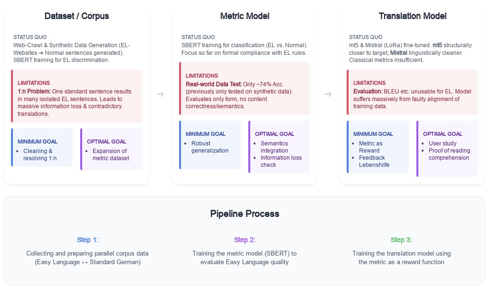

---

<!-- _class: section-header -->

## Week 1

---

### Data Research

**Problem:**

It is often very difficult to find exact parallel texts (such as news articles or blog posts) on the internet that are written in standard language (or "complex language") and simple language, and that can be systematically matched with one another.

---

### sozialpolitik.com (Sloution with URL)

Here, the blog posts have the same title in both language versions.

The "Easy Language" version is easy to identify and access, as the URL simply has the **prefix** "ls-" added to the beginning.

While the URLs for the blog posts differ, there is a **button** on each page that allows you to **switch between "Easy Language" and "Standard Language."**

---

<!-- _class: image-caption -->

### sozialpolitik.com (normal german)


---

<!-- _class: image-caption -->

### sozialpolitik.com (simple german)

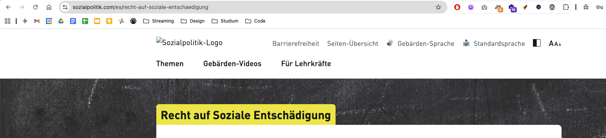

---

### mdr.de

At Mitteldeutscher Rundfunk, the links aren't embedded in the URL, but the user guidance within the text is excellent.

Below every article in Easy Language, there is a **direct link** to its counterpart in standard language and **vice versa**.

Not every article in standard language is translated into Easy Language, but **every article in Easy Language is translated into standard language** (as verified by random sampling).

---

<!-- _class: image-caption -->

### mdr.de (normal german)

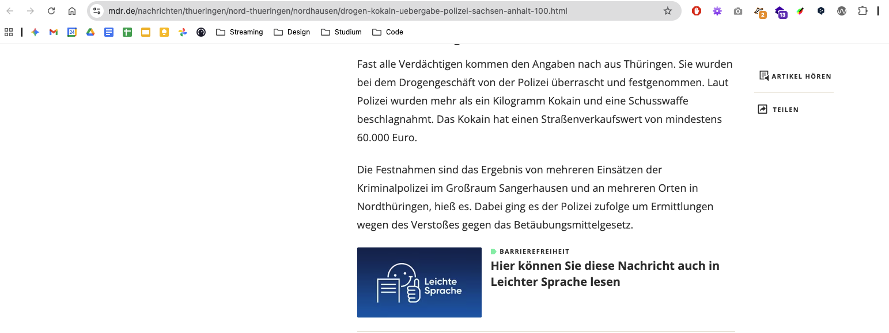

---

<!-- _class: image-caption -->

### mdr.de (simple german)


---

### tagesschau.de

Unfortunately, Tagesschau stands out negatively when it comes to integrating standard and simplified language, as it lacks a user-friendly and systematic structure:

- **Lack of links:** There is no button or direct link within the articles to easily switch back and forth between the different language levels.

- **Inconsistent URL structure:** While the basic structure of the URLs appears well-thought-out, in practice the articles are named inconsistently. There is no reliable pattern (such as a fixed prefix), making a systematic or even automated mapping of the texts impossible.

- **High manual effort:** To find parallel texts, the only option is a time-consuming manual search for the semantically matching counterpart.

- **Significant reduction in content:** Even if you have found the corresponding pair of articles, a direct text comparison is difficult because the version in Easy Language has been drastically shortened and greatly simplified in terms of content.

---

### Next Steps

**Researching additional sources:** Searching for other news portals or official government websites (e.g., bpb.de) that systematically provide LS texts.

**Quantification of sources:** Determining the approximate number of available article pairs on mdr.de and sozialpolitik.com .

\_\_\_\_\_\_\_\_

**Scraper development:** Creating a prototype for the automated extraction of articles from sozialpolitik.com (using URL logic).

**MDR crawler:** Investigation into whether the links between LS and standard language on mdr.de can be systematically crawled.

**Matching strategy for Tagesschau:** Evaluation of whether semantic similarity analyses (e.g., via embeddings) can be used to automatically establish the missing links in Tagesschau.

---

<!-- _class: section-header -->

## Week 2-3

---

### Evaluation of institutional and governmental websites.

**Observations:** Significant availability of \"Easy Language\" (Leichte Sprache) sections, but alignment Issue.

**Alignment Issue:** Most institutional pages provide summaries or simplified overviews rather than 1:1 translations of standard articles.

**Terminological Inconsistency:** Frequent overlap and confusion between \"Plain Language\" (Einfache Sprache) and \"Easy Language.\"

---

### Saarländischer Rundfunk (SR)

**Problem:** Standard language content is often video/audio (broadcast format), while the Easy Language version is a brief text summary.

**Impact:** Automated 1:1 alignment is difficult due to the format mismatch.

**Technical Workaround:** Using metadata (Open Graph/OG-Images) to verify if two different formats refer to the same news event + Date of Publishment

---

### Media Portals with High Alignment Potential

**MDR (Mitteldeutscher Rundfunk):** High suitability for scraping due to clear XML sitemaps and explicit \"linking mechanisms\" in the HTML structure.

**taz:** Alignment is present but less systematic; links are often embedded manually in italicized paragraphs at the end of articles with word "hier" .

**Conclusion:** Media portals show significantly higher potential for 1:1 alignment than administrative/government portals.

---

<!-- _class: split -->

### Terminological Anchors: Dictionaries

<div class="column-left">

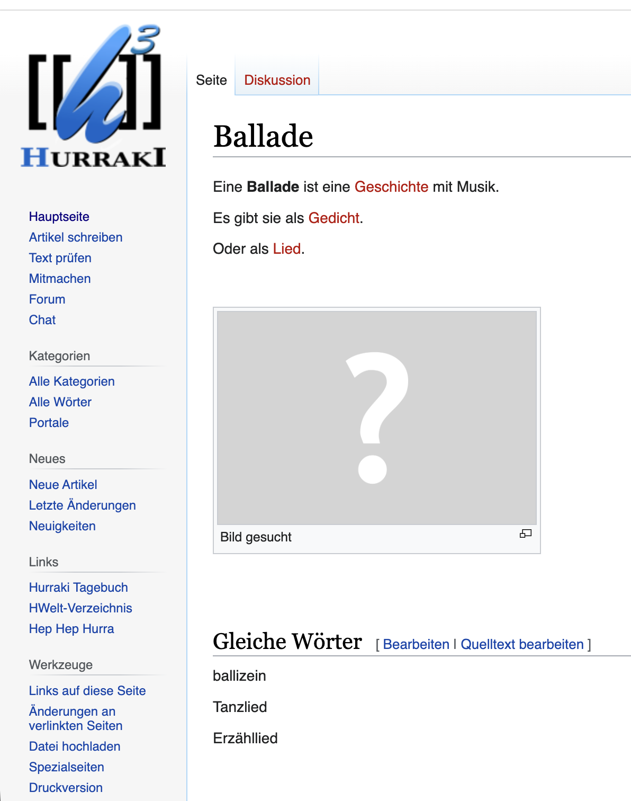

</div>

<div class="column-right">

**Objective:** Establishing a "Ground Truth" for specific terminology.

Resources Analyzed:

- **Hurraki**: A specialized Wiki for Easy Language.
- **Nachrichtenleicht**: A dictionary section providing definitions for complex terms.

**Benefit:** These provide direct 1:1 word/phrase mappings, essential for terminological consistency.

</div>

---

### Literature Review: Existing Corpora (Status 2023)

**Analysis of Klaper et al. (2013)**

**Pros:** High-quality 1:1 alignment; approx. 70,000 tokens.

**Cons:** \"Source decay\"---many URLs from 2013 are no longer active.

**Next Step:** Evaluating the reconstruction of this corpus using the Wayback Machine (Internet Archive).

---

### Literature Review: Existing Corpora (Status 2023)

**A New Aligned Simple German Corpus (ACL 2023)**

**Analysis:** Investigating provided crawler scripts and alignment logic.

**Key Insight:** The project moves away from generic scraping toward source-specific extraction heuristics to ensure high-quality sentence alignment.

---

<!-- _class: split -->

<div class="column-left">

### Extraction Strategies

**Apotheken Umschau:** Targeting specific link titles `title="hier"` for back-references.

**Behindertenbeauftragter:** Identifying language switches via CSS class patterns `.c-language-switch`.

**Sozialpolitik.com:** Filtering for links with the class `underline easy` and specific `hreflang` attributes.

```html
<a href="/es/die-arbeits-welt" hreflang="de-DE" class="underline easy">
  Leichte Sprache
</a>
```

</div>

<div class="column-right">


</div>

---

### Extraction Strategies

**Brand Eins:** Unique case where both languages exist on the same URL; differentiation achieved through CSS color coding (Red text = Easy Language).

**Stadt Köln:** Using exact string matching for navigational links (\"Diese Seite in Alltags-Sprache lesen\").

**Summary:** Technical research confirms a \"one-size-fits-all\" scraper is ineffective; custom logic for each domain is required.

---

### Conclusion & Next Steps

**Current Activity:** Development of a quantification script to scan identified sources and calculate current token counts.

**Pipeline Integration:** These counting scripts serve as \"pre-scrapers\" to validate data density before full extraction.

**Literature & Expansion:** Systematic review of remaining papers from the \"Existing Corpora (Status 2023)\" list.

Identification of additional sources and site-specific scraping mechanisms.

**Goal:** Adaptation of the Toborek et al. crawler logic to the newly identified structures (MDR, taz, etc.).

---

<!-- _class: section-header -->

## Week 4

---

### Initial Scraping for Token Count

**Goal:** Create a diverse, multi-domain corpus exceeding current benchmarks in quality and thematic breadth.

**The Pipeline:**

**Discovery:** Crawling target websites for \"Simple Language\" (LS) sections.

**Alignment:** Matching LS articles to their \"Standard Language\" (AS) originals.

**Extraction:** Pulling raw content for initial analysis.

**Target Scope:** News, Health, Administration, Social Policy, and Economy.

---

### Results: Media & News

**MDR** (Mitteldeutscher Rundfunk):

298 LS articles scanned → 242 successfully aligned.

Largest news source in the corpus (\~300k tokens total).

**taz** (die tageszeitung):

Small but high-quality subset (7 pairs aligned).

Challenge: One LS text often summarizes multiple AS articles.

**Brand Eins:**

90 articles scanned → 34 pairs aligned.

Focus on economic and social narratives.

---

### Results: Public Sector & Administration

**Hamburg.de:**

156 articles scanned → 155 initial pairs.

Broad coverage of city services and regulations.

**Stadt Köln:**

95 articles scanned → 57 pairs aligned.

Historical data recovered from archives.

**Behindertenbeauftragter:**

95 articles scanned → 73 pairs aligned.

Policy-focused content with technical terminology.

---

### Results: Specialized Topics

**Apotheken Umschau** (Health/Medical):

484 articles scanned → 161 pairs aligned.

Critical source for medical term simplification.

**Sozialpolitik.com:**

22 articles → 22 pairs (100% success rate).

Educational content on the German social system.

**Lebenshilfe Main-Taunus:**

59 articles scanned → 46 pairs aligned.

Community-level communication and event reporting.

---

### Global Scraping Statistics

| Metric                     | Result   |
| -------------------------- | -------- |
| Total Scanned LS Articles  | 1,347    |
| Successfully Aligned Pairs | 797      |
| Total Tokens (Simple)      | 411,540  |
| Total Tokens (Standard)    | 676,903  |
| Average Success Rate       | ~59%     |
| Length Ratio (AS:LS)       | 1.65 : 1 |

Tokens: words and punctuation

---

### Findings & Lessons Learned

**Content Divergence:** Standard articles are significantly longer, suggesting that simplification involves heavy summarization, not just sentence splitting.

**Alignment Gaps:** 41% of simple language articles lack a direct 1:1 standard counterpart on the same site.

**Scale:** With 797 pairs, the new corpus is already larger than most existing document-aligned German datasets.

---

<!-- _class: section-header -->

## Week 5

---

### Focus: From Quantity to Quality

**The Noise Problem:** Raw scraping produced significant \"boilerplate\" (menus, ads, legal footers).

Implement source-specific minimal scripts to ensure that the tokens in the dataset are strictly editorial content (not menus, ads etc.).

---

### Case Study: Apotheken Umschau

**Issue:** Figcaptions (\"The image shows\...\"), internal table of contents (TOC), and \"Sign up now\" banners were polluting the text.

**Solution:**

**Decomposition:** Stripped \<figcaption\>, \<figure\>, and .copyright elements.

**TOC Filter:** Identified and removed \<ul\> blocks containing only internal anchor links.

**Blacklist:** Regex filters for \"Das Bild zeigt\" and registration prompts. (extend in future)

---

### Case Study: Brand Eins

**Issue:** AS and LS content lived in the same HTML blocks; simple paragraph splitting failed due to irregular formatting.

**Solution:**

**Deep-Color Inspection:** Scraper now analyzes inline CSS for the red color codes (#ff0000) used by Brand Eins to highlight simple language.

**Tag-Based Extraction:** Using \<strong\> and span-styles as semantic markers for language levels rather than just structure.

---

### Case Study: Hamburg.de

**Issue:** Many articles were machine-translated (MT), marked by a \"Computer has translated this\" disclaimer. These are unsuitable for a gold-standard corpus.

**Solution:**

**MT-Detection:** Automated scanning for MT-disclaimers; immediate exclusion of affected pairs.

**Precision Alignment:** Restricted search for AS-links to the official .km1-language-bar, reducing \"Ghost Alignments\" from 155 down to 57 high-quality pairs.

---

### Case Study: MDR

**Issue:** \"The Echo Effect\" - Nested `<div\>` and `<p\>` tags caused the same text to be extracted twice.

**Solution:**

**Parent-Check Algorithm:** Elements are only extracted if none of their ancestors are already in the extraction list.

**Idea: Length-Ratio Filter:** Pairs with a ratio \> 5.0 (e.g., a Live-Ticker vs. a short summary) are automatically discarded as \"Unbalanced.\"

---

### Case Study: Archival Sources

**Cities of Cologne & Main-Taunus:**

**Encoding Issues:** Resolved \"Umlaut\" errors (e.g., können) by forcing response.apparent_encoding.

**Redundancy:** Content hashing introduced to prevent duplicate articles caused by multiple URL parameters (m-20, m-79) pointing to the same archive snapshot.

**Truncation:** Automatically cutting off repetitive contact blocks (\"Ansprechpartner:\", \"Telefon:\").

---

### Automated Data Cleaning Pipeline

**HTML De-cluttering:** Remove non-article tags (nav, aside, footer).

**Structural Extraction:** Map headers, lists, and paragraphs with proper spacing (\\n).

**Regex Filtering:** Strip author credits, donation calls (taz), and radio-station promos (MDR).

**Identity Filter:** Compare LS and AS strings; discard pairs where the content is identical (common in news sites).

**Deduplication:** Hash-based check for uniqueness across the entire corpus.

---

### Resulting Quality Improvement

**Cleaner Data:** Average noise reduction of 15-20% per article.

**Better Alignment:** Improved thematic coherence by filtering out \"Hub-pages\" and \"Tag-overviews.\"

**Final Count:** A refined, manually verified collection of \~600-700 high-quality pairs (post-filtering).

---

### Zwischenergebnis Corpus

| Source                  | LS Tokens   | AS Tokens   | Total       |
| ----------------------- | ----------- | ----------- | ----------- |
| apotheken               | 147,539     | 249,790     | 397,329     |
| behindertenbeauftragter | 27,822      | 34,113      | 61,935      |
| brandeins               | 7,275       | 7,423       | 14,698      |
| hamburg                 | 44,358      | 40,063      | 84,421      |
| koeln                   | 40,868      | 24,182      | 65,050      |
| main_taunus             | 7,289       | 6,715       | 14,004      |
| mdr                     | 70,761      | 100,608     | 171,369     |
| sozialpolitik           | 6,654       | 14,651      | 21,305      |
| taz                     | 4,589       | 8,027       | 12,616      |
| **TOTAL**               | **357,155** | **485,572** | **842,727** |

<p class="hint">Summary of tokens (words and punctuation)</p>

---

### Next Steps

**Apotheken Umschau:** Investigation into why so few URLs from this source could be successfully aligned (root cause analysis for low alignment rate).

**Length Ratios:** Analysis of discrepancies between Plain Language (PL) and Everyday Language (EL) across various sources. Why do some sources systematically have more PL tokens than EL tokens, and others the reverse?

**Historical data acquisition:** Evaluation of the Wayback Machine to achieve broader coverage of articles from different time periods (past and present) and thus expand the corpus.

**Template Script:** Because of redundant code, build a template script with core functionalities

---

<!-- _class: section-header -->

## Week 6

---

## Weekly Focus: City and State Portals

- **Strategy:** Systematic review of states and state capital portals (Stuttgart, Wiesbaden, Hannover).
- **Findings:**
  - High variance in the implementation of legal accessibility requirements.
  - Hannover identified as the absolute "top performer".
  - All sites have the same entrypoint page for "Leichte Sprache"

---

## Legal Obligations

Why do many government sites offer so little parallel data?

1.  **BITV 2.0 Minimum Solution:** The law only requires LS for:
    - Essential tasks (homepage)
    - Navigation & Accessibility statements
2.  **No Full-Text Obligation:** News or technical articles do not legally have to be translated.

---

## Case Study: Hannover.de (The Gold Standard)

- **Scale:** Over 800 article pairs – the largest single source in the corpus.
- **Technical Features:**
  - **Alignment:** URL logic - the AS version is primarily derived by removing the query parameter `?sp:out=easy` (or `?sp%3Aout=easy`) from the LS URL.
  - **Quality:** High coherence between Easy-to-Read (LS) and Standard Language (AS).

---

## Technical Challenges: Surgical Cleaning

**Problem:** Standard extraction yields 10-20% boilerplate noise.

- _UI Fragments:_ "Print page", "In sign language", "Send email".
- _Navigation:_ "Back to overview", "Related topics".

**Solution:**

- Implementation of CSS blacklists (decomposition of containers like `.SP-Tools`, `.header-ls`).
- Regex-based filtering of repetitive standard sentences.
- **Result:** Significant increase in token precision and cleaner vocabulary statistics.

---

## Problem: Wiesbaden Alignment

**Insight:** Technical alignment does not equal semantic alignment.

- **Symptom:** URL parameters suggest a translation, but content varies significantly.
- **Examples:**
  - AS: History of the city forest vs. LS: General forest rules.
  - AS: Press release on a poster campaign vs. LS: Explanation of "Smart City".
- **Action:** Introduction of a manual audit step before the model training phase. Wiesbaden data may be excluded.

---

### Current Status (Metrics)

| Source                |   Pairs   | Words (LS)  | Words (AS)  |  Tokens (LS)  |  Tokens (AS)  |
| :-------------------- | :-------: | :---------: | :---------: | :-----------: | :-----------: |
| **(...)**             |    189    |   72,816    |   79,585    |    135,484    |    168,489    |
| MDR (prev.)           |    235    |   53,869    |   83,487    |    98,780     |    173,765    |
| Apotheken (prev.)     |    161    |   123,505   |   205,063   |    241,325    |    451,812    |
| Hamburg (prev.)       |    57     |   34,124    |   33,688    |    61,455     |    73,137     |
| **Week 06 Additions** |           |             |             |               |               |
| **Hannover**          |    808    |   458,621   |   405,321   |    872,291    |    871,830    |
| **Stuttgart**         |    42     |   23,653    |   46,060    |    45,202     |    106,629    |
| **Wiesbaden**         |    41     |    7,138    |   10,127    |    13,808     |    23,332     |
| **Total**             | **1,533** | **773,726** | **863,331** | **1,468,345** | **1,868,994** |

<p class="hint">Tokens counted using the <code>tiktoken</code> library with the <code>cl100k_base</code> encoding.</p>

---

## Next Steps

1.  **Finalize Extraction:** Complete final sources.
2.  **(Ongoing):** Find more sources systematically.
3.  **Train first model:** Train first model to see some first results.

---

<!-- _class: section-header -->

## Week 7

---

### Weekly Focus: Measuring Information Loss

- **Hypothesis:** Texts in Easy Language (LS) don't just simplify syntax; they lose significant, concrete information compared to Standard Language (AS), even when they are longer due to explanations.
- **Goal:** Move beyond token counts and develop a multi-dimensional NLP methodology to quantify this information loss.
- **Corpus:** Analysis executed across the entire aligned dataset (1,501 article pairs).

---

### Methodology: Similarity

**1. Semantic Similarity (Embeddings)**

- **Tool:** Sentence-BERT (`paraphrase-multilingual-MiniLM-L12-v2`).
- **How:** Calculate Cosine Similarity from AS and LS texts.
- **Why:** Captures whether the "core message" remains, even if heavily paraphrased.

---

### Methodology

**2. Fact Retention via NER Recall**

- **Tool:** `spaCy` (`de_core_news_lg`).
- **How:** Extract entities (Persons, Locations, Organizations) from AS and check if they survive in LS.
- **Why:** Measures hard information loss. If names and places vanish, factual detail is lost or is being described differently.

**3. Linguistic & Syntactic Metrics**

- **Tool:** `spaCy` POS-Tagging.
- **How:** Analyze Lexical Density, Average Sentence Length, and Part-of-Speech (POS) shifts (e.g., ratio of Adjectives, Conjunctions).
- **Why:** Reveals _how_ the simplification is achieved structurally (e.g., dropping conjunctions implies loss of subordinate clauses / hypotaxis).

<!--

- spaCy bietet mittlerweile auch Modelle an, die auf Transformern (wie RoBERTa) basieren (diese enden dann meistens auf _trf, z.B. de_dep_news_trf)

-->

---

### Key Finding 1: Massive Loss of Factual Entities

**Observation:** Across almost all sources, the **NER Recall is extremely low (Ø ~15-25%)**.

- This means roughly 80% of specific entities (names, locations, dates) mentioned in the Standard Language text do _not_ appear in the Easy Language version.
- **Conclusion:** LS achieves simplification primarily by omitting specific facts and generalizing content, confirming a massive factual information loss.

---

<!-- _class: split -->

### Key Finding 2: Token Expansion vs. Semantic Shift

<div class="column-left">

**Observation:** In some sources like **Hannover** (Ratio: 1.89) and **Köln** (Ratio: 1.83), the LS texts are nearly twice as long as the AS texts.

- _Why?_ Complex terms are replaced with lengthy, multi-sentence explanations.
- _Result:_ Despite being longer, the semantic similarity drops to ~0.70. The text explains more, but delivers less original detail.

</div>

<div class="column-right">

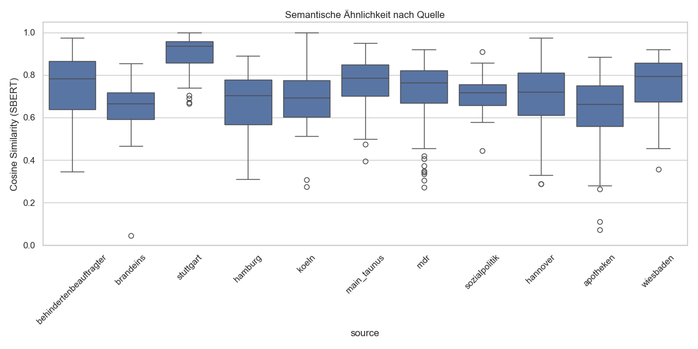

</div>

---

<!-- _class: split -->

### Key Finding 3: Structural Simplification (POS)

<div class="column-left">

**Observation:** Clear shifts in word classes between complex and simple language.

- **Conjunctions & Adjectives:** Significant decrease in **simple** language.
- **Verbs vs. Nouns:** **Simple** language uses more Verbs and fewer Nouns.
- **Stylistic Shift:** This confirms a transition from **complex** to **simple** style, which is easier to process.

</div>

<div class="column-right">

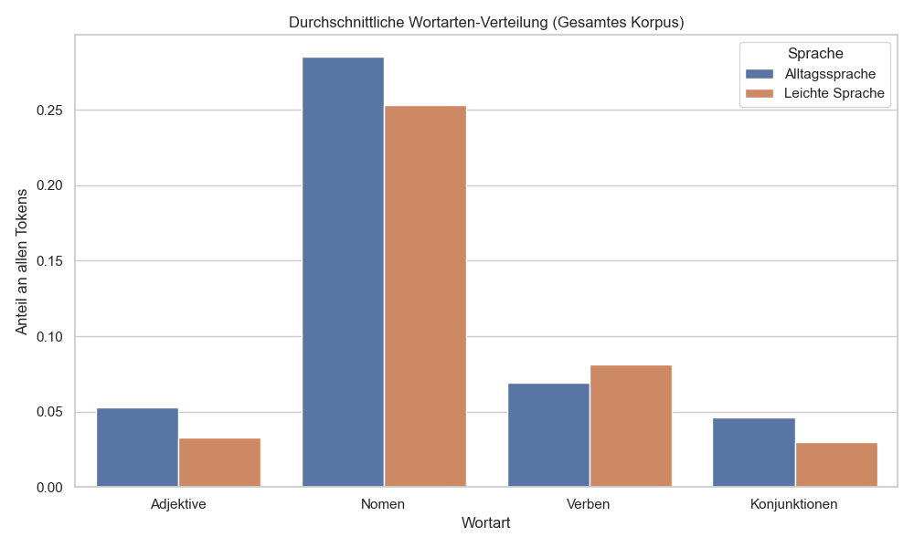

</div>

---

### Summary of Analysis Results

| Source                      | Token Ratio (LS/AS) | NER Recall | Sem. Similarity (SBERT) |
| :-------------------------- | :-----------------: | :--------: | :---------------------: |
| **apotheken**               |        0.98         |    0.09    |          0.64           |
| **behindertenbeauftragter** |        0.91         |    0.30    |          0.75           |
| **hannover**                |      **1.89**       |    0.25    |          0.71           |
| **koeln**                   |        1.83         |    0.20    |          0.68           |
| **mdr**                     |        0.85         |    0.22    |          0.73           |
| **stuttgart**               |        0.97         |    0.24    |        **0.90**         |
| **sozialpolitik**           |        0.46         |    0.10    |          0.71           |

<p class="hint">Extract of the full analysis results across 1,501 pairs.</p>

---

### Mögliche Titelvarianten & Forschungsfokus

1.  **Allgemein & Flexibel:**
    - _Automatisierte Textvereinfachung für Leichte Sprache: Ein Framework zur datengestützten Modellierung und Evaluation_
2.  **Ausgewogen & Methodisch:**
    - _Neuronale Textvereinfachung in Leichte Sprache: Entwicklung domänenspezifischer Datensätze und automatisierter Bewertungsmetriken_
3.  **Spezifisch & Technisch:**
    - _Optimierung der maschinellen Übersetzung in Leichte Sprache: Aufbau eines Gold-Standard-Korpus und Training von Reward-Modellen zur qualitativen Modellsteuerung_

---

<!-- _class: section-header -->

## Week 8

---

### Corpus Analysis

- **Problem:** Initial SBERT analysis (Week 7) was limited to **128 tokens**, resulting in >90% of articles being truncated.
- **Goal:** Increase model coverage and validate if semantic similarity holds across full-length articles.
- **Methodology Update:**
  - Scale up to **512 tokens** (MiniLM limit).
  - Introduction of **Jina Embeddings v2** (8192 tokens) for 100% coverage.
  - **Bidirectional NER:** Analysis of "Faktentreue" (LS -> AS).

---

<!-- _class: image-caption -->

### Article Length Distribution

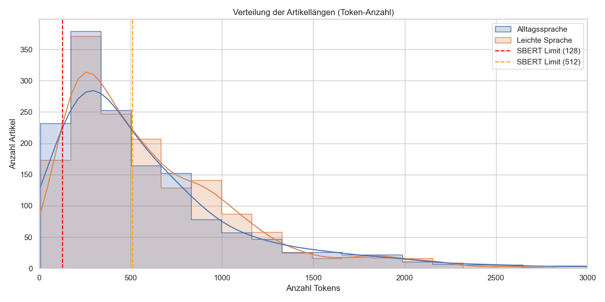

---

### SBERT Limitation & Coverage Analysis

A statistical review of token counts revealed that the 128-token limit was capturing primarily "teasers" or "introductions," which often contain boilerplate or navigation instructions in LS.

| Coverage           | AS (Limit: 128) | LS (Limit: 128) | AS (Limit: 512) | LS (Limit: 512) |
| :----------------- | :-------------: | :-------------: | :-------------: | :-------------: |
| **Fully Captured** |      9.4 %      |      5.1 %      |   **56.9 %**    |   **52.9 %**    |
| **Truncated**      |     90.6 %      |     94.9 %      |   **43.1 %**    |   **47.1 %**    |

**Lesson Learned:** Even at 512 tokens, nearly half of the corpus is cut off. This necessitated the switch to a long-context model (Jina) to ensure total information retention during analysis.

---

### Optimized Analysis: 128 vs. 512 Tokens

Increasing the context window significantly changed the measured similarity for most sources.

| Source            | Sim (128 Tokens) | Sim (512 Tokens) | Difference |
| :---------------- | :--------------: | :--------------: | :--------: |
| **apotheken**     |      0.636       |    **0.894**     |   +0.258   |
| **hamburg**       |      0.665       |    **0.804**     |   +0.139   |
| **koeln**         |      0.684       |    **0.833**     |   +0.149   |
| **sozialpolitik** |      0.706       |    **0.850**     |   +0.144   |
| **wiesbaden**     |    **0.750**     |      0.642       |   -0.108   |

**Interpretation:** For long texts (Apotheken, Köln), similarity rises with context. For others (Wiesbaden), it drops, indicating that while introductions are aligned, the core content diverges significantly.

---

<!-- _class: split -->

### Model Comparison: MiniLM vs. Jina (128 & 512 Tokens)

<div class="column-left">

To ensure the model choice introduces no bias, we compared the original model (`MiniLM`) with the new one (`jina-embeddings-v2-base-de`) at identical limits.

**Conclusion:**

- **Same Trends:** Higher context equals higher similarity in both.
- **Stability:** Jina is more stable with longer texts (e.g., Wiesbaden doesn't drop abruptly). It validates that LS stays semantically close to AS.

</div>

<div class="column-right">

| Source                      | MiniLM (128) | Jina (128) | MiniLM (512) | Jina (512) |
| :-------------------------- | :----------: | :--------: | :----------: | :--------: |
| **apotheken**               |    0.636     |   0.688    |  **0.894**   |   0.800    |
| **behindertenbeauftragter** |    0.746     |   0.756    |    0.761     | **0.793**  |
| **brandeins**               |  **0.637**   |   0.549    |  **0.698**   |   0.599    |
| **hamburg**                 |    0.665     | **0.690**  |  **0.804**   |   0.790    |
| **hannover**                |    0.706     | **0.742**  |    0.776     | **0.807**  |
| **koeln**                   |    0.684     |   0.693    |  **0.833**   |   0.782    |
| **main_taunus**             |    0.762     |   0.763    |    0.727     | **0.794**  |
| **mdr**                     |    0.733     |   0.731    |    0.766     | **0.784**  |
| **sozialpolitik**           |  **0.706**   |   0.694    |  **0.850**   |   0.760    |
| **stuttgart**               |  **0.896**   |   0.884    |    0.856     | **0.884**  |
| **wiesbaden**               |    0.750     |   0.754    |    0.642     | **0.777**  |

</div>

---

### Solving Truncation: The Jina Model (8192 Tokens)

| Source                      | Jina (128 Tokens) | Jina (512 Tokens) | Jina (Full / 8192) |
| :-------------------------- | :---------------: | :---------------: | :----------------: |
| **apotheken**               |       0.688       |       0.800       |     **0.836**      |
| **behindertenbeauftragter** |       0.756       |       0.793       |     **0.804**      |
| **hannover**                |       0.742       |       0.807       |     **0.828**      |
| **koeln**                   |       0.693       |       0.782       |     **0.829**      |
| **stuttgart**               |     **0.884**     |       0.884       |       0.821        |

---

<!-- _class: image-caption -->

### Solving Truncation: The Jina Model (8192 Tokens)

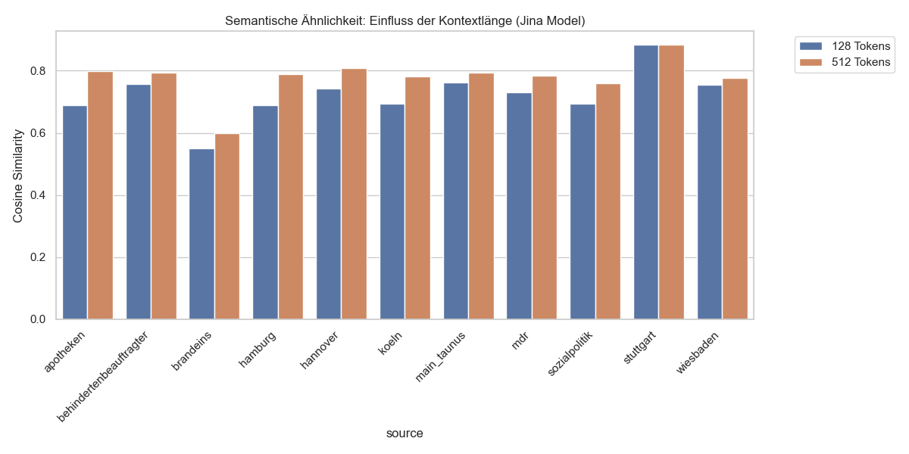

---

<!-- _class: split -->

### Bidirectional NER: Does LS "Invent" Facts?

<div class="column-left">

We measured not just what survives (AS -> LS), but also if LS introduces new entities (LS -> AS).

**Finding:** Both metrics are low. LS doesn't necessarily invent facts, but it rephrases entities into common nouns (e.g., "Arbeitsagentur" -> "Amt"), which current NER models fail to align.

</div>

<div class="column-right">

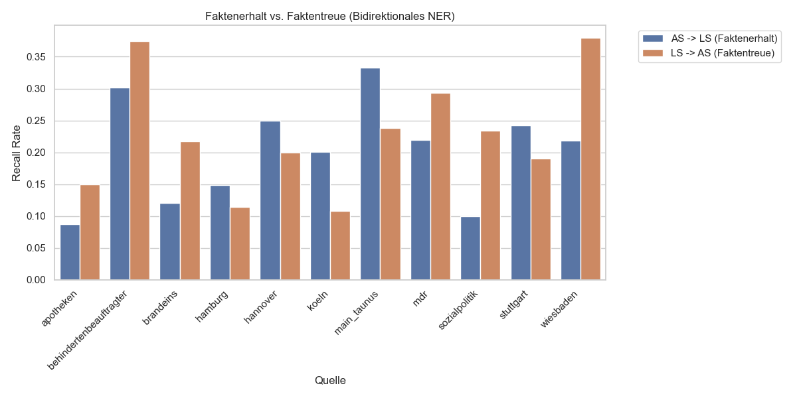

</div>

---

<!-- _class: split -->

### Correlation: Token-Ratio vs. Similarity

<div class="column-left">

**Finding:** No significant linear correlation between text length expansion and semantic similarity.

Longer explanations in LS don't automatically guarantee higher semantic proximity to the original.

</div>

<div class="column-right">

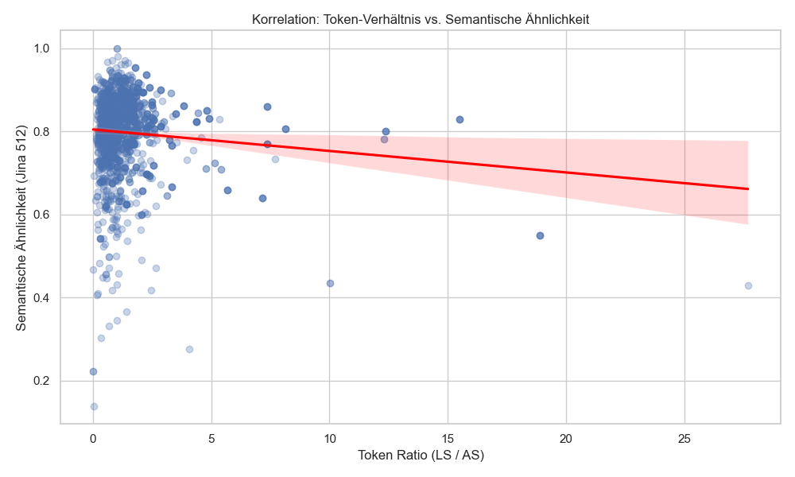

</div>

---

<!-- _class: image-caption -->

### Manual Audit & Corpus Cleaning

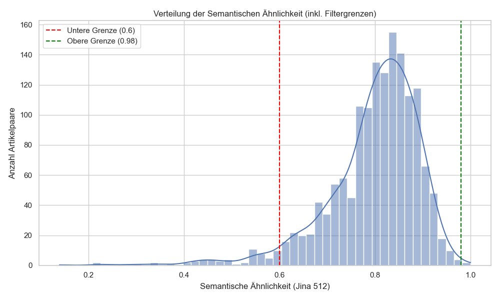

---

<!-- _class: split -->

### Linguistic Shifts: Sentence Length

<div class="column-left">

Analysis of 1,526 pairs confirms structural simplification.

- **Sentence Length:** Dropped from **15.6 tokens** (AS) to **9.1 tokens** (LS) – a 42% reduction.
- **Impact:** Drastic reduction in cognitive load per processing unit.

</div>

<div class="column-right">

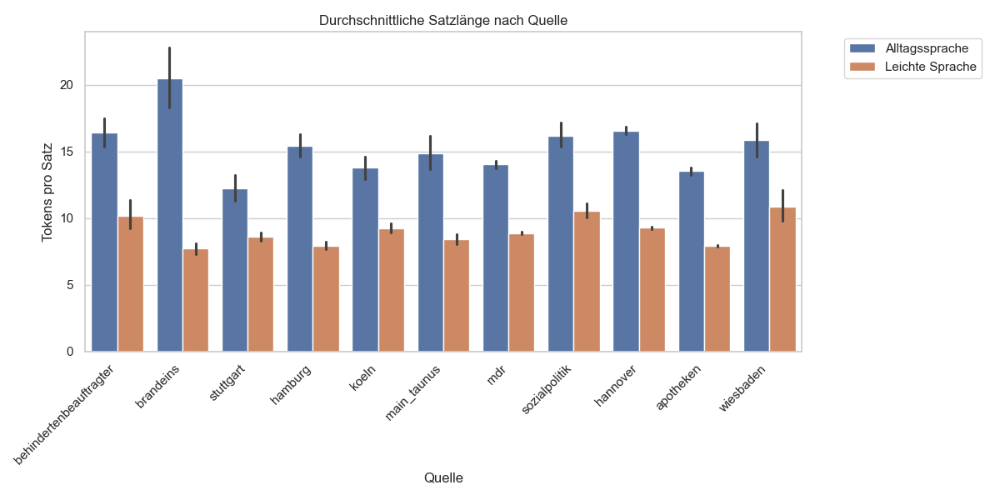

</div>

---

### Next Steps

1.  **Dataset Cleaning:** Apply the 0.6 - 0.98 similarity filter to create the "Gold Standard" training corpus. Also look for all other extremes like ratio too high etc.

**Thesis-Titel**

Entwicklung domänenspezifischer Datensätze und automatisierter Evaluation für ein Framework zur neuronalen Textvereinfachung in Leichte Sprache

---

<!-- _class: section-header -->

## Week 11

---

### Lexical Diversity (Type-Token-Ratio)

**Average Reduction:** The lexical variety in LS is reduced by an average of **13.6 %** compared to AS.

- **Averages:** AS (0.778) vs. LS (0.672).
- **Top Simplifiers:** _Hannover_ (0.656) and _Hamburg_ (0.658) show the most rigorous vocabulary reduction.
- **Journalistic LS:** The _taz_ (0.742) maintains the highest lexical diversity, indicating a "higher-level" Easy Language.

---

<!-- _class: split -->

### Visualization of Lexical Diversity

<div class="column-left">

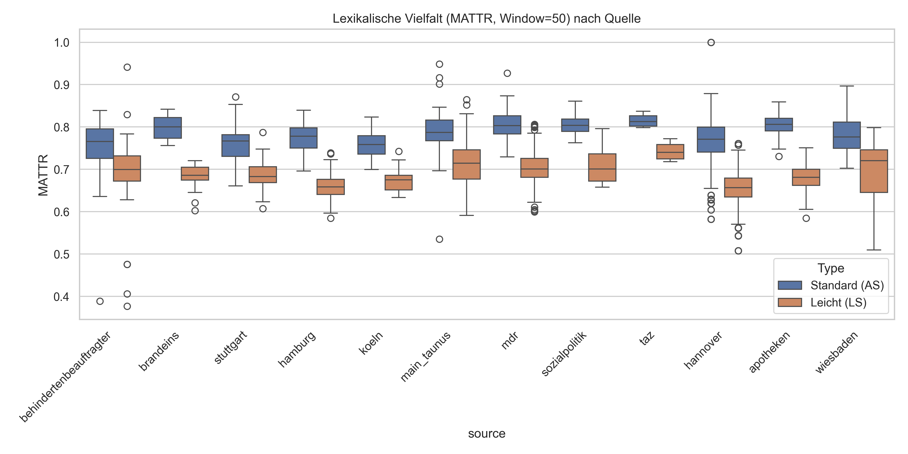

_Comparison of lexical diversity (MATTR) by source._

</div>

<div class="column-right">

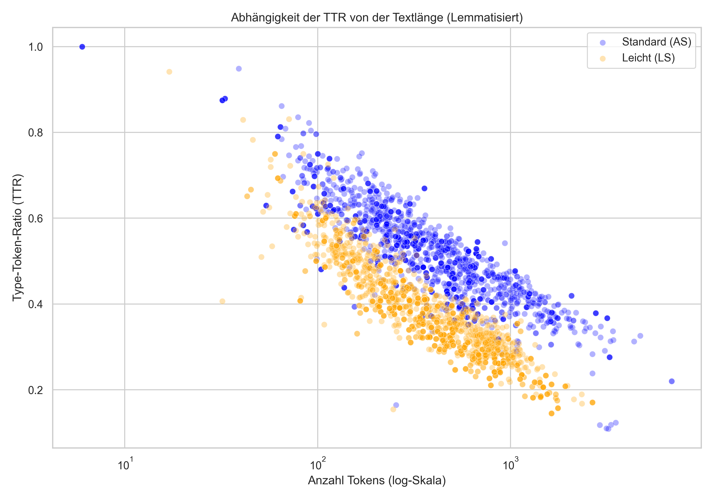

_TTR relative to text length (log-scale) with regression lines._

</div>

---

<!-- _class: section-header -->

## Week 12

---

### Model Training Strategy

**Goal:** Establish a baseline for binary classification (Normal vs. Easy German) and identify optimal data filters.

- **First Step: Baseline:** Bi-directional LSTM (BiLSTM) for lightweight comparison.

---

### Sentence-Level Classification

| Similarity Range | Balanced Accuracy |
| :--------------- | :---------------: |
| 0.60 - 0.98      |      92.48 %      |
| 0.70 - 0.98      |      92.43 %      |
| **0.80 - 0.98**  |    **92.99 %**    |
| 0.90 - 0.98      |      90.55 %      |

_The range 0.80 - 0.98 provides the best balance between data volume and semantic alignment._

---

### Article-Level Classification

Does full context (up to 512 tokens) improve the distinction?

| Similarity Range | Balanced Accuracy |
| :--------------- | :---------------: |
| 0.60 - 0.98      |      95.93 %      |
| 0.70 - 0.98      |      97.30 %      |
| **0.80 - 0.98**  |    **99.03 %**    |
| 0.90 - 0.98      |      98.44 %      |

**Finding:** The jump from **93 % (sentence)** to **99 % (article)** confirms that "Easy Language" is a holistic stylistic phenomenon that becomes nearly perfectly distinguishable at the document level.

---

### Training Configuration (BiLSTM)

The following hyperparameters were used to achieve the baseline performance (99% BAcc):

| Parameter                   | Value          |
| :-------------------------- | :------------- |
| **Optimizer**               | AdamW          |
| **Learning Rate**           | $10^{-3}$      |
| **Weight Decay**            | 0.01           |
| **Batch Size**              | 32             |
| **Max Epochs**              | 30             |
| **Early Stopping Patience** | 7              |
| **Dropout**                 | 0,4            |
| **Max Seq Len**             | 512 (Articles) |

---

### Next Steps & Research Questions

1.  **Out-of-Domain Validation:** Testing the models on external data (e.g., Lebenshilfe Kiel) to check for over-fitting on governmental styles.
2.  **Hyperparameter Testing** Change hyperparameters systematicly to find the best setup
3.  **Long-Context Transformers:** Exploring models that can process up to 8,192 tokens to capture very long administrative articles without truncation.
4.  **Vocabulary Pruning:** Investigating if removing rare words (< 3 occurrences) improves the classifier by forcing it to focus on common simplification patterns.

---

<!-- _class: section-header -->

## Week 13

---

### Some Thougts...

- **Paragraph Control Experiment:**
  - filtered a paragraph-free version of the dataset (`lebenshilfe_dataset_no_paragraphs.json`).
  - with `spaCy` we can filter out all whitespace tokens.
- **Vulnerability to Data Leakage Avoided:**
  - Training data (governmental and news portals) and test data (internal documents, house rules, statutes from _Lebenshilfe_) are completely disjoint.
  - An out-of-domain accuracy of >90% proves the BiLSTM captures genuine linguistic patterns of Easy Language rather than source-specific formatting.
- **Vocabulary Robustness:**
  - Many specialized legal or administrative terms were absent from the training corpus and thus masked as `<unk>` (unknown tokens - freq <= 3).
  - The model successfully classifies despite this, demonstrating reliance on structural features (sentence length, conjunctions, syntactic simplicity) rather than rote-memorizing vocabulary.

---

<!-- _class: split -->

### Content vs. Length Controls

<div class="column-left">

**Dummy Content Test**

- All words replaced by a neutral token (`.`), preserving original text lengths and padding patterns.
- **Balanced Accuracy:** **50.0%** (classifies all as LS).

**Constant-Length Slicing**

- All texts sliced to exactly 50 or 100 tokens, eliminating all length variance.

</div>

<div class="column-right">

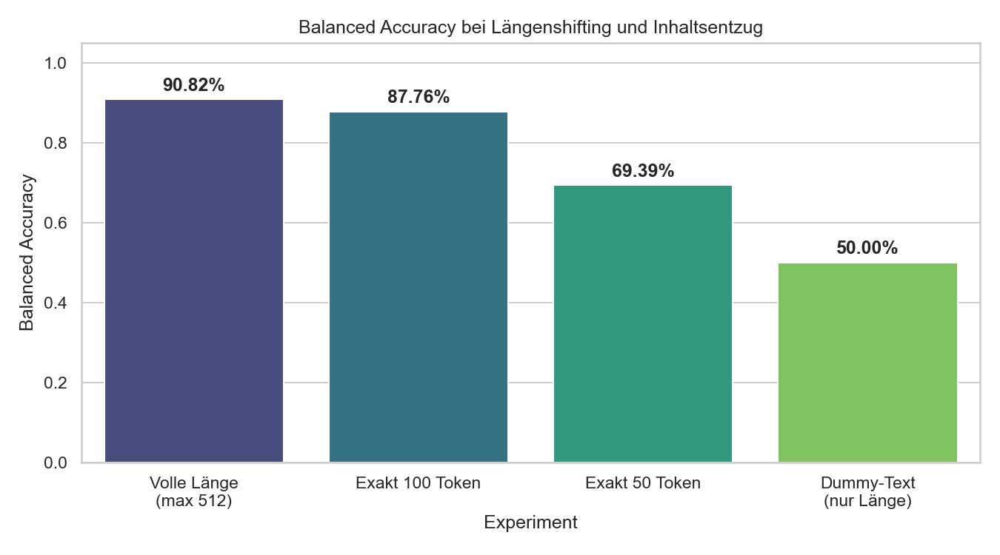

</div>

---

### Weekly Focus: Out-of-Domain Evaluation (Lebenshilfe)

- **Objective:** Verify the generalization capability of the BiLSTM classifier on a completely independent, unpublished dataset from _Lebenshilfe_.
- **Source Data:** 98 unstructured text documents (`.docx`, `.doc`, `.odt`, `.rtf`) containing manual translations into Easy Language (LS) and their everyday language (AS) counterparts.
- **Result:** A cleaned JSON dataset with **49 verified AS-LS article pairs** (98 documents total).

---

### Out-of-Domain Classification Performance

We evaluated the BiLSTM models (trained on the similarity sweet spot `0.80 - 0.98`) on the 98 _Lebenshilfe_ texts without fine-tuning:

| Metric                  | Article-Level Model | Sentence-Level Model (Aggregated) | Sentence-Level Model (Sentence-Level) |
| :---------------------- | :-----------------: | :-------------------------------: | :-----------------------------------: |
| **Balanced Accuracy**   |       90.82%        |            **97.96%**             |                79.71%                 |
| **LS Correct (Simple)** |   93.88% (46/49)    |        **97.96%** (48/49)         |          76.02% (5877/7731)           |
| **AS Correct (Normal)** |   87.76% (43/49)    |        **97.96%** (48/49)         |          83.41% (1961/2351)           |

<p class="hint">Sentence-level aggregation is performed via majority voting on the sentences of each article.</p>

---

### Next Steps & Future Work

- **Regression:**
  - _Concept:_ Map the degree of simplification between standard (AS) and simple language (LS) texts.
  - _Variant 1 (Mix-Up):_ Create artificial mixed sentences of equal length from LS and AS to study step-wise transition boundaries.
  - _Variant 2 (LLM-in-the-Loop):_ Feed AS and LS text pairs into LLMs as input to predict and measure progression levels between different simplification stages.

---

<!-- _class: section-header -->

## Week 14

---

### Weekly Focus: Implementing the Regression Model

- **Variant 1 (Mix-Up):** Create artificial mixed sentences of equal length from LS and AS to study step-wise transition boundaries.
- **Variant 2 (LLM-in-the-Loop):** Feed AS and LS text pairs into LLMs as input to predict and measure progression levels between different simplification stages.

---

### Variant 2: LLM-based Generation of Synthetic Intermediate Steps

- **Objective:** Establish a pipeline for generating progressive intermediate steps of text simplification between everyday language (AS) and Easy Language (LS) using LLMs.
- **Implementation:** Created a dedicated text generation script.
  - **Inputs:** Paired articles from the Lebenshilfe dataset.
  - **Outputs:** Progressively simplified versions stored incrementally in a new JSON dataset.
  - **Configurable Steps:** Supported generation of any float steps between `0.0` (LS) and `1.0` (AS), defaulting to `0.25`, `0.50`, and `0.75`.
  - **Features:** Robust resume functionality (detects existing output and skips completed steps), input limit option, and post-processing/cleaning of LLM output.

---

### Test Run & Lessons Learned (Ollama & Remote Endpoint)

- **Local Execution:** local execution using Ollama and Llama 3.
- **Remote Execution:** Server can be pinged successfully, but the model itself cannot be invoked.
- **Key Issues Identified:**
  1. **Model Chatty Prefixes:** LLMs frequently prepend introductory text (e.g., _"Hier ist der Text..."_), necessitating an enhanced post-processing script logic.
  2. **Layout Loss:** Easy Language formatting (line breaks, bullets) was lost in lower intermediate steps (e.g., `0.25`), requiring prompt refinement.

---

### Implementation Design for Variant 1 (Mix-Up)

**Approach B (Sentence-Level Mixup):**
Build paragraphs mixing AS and LS sentences (e.g. 50% LS sentences, 50% AS sentences for step `0.50`).

- **Question:** Which sentences should be selected to ensure the content still makes sense?

---

<!-- _class: section-header -->

## Week 15

---

### Weekly Focus: Implementing & Evaluating the Regression Setup

- **Goal:** Realization of the regression approaches (Mix-Up and LLM-based synthetic steps) to predict continuous complexity scores $\lambda \in [0.0, 1.0]$.
- **Approach 1 (Sentence-Level Mix-Up):** Implementation of the sentence-blending logic (First Variant), generation of training paragraphs, and analysis of target distribution.
- **Approach 2 (LLM Step Generation):** Running step-wise text generation, resolving LLM formatting/prefix issues, and performing dataset alignment cleanup.

---

### Approach 2: LLM Step Generation Execution

- **Pipeline Run:** Executed `generate_synthetic_regression_steps.py` on the remote GPU server (`FlensGen-GPT-OSS120B` model via VPN) and locally (LLaMA 3 via Ollama).
  **Remote Execution:** Server can be pinged successfully, but the model itself cannot be invoked.

---

<!-- _class: split -->

### Approach 1: Mix-Up (First Variant)

<div class="column-left">

**First Variant Implementation:**

- Sentence-level segmentation of parallel articles (LS & AS) using `spaCy`.
- Slices of randomly selected contiguous sentence ranges extracted independently from LS and AS and shuffled to build a paragraph.
- **Regression Target:** Calculated dynamically as the character length ratio of the LS portion to the total paragraph length.
- **Alternative Concept (Variant 2):** If the resulting target distribution of the first variant is not uniform enough for the regression model, a target $\lambda \sim U(0.0, 1.0)$ can be pre-sampled and sentence counts calculated accordingly.

</div>

<div class="column-right">

**Pseudocode (First Variant):**

```python
# Segment sentences
sents_ls = sentencize(ls_text)
sents_as = sentencize(as_text)

# Slice random contiguous blocks
start_ls, end_ls = rand_range(len(sents_ls))
start_as, end_as = rand_range(len(sents_as))
sample_ls = sents_ls[start_ls:end_ls]
sample_as = sents_as[start_as:end_as]

# Shuffle and calculate target
mixed = shuffle(sample_ls + sample_as)
target = char_len(sample_ls) / (
    char_len(sample_ls) + char_len(sample_as)
)
```

</div>

---

<!-- _class: split -->

### Target Distribution of the First Mix-Up Variant

<div class="column-left">

- **First Variant Distribution:**
  - The target distribution (peaking at 0.5 and near the boundaries) is usable for training, as the regression model should be robust enough.
- **Backup Concept (Variant 2):**
  - Should the target distribution of the first variant lead to imprecise predictions at the extremes, Variant 2 is available as a backup concept where a uniformly distributed $\lambda \sim U(0.0, 1.0)$ is pre-sampled.

</div>

<div class="column-right">

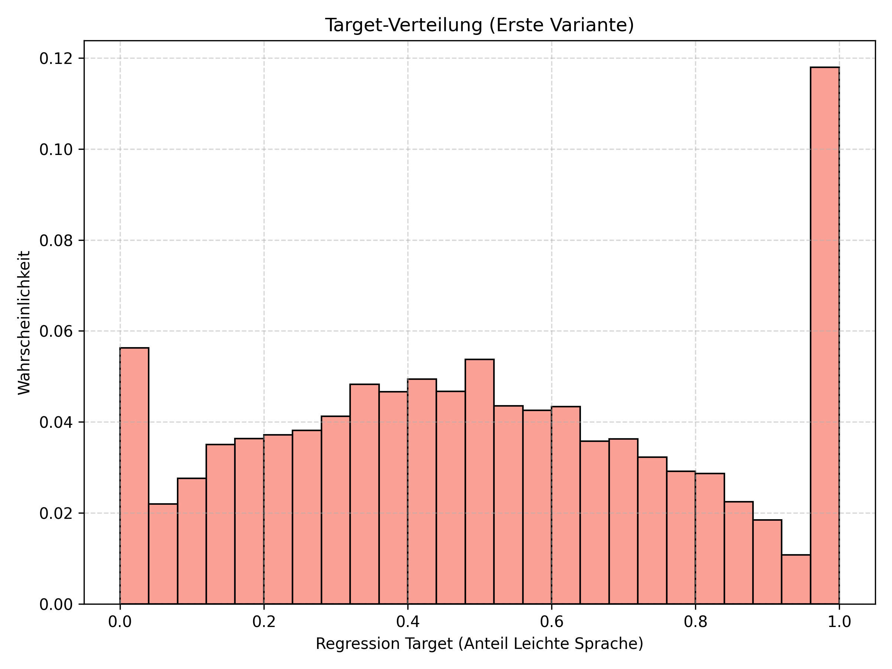

</div>

---

### Next Steps & Research Questions

1.  **Regression Training:** Implement model training based on the Mix-Up dataloaders.
2.  **Remote Model Access:** Resolve the remote GPU server model invocation issue (server is pingable, but API does not return completions).

---

<!-- _class: section-header -->

## Week 16

---

### Weekly Focus: Regression Training & Mix-Up Evaluation

- **Goal:** Train the regression model on the sentence-level Mix-Up approach.
- **Mix-Up Data Inspection:** Analyzed blended paragraph structure and manually checked calculated target values.
- **Model Stabilization:** Moved from an initial unstable setup (non-deterministic) to a fully converged, deterministic training pipeline.

---

### Mix-Up Paragraph Generation & Target

- **DataLoader Logic:** Randomly extracts contiguous blocks from the Easy Language (LS) and Standard Language (AS) versions of an article, shuffles them, and computes the target.
- **Target ($\lambda$) Definition:** Character length ratio of the LS portion:
  $$\lambda = \frac{\text{Length}(LS)}{\text{Length}(LS) + \text{Length}(AS)}$$
- **Linguistic Coherence:** Shuffling destroys logical paragraph coherence, which prevents the model from overfitting on semantic cues and forces it to focus strictly on sentence and stylistic complexity.

---

<!-- _class: split -->

### Mix-Up Paragraph Example

<div class="column-left">

**Source Sentences (German Extrakt):**

- **Easy German (LS)** ($n = 2$):
  - _"Die Beauftragten der Bundes-Regierung für die Belange von Menschen mit Behinderungen..."_
  - _"Was macht der Behindertenbeauftragte..."_
- **Standard German (AS)** ($n = 5$):
  - _"Inhaltsverzeichnis Video: Was macht..."_
  - _"zum Download: Video: Was macht..."_
  - _"Gesetzlicher Auftrag..."_

</div>

<div class="column-right">

**Blended & Shuffled Paragraph:**

> Die Beauftragten der Bundes-Regierung... zum Download: Video... Gesetzlicher Auftrag... Was macht der Behindertenbeauftragte... Inhaltsverzeichnis Video...

**Computed Regression Target ($\lambda$):**
$$\lambda = \frac{\text{CharLen}(LS)}{\text{CharLen}(LS) + \text{CharLen}(AS)} \approx 0.2087$$

</div>

---

<!-- _class: split -->

### Initial Setup & Failure Mode (On-the-Fly Shuffling)

<div class="column-left">

**BiLSTM Regressor Setup:**

- Embedding & Hidden Dim: 128, Dropout: 0.3, MSE Loss.
- Blending performed **on-the-fly** during `__getitem__`.

**Problem & Diagnostic:**

- Val MSE: `0.0655`, Val MAE: `0.2099` (deceptive).
- **Diagnosis:** Shuffling on-the-fly made the validation set non-deterministic every epoch.
- **Prediction Collapse:** Lacking a persistent sequence structure, the model predicted the mean ($\approx 0.45$).

</div>

<div class="column-right">

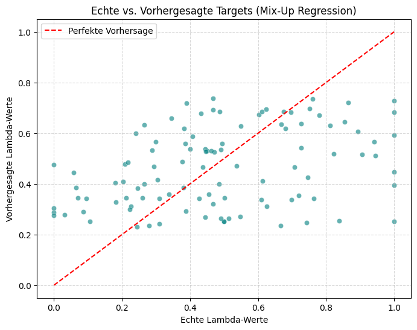

</div>

---

### Solution: Deterministic & Pre-Generated Datasets

- **Pre-generation:** The mixed paragraphs are generated once during dataset initialization rather than on-the-fly.
- **Reproducibility:** Seeded random generator (`42` for train, `99` for validation) ensures identical samples across all epochs.
- **Data Augmentation:**
  - **Train:** 10 fixed mixes per article pair $\rightarrow$ **9,280 samples**.
  - **Validation:** 2 fixed mixes per article pair $\rightarrow$ **208 samples**.

---

<!-- _class: split -->

### Final Results

<div class="column-left">

**Results at Epoch 23 (Early Stopping at 28):**

- **Validation MSE:** **0.0335** (halved from 0.0655)
- **Validation MAE:** **0.1195** (halved from 0.2099)

**Interpretation:**

- **Continuous Curve:** Predictions align more with the diagonal $y = x$.
- **Extremes Accuracy:** Clean AS ($\lambda=0$) and LS ($\lambda=1$) are predicted with high confidence near their true values.

</div>

<div class="column-right">

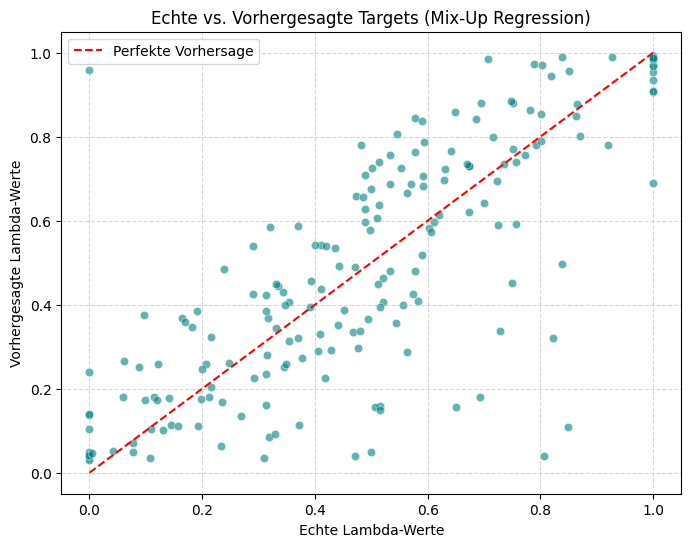

</div>

---

### Next Steps

1. **Evaluate on Lebenshilfe dataset:** We should get only extremes?

2. **Evaluate LLM-Generated Levels (Approach 2):** Run the trained Mix-Up BiLSTM model on the synthetic LLM text stages (`0.25`, `0.50`, `0.75`) to assess if the predicted complexity aligns with prompt instructions.

---

<!-- _class: section-header -->

## Week 17

---

### MixUp Regressors: Comparing the 4 Training Variants

- **Variant A: Static Pre-mixing**
  - _Concept:_ Sentence mixing and shuffling are generated once during dataset initialization.
- **Variant B: Dynamic Mixing**
  - _Concept:_ Random shuffling and mixing of sentences performed on-the-fly in `__getitem__`.
- **Variant C: Hybrid Solution**
  - _Concept:_ Combination of static and dynamic. The probability of dynamic mixing $p_{dynamic}$ increases linearly across epochs from $0.0$ to $1.0$.
- **Variant D: Hybrid Solution + Cyclic LR**
  - _Concept:_ Based on the Hybrid Solution (Variant C), but introduces a cyclic learning rate scheduler (`CosineAnnealingWarmRestarts`).

---

<!-- _class: image-caption -->

### MixUp Regressors: Training & Validation Loss Curves

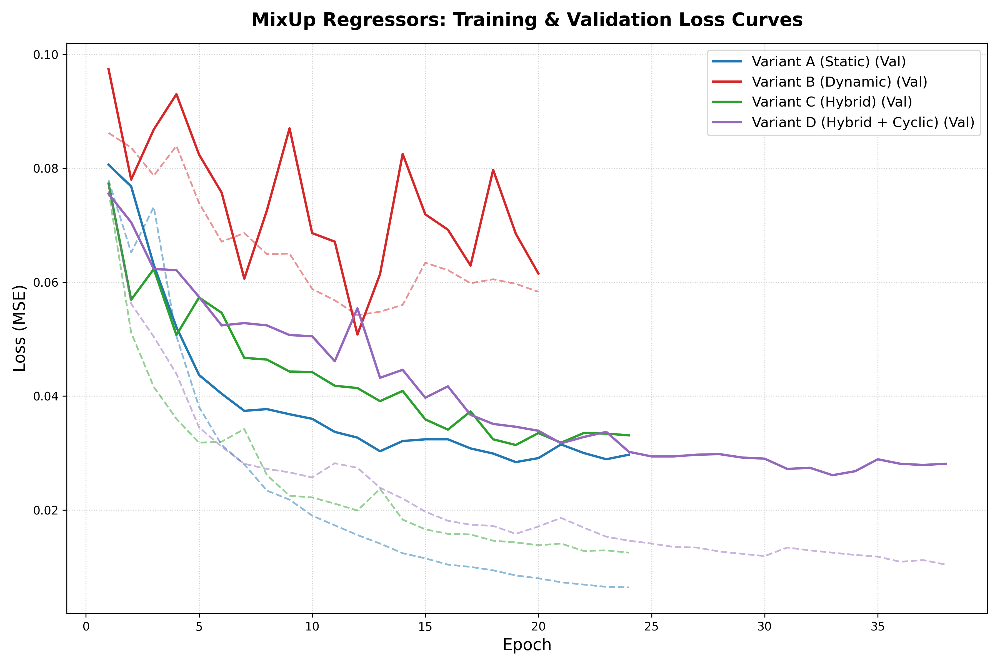

---

### Evaluation on the Lebenshilfe Test Set

| Model                   | Ø $\lambda$ (LS) | Ø $\lambda$ (AS) | Acc (0.5)  | Balanced Acc | MAE (1/0)  |
| :---------------------- | :--------------: | :--------------: | :--------: | :----------: | :--------: |
| **A (Static)**          |      0.6518      |      0.1176      |   87.16%   |    89.20%    |   0.2597   |
| **B (Dynamic)**         |      0.5516      |      0.2811      |   77.41%   |    81.48%    |   0.3842   |
| **C (Hybrid)**          |      0.6315      |      0.1323      |   83.18%   |    85.98%    |   0.2779   |
| **D (Hybrid + Cyclic)** |    **0.7554**    |    **0.1051**    | **91.78%** |  **92.83%**  | **0.1911** |

- **Best Results:** Variant D (Hybrid + Cyclic) dominates across all metrics.
- **Worst Results:** Variant B (Dynamic) struggles to learn stable representations.

---

<!-- _class: image-caption -->

### Analysis of the Lebenshilfe KDE Plots

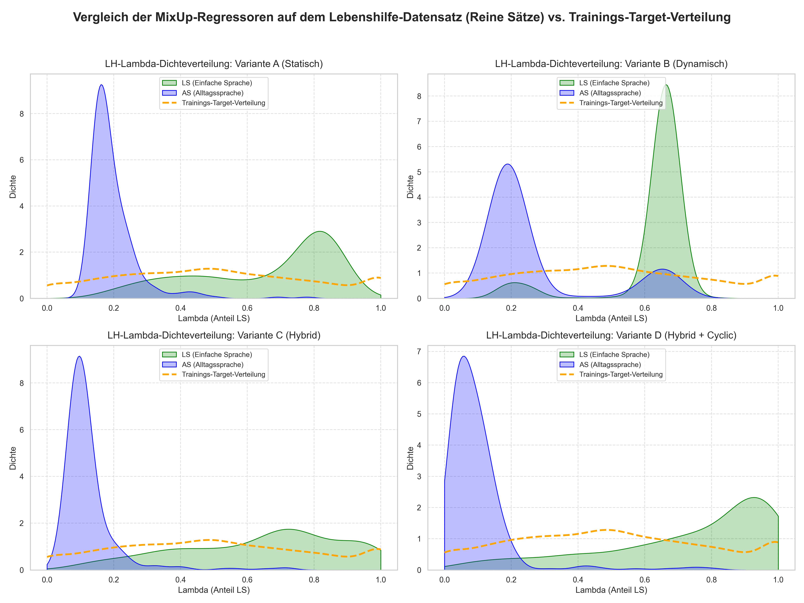

---

### Future Optimization Steps (Backlog)

- **Train with LLM-Generated Levels:**
  - Train the model on synthetic text stages (`0.25`, `0.50`, `0.75`).
- **Variant B with Cyclic LR:**
  - Train the purely dynamic mixing model (Variant B) using a cyclic learning rate scheduler (e.g., Cosine Annealing with Warm Restarts) to see if periodic momentum helps it escape local minima and overcome its initial convergence plateau.

---

<!-- _class: section-header -->

## Week 18

---

### Weekly Focus: MixUp Optimization, Thesis Summary & Translation Model Planning

- **1. MixUp Regressor Optimization & Evaluation:** Cyclic LR evaluation on Variant B, diagnostic error analysis, and complete In-Domain & Out-of-Domain (Lebenshilfe) performance comparison across all 4 variants (MixUp & Non-MixUp).
- **2. Master Thesis Status Summary & Overall Architecture:** High-Level Overview for status quo.
- **3. Planning Translation Model (Step 3):** Model selection (Seq2Seq vs. Causal LLMs) and reward guided training.

---

<!-- _class: section-header -->

## Part 1: MixUp Regressor Optimization & Evaluation

---

<!-- _class: split -->

### 1.1 MixUp Variant B + Cyclic LR: Loss & Scatterplot Analysis

<div class="column-left">

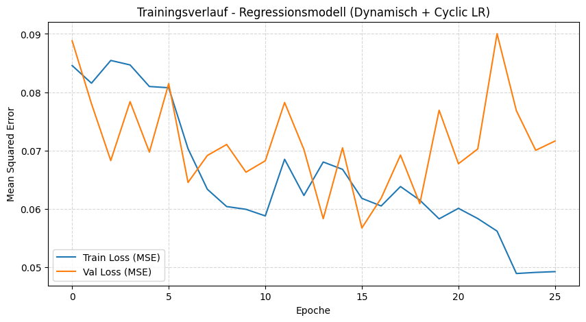

</div>

<div class="column-right">

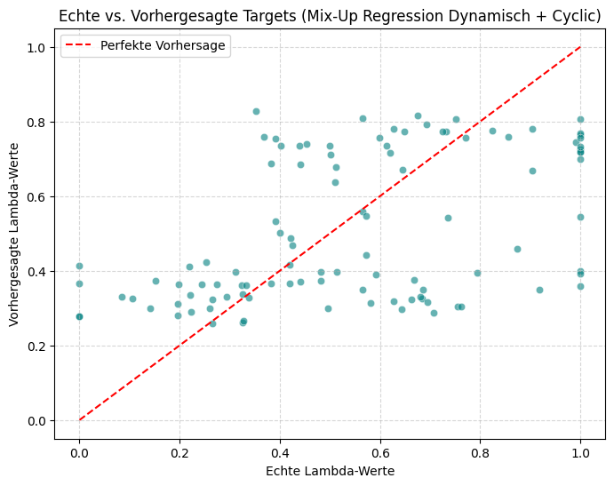

</div>

---

### 1.2 In-Domain Evaluation (Test-Split)

#### A. Continuous MixUp Regression (MixUp Evaluation)

| Model Variant                   |  Test MSE  |  Test MAE  |
| :------------------------------ | :--------: | :--------: |
| **Variant A (Static)**          |   0.0383   |   0.1557   |
| **Variant B (Dynamic)**         |   0.0758   |   0.2264   |
| **Variant D (Hybrid + Cyclic)** | **0.0241** | **0.1027** |

#### B. Binary Classification on Pure Sentences (Non-MixUp Evaluation: LS = 1.0, AS = 0.0)

| Model Variant                   | Ø $\lambda_{LS}$ | Ø $\lambda_{AS}$ | Accuracy (0.5) | Balanced Acc | MAE (Target 1/0) |
| :------------------------------ | :--------------: | :--------------: | :------------: | :----------: | :--------------: |
| **Variant A (Static)**          |      0.7596      |      0.2680      |     91.55%     |    91.46%    |      0.2526      |
| **Variant B (Dynamic)**         |      0.6138      |      0.3312      |     80.17%     |    79.53%    |      0.3620      |
| **Variant D (Hybrid + Cyclic)** |    **0.9007**    |    **0.1382**    |   **95.92%**   |  **95.93%**  |    **0.1164**    |

---

### 1.3 Out-of-Domain Evaluation (Lebenshilfe Dataset)

#### A. Continuous MixUp Regression (MixUp Evaluation)

| Model Variant                   |   LH MSE   |   LH MAE   |
| :------------------------------ | :--------: | :--------: |
| **Variant A (Static)**          |   0.0725   |   0.2111   |
| **Variant B (Dynamic)**         |   0.0766   |   0.2212   |
| **Variant D (Hybrid + Cyclic)** | **0.0739** | **0.2087** |

#### B. Binary Classification on Pure Sentences (Non-MixUp Evaluation: LS = 1.0, AS = 0.0)

| Model Variant                   | Ø $\lambda_{LS}$ | Ø $\lambda_{AS}$ | Accuracy (0.5) | Balanced Acc | MAE (Target 1/0) |
| :------------------------------ | :--------------: | :--------------: | :------------: | :----------: | :--------------: |
| **Variant A (Static)**          |      0.6533      |      0.1958      |     82.67%     |    85.75%    |      0.2888      |
| **Variant B (Dynamic)**         |      0.6241      |      0.2766      |     87.42%     |    86.32%    |      0.3378      |
| **Variant D (Hybrid + Cyclic)** |    **0.7293**    |    **0.0957**    |   **87.29%**   |  **89.37%**  |    **0.2036**    |

---

<!-- _class: split -->

### 1.4 In-Domain Test-Split Scatterplots: Non-MixUp vs. MixUp

<div class="column-left">

**Binary Classification (Non-MixUp: Pure Sentences):**

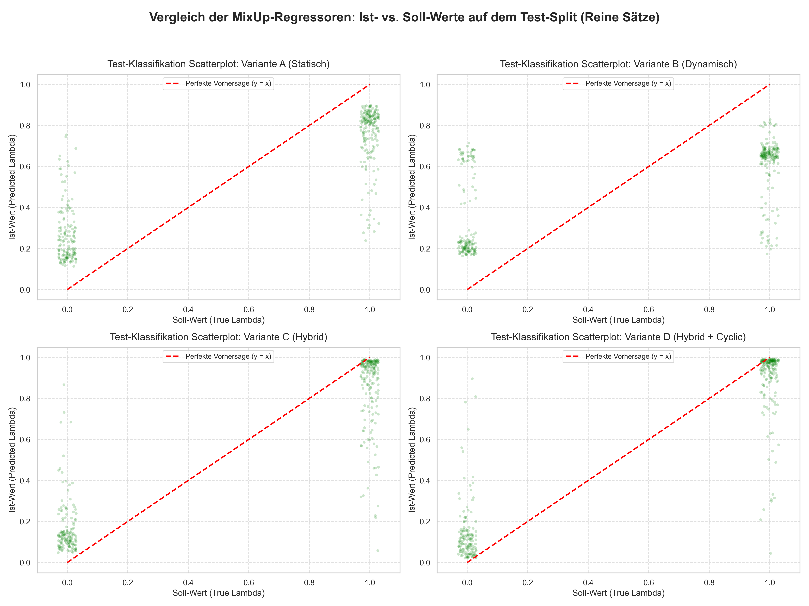

</div>

<div class="column-right">

**Continuous Regression (MixUp Blends):**

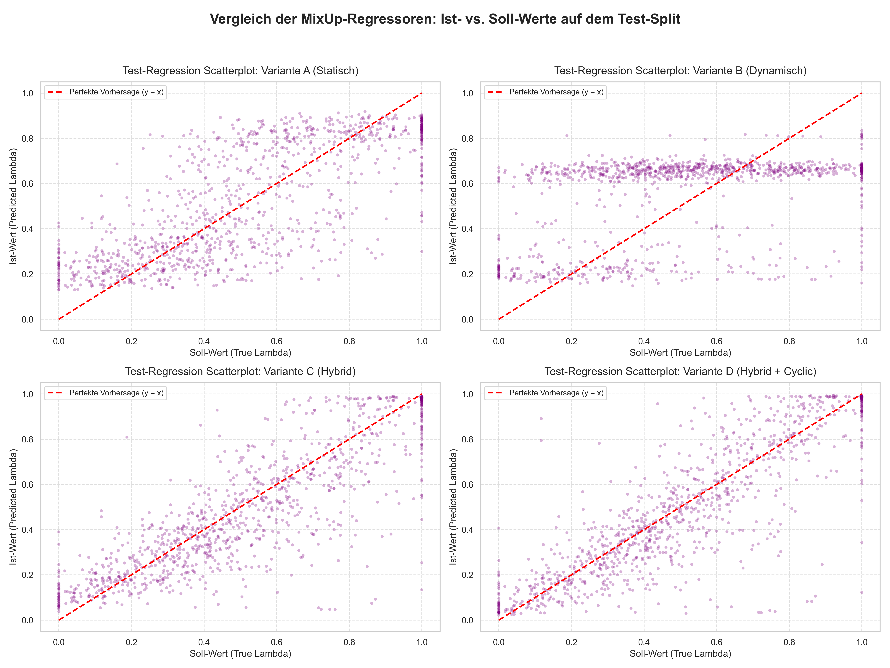

</div>

---

<!-- _class: split -->

### 1.5 In-Domain Test-Split Density Distributions

<div class="column-left">

**Binary Classification (Non-MixUp: Pure Sentences):**

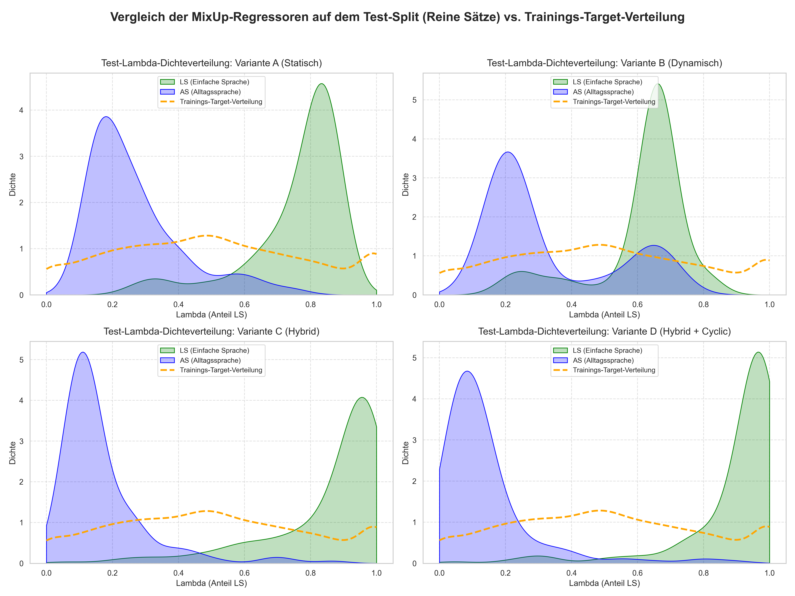

</div>

<div class="column-right">

**Continuous Regression (MixUp Blends):**

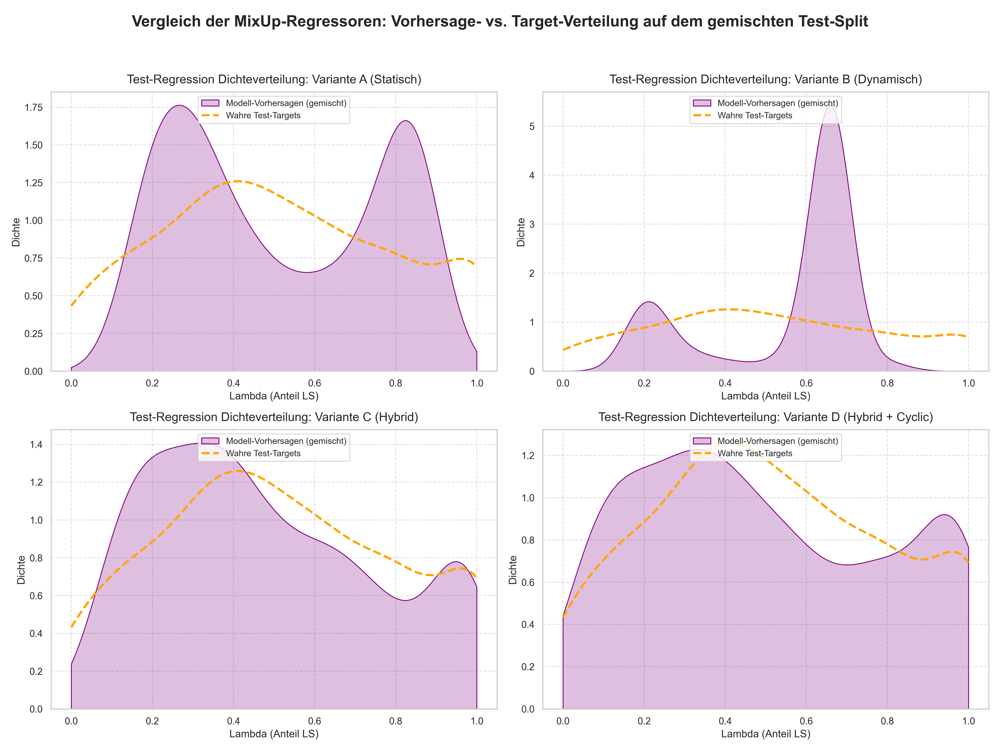

</div>

---

<!-- _class: split -->

### 1.6 Out-of-Domain Lebenshilfe Scatterplots: Non-MixUp vs. MixUp

<div class="column-left">

**Binary Classification (Non-MixUp: Pure Sentences):**

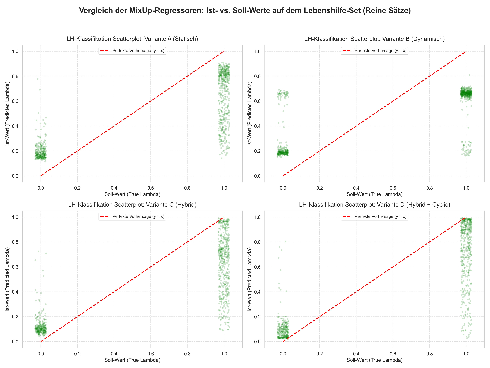

</div>

<div class="column-right">

**Continuous Regression (MixUp Blends):**

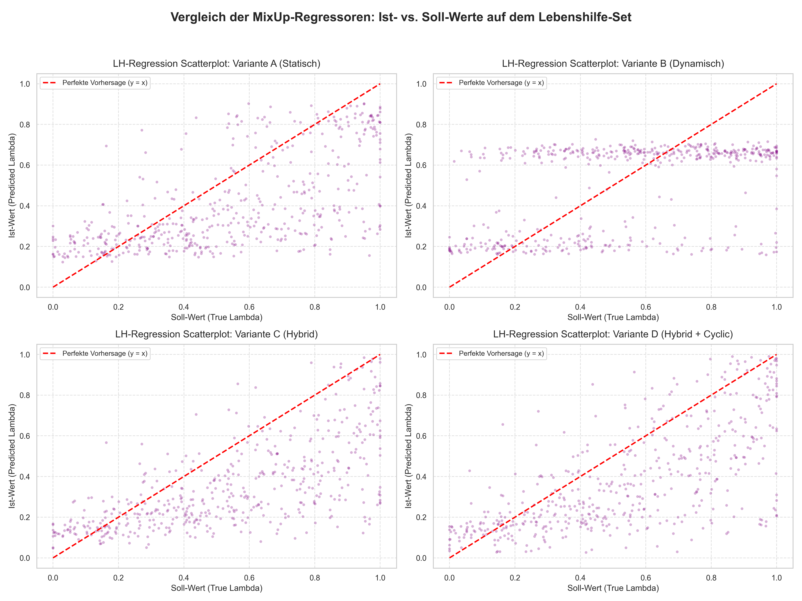

</div>

---

<!-- _class: split -->

### 1.7 Out-of-Domain Lebenshilfe Density Distributions

<div class="column-left">

**Binary Classification (Non-MixUp: Pure Sentences):**


</div>

<div class="column-right">

**Continuous Regression (MixUp Blends):**

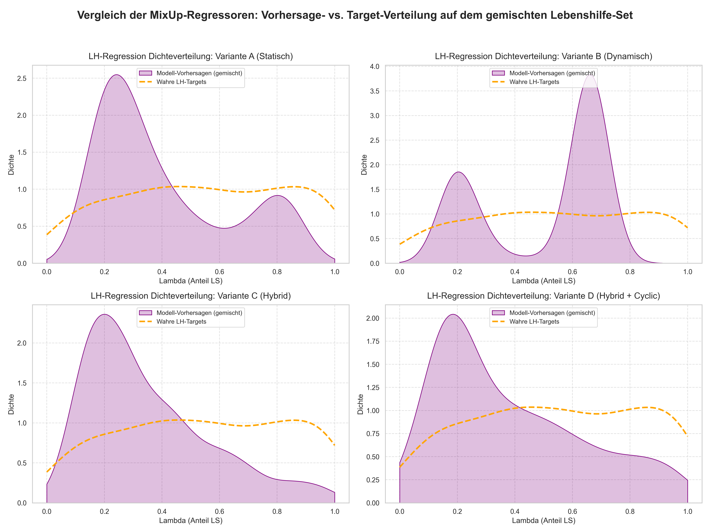

</div>

---

<!-- _class: section-header -->

## Part 2: Thesis Status Summary & Big Picture

---

### 2.1 Big Picture: 3-Step Master Thesis Architecture



---

<!-- _class: split -->

### 2.2 Step 1 Status: Data Corpus & Quality Assurance

<div class="column-left">

**Corpus Statistics (Final Cleaned State):**

- **1,471** verified article pairs across 11 sources.
- **1.43M Easy German Tokens** vs. **1.78M Standard German Tokens**.
- **91,103 LS Sentences** vs. **54,256 AS Sentences**.

**Quality Assurance Pipeline:**

- **Long-Context Alignment:** `jina-embeddings-v2-base-de` (8,192 token window) for section-level matching.
- **Similarity Sweet-Spot:** Filtered range $0.80 \le \text{Similarity} \le 0.98$.

</div>

<div class="column-right">

| Top Sources                 |   Pairs   |  Tokens (LS)  |  Tokens (AS)  |
| :-------------------------- | :-------: | :-----------: | :-----------: |
| **Hannover.de**             |    796    |    861,967    |    858,086    |
| **MDR**                     |    227    |    94,976     |    168,440    |
| **Apotheken Umschau**       |    157    |    234,608    |    443,722    |
| **Hamburg.de**              |    56     |    61,204     |    66,977     |
| **Behindertenbeauftragter** |    51     |    38,724     |    44,725     |
| **Wiesbaden.de**            |    41     |    13,808     |    23,332     |
| **Lebenshilfe (Test)**      |    34     |     9,974     |    11,037     |
| **TOTAL (Final)**           | **1,471** | **1,429,433** | **1.781.714** |

</div>

---

### 2.3 Step 2 Status: Classification & MixUp Regression

**1. Binary Classification Baseline Models**

| Model Architecture              |  Scope / Aggregation   | In-Domain BAcc | Out-of-Domain BAcc (LH) |
| :------------------------------ | :--------------------: | :------------: | :---------------------: |
| **Sentence BiLSTM (Maj. Vote)** | **Sentence → Article** |   **99.68%**   |       **96.94%**        |
| **Article BiLSTM Baseline**     |  Article (512 tokens)  |     99.03%     |         90.82%          |
| **Sentence BiLSTM (Raw)**       |    Single Sentence     |     92.99%     |         78.76%          |

**2. Continuous MixUp Regressor Variants**

| Model Variant | Training Strategy       |  Test MSE  |  Test MAE  | In-Domain BAcc | Out-of-Domain BAcc (LH) |
| :------------ | :---------------------- | :--------: | :--------: | :------------: | :---------------------: |
| **Variant A** | Static (Pre-mixed)      |   0.0383   |   0.1557   |     91.46%     |         85.75%          |
| **Variant B** | Dynamic (`__getitem__`) |   0.0758   |   0.2264   |     79.53%     |         86.32%          |
| **Variant C** | Hybrid Schedule         |   0.0267   |   0.1158   |     95.22%     |         85.10%          |
| **Variant D** | **Hybrid + Cyclic LR**  | **0.0241** | **0.1027** |   **95.93%**   |       **89.37%**        |

---

### 2.4 Project Progress & Milestone Dashboard

| Milestone                             |     Status      | Key Metrics & Achievements                    |
| :------------------------------------ | :-------------: | :-------------------------------------------- |
| **1. Web Crawling & Corpus Building** |  **Completed**  | 1,471 Pairs, 1.43M Tokens, 11 Sources         |
| **2. Quality & Embedding Alignment**  |  **Completed**  | Jina-Embeddings-v2 (8k), Similarity 0.80–0.98 |
| **3. BiLSTM Classifier Baseline**     |  **Completed**  | 99.68% Balanced Accuracy (Majority Vote)      |
| **4. Continuous MixUp Regressor**     |  **Completed**  | MSE 0.0241, MAE 0.1027 (Variant D)            |
| **5. Synthetic LLM Levels Eval**      | **In Progress** | Ollama / FlensGen-GPT Evaluation              |
| **7. Translation**                    |  **Planning**   | mBART-50 & LLaMA-3-8B (LoRA/QLoRA) & Reward   |

---

<!-- _class: section-header -->

## Part 3: Planning Translation Model (Step 3)

---

### 3.1 Step 3: Model Architectures & Approaches

**A. Sequence-to-Sequence (Encoder-Decoder)**

- **Models:** `mBART-50` (`facebook/mbart-large-50`), `mt5` (`google/mt5-base` / `mt5-large`).

**B. Causal LLMs (Decoder-Only via LoRA / QLoRA)**

- **Models:** `LLaMA-3-8B-Instruct`, `Mistral-7B-v0.3`, `Qwen2.5-7B`.

**Metric Models as Reward Function**

- Reinforcement Learning / Direct Preference Optimization / Metric Guidance

---

### Open Questions & Discussion

- **Reward Function:**
  - Proceed with a metric model (the best one) as the reward function?

- **Dataset Usage:**
  - Is it valid to train/evaluate multiple models (metric & translation models) on the same dataset?
