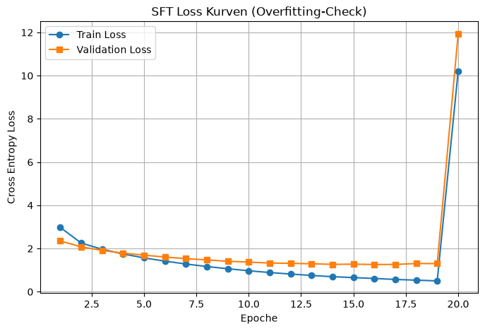
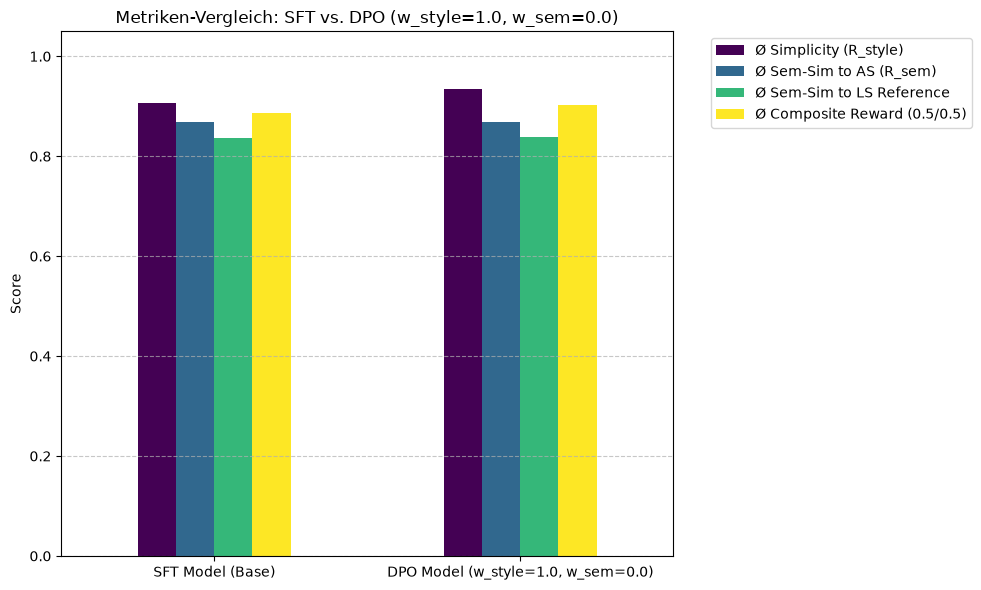

<!-- _class: title -->

# Master Thesis Update

Entwicklung domänenspezifischer Datensätze und automatisierter Evaluation für ein Framework zur neuronalen Textvereinfachung in leichte Sprache

Fiete Scheel
Update | Juni 2026

---

### Motivation und Zielsetzung

**Barrierefreie Kommunikation:** Über 10 Mio. Menschen in Deutschland sind auf einfache oder leichte Sprache angewiesen.

**Problem:** Die manuelle Erstellung von "Leichter Sprache" (LS) ist zeitaufwendig, teuer und skaliert nicht.

**Kernfragen der Arbeit:**

1. Wie lässt sich ein qualitativ hochwertiger, domänenübergreifender **Parallelkorpus** (AS - LS) automatisiert aufbauen?
2. Mit welchen **Metriken** lässt sich die Qualität und der Informationsverlust objektiv messen?
3. Wie können **neuronale Sprachmodelle** trainiert werden, um regelkonforme Vereinfachungen zu generieren?
4. Lässt sich auf Basis des Datensatzes eine Metrik trainieren, um die Ergebnisse zu messen?

---

<!-- _class: section-header -->

## Korpus-Erstellung & Alignment

---

### Aufbau des Parallelkorpus

Die größte Hürde für Machine Learning im Bereich "Leichte Sprache" ist der Mangel an strukturierten Daten.

**Vorgehensweise:**

- **Quellen Scraping:** Entwicklung maßgeschneiderter Crawler für News (MDR, taz), Gesundheit (Apotheken Umschau) und Verwaltung (Staatliche Portale).
- **Alignment-Strategien:** URL-Logik (z.B. Hannover), Sprach-Switch-Buttons (CSS-Patterns) und semantisches Matching.
- **Domänen-Abdeckung:** Nachrichten, Politik, Recht, Gesundheit und lokaler Bürgerservice.

---

### Aktuelle Korpus-Statistiken

| Quelle                         | Artikelpaare | Tokens (Standard) | Tokens (Leicht) |
| :----------------------------- | :----------: | :---------------: | :-------------: |
| **Hannover**                   |     808      |     ~871.000      |    ~872.000     |
| **Apotheken Umschau**          |     161      |     ~451.000      |    ~241.000     |
| **MDR**                        |     235      |     ~173.000      |     ~98.000     |
| **Hamburg / Stuttgart / Köln** |     194      |     ~244.000      |    ~171.000     |
| **Gesamt (Bereinigt)**         |  **1.471**   |  **~1.787.000**   | **~1.432.000**  |

**Ziel:** Einer der größten und am besten dokumentierten deutschsprachigen Parallelkorpora für Leichte Sprache. (Da es bisher kaum Forschung in diesem Gebiet gibt)

---

<!-- _class: section-header -->

## Qualitätssicherung & Analysis

---

### Herausforderung: Informationsverlust messbar machen

**Theorie:** Leichte Sprache vereinfacht nicht nur, sie lässt Informationen weg (Reduktion auf den Kern).

**Analytische Ansätze:**

1. **Semantische Ähnlichkeit:** Messung über Embeddings.
   - _Problem:_ Herkömmliche Modelle (SBERT) schneiden bei 128/512 Tokens ab.
   - _Lösung:_ Einsatz von **Jina Embeddings v2** (8192 Tokens Kontext) für vollständige Artikel-Erfassung.
2. **NER Recall (Faktenerhalt):** Wieviele Eigennamen (Orte, Personen, Organisationen) überleben die Vereinfachung?
3. **Syntaktische Shifts:** Analyse von Satzlängen und Wortarten-Verteilung (POS).

---

<!-- _class: image-caption -->

### Analyse-Ergebnisse: Kontextlänge ist wichtig

---

<!-- _class: split -->

### Analyse-Ergebnisse: Struktur & Fakten

**NER Recall (Bidirektional):**
Sowohl AS → LS als auch LS → AS zeigen niedrige Werte (~20-30%).

- _Interpretation:_ Die niedrigen Werte in **beide** Richtungen deuten darauf hin, dass Informationen nicht zwangsläufig verloren gehen, sondern **anders beschrieben** werden.
- Eigennamen werden in LS oft paraphrasiert oder durch einfachere Begriffe ersetzt (z.B. "Arbeitsagentur" → "Amt für Arbeit").

---

### Der "Gold Standard" Datensatz

Durch automatisierte Filterung wurde die Qualität für das Modelltraining maximiert:

**Filterkriterien:**

- **Ähnlichkeits-Korridor:** 0.60 < Score < 0.98 (entfernt Fehl-Alignments & Kopien).
- **Längen-Validierung:** Ausschluss von Teasern (< 10 Tokens).
- **Post-Cleaning:** Entfernung von Bildunterschriften, Radio-Metadaten und Navigations-Fragmenten.
- **Normalisierung:** Behandlung von Sonderzeichen wie dem Mediopunkt (`·`).

---

<!-- _class: section-header -->

## Nächste Schritte: Modellierung

---

### Ausblick: Training & Evaluation

**1. Baseline Modelle:**
Fine-Tuning von LLMs auf dem erstellten Gold-Standard Korpus.

**2. Reward-Modellierung:**
Training einer Metrik als Belohnungsfunktion. Zusätzlich vlt. eine kombinierte Metrik (Ähnlichkeit + NER + trainiertes Modell).

**3. Qualitative Validierung:**
User-Studie oder Experten-Review (z.B. Lebenshilfe) zur Überprüfung der Lesbarkeit und inhaltlichen Korrektheit.

---

<!-- _class: title -->

# Vielen Dank!

**Fiete Scheel**
Fragen & Diskussion

---

<!-- _class: section-header -->

## Meeting 2: Klassifikation, Regressoren, DPO & Web-App

---

### Stufe 2: Metrik-Entwicklung (Klassifikation)

Ziel ist die Bewertung stilistischer Einfachheit mittels neuronaler Netze (`BiLSTM`).

**In-Domain Klassifikationsleistung (BAcc):**

- **Satz-Klassifikator (Satzebene):** Trainiert & evaluiert auf isolierten Einzelsätzen (**92,99%**)
- **Artikel-Klassifikator (Artikelebene):** Trainiert & evaluiert auf ganzen Artikeln (max. 512 Tokens) (**99,03%**)

**Out-of-Domain Generalisierung (Lebenshilfe Testset):**

- **Artikel-Klassifikator (Dokumenten-Ebene):** Direkte Dokumenten-Klassifikation (**90,82%**)
- **Satz-Klassifikator (Majority Vote):** Aggregation aller Satz-Vorhersagen eines Artikels via Mehrheitsentscheid (**97,96%**)
- **Satz-Klassifikator (Satz-Ebene):** Bewertung einzelner, isolierter Sätze (**78,76%**)

---

<!-- _class: image-caption -->

### Bidirektionale NER-Abdeckung

---

<!-- _class: split -->

### Visualization of Lexical Diversity

_Comparison of lexical diversity (MATTR) by source._

_TTR relative to text length (log-scale) with regression lines._

---

<!-- _class: split -->

### Shortcut- und Bias-Kontrolle

Ausschluss von statistischen Abkürzungen (Shortcuts) beim Klassifikator-Training:

- **Dummy Content Test:** Ersetzung aller Wörter durch Punkte (`.`) bei identischer Länge.
  - Ergebnis: Accuracy bricht auf **50,0% BAcc** ein. Kein Längen-Shortcut!
- **Layout-Bias Control:** Entfernung aller Absätze und Whitespaces.
  - Ergebnis: Modell behält OOD-Genauigkeit von **>90% BAcc**. Zeilenumbrüche werden nicht als Abkürzung genutzt.

Vergleich der BAcc-Szenarien für die Shortcut-Kontrolle.

---

### Continuous MixUp Regressoren

Vorhersage kontinuierlicher Komplexitätsgrade $\lambda \in [0.0, 1.0]$ mittels Satz-Mischungen (MixUp):

- **Mischungs-Logik:** Satzweise Blends aus AS- und LS-Versionen eines Artikels mit dynamischem Target:
  $$\lambda = \frac{\text{CharLen}(LS)}{\text{CharLen}(LS) + \text{CharLen}(AS)}$$
- Stufenlose Bewertung von Komplexitätsübergängen.

---

<!-- _class: split -->

### Target Distribution of the First Mix-Up Variant

- **First Variant Distribution:**
  - The target distribution (peaking at 0.5 and near the boundaries) is usable for training, as the regression model should be robust enough.
- **Backup Concept (Variant 2):**
  - Should the target distribution of the first variant lead to imprecise predictions at the extremes, Variant 2 is available as a backup concept where a uniformly distributed $\lambda \sim U(0.0, 1.0)$ is pre-sampled.

---

### Evaluation on the Lebenshilfe Test Set

| Model                   | Ø $\lambda$ (LS) | Ø $\lambda$ (AS) | Acc (0.5)  | Balanced Acc | MAE (1/0)  |
| :---------------------- | :--------------: | :--------------: | :--------: | :----------: | :--------: |
| **A (Static)**          |      0.6518      |      0.1176      |   87.16%   |    89.20%    |   0.2597   |
| **B (Dynamic)**         |      0.5516      |      0.2811      |   77.41%   |    81.48%    |   0.3842   |
| **C (Hybrid)**          |      0.6315      |      0.1323      |   83.18%   |    85.98%    |   0.2779   |
| **D (Hybrid + Cyclic)** |    **0.7554**    |    **0.1051**    | **91.78%** |  **92.83%**  | **0.1911** |

- **Best Results:** Variant D (Hybrid + Cyclic) dominates across all metrics.
- **Worst Results:** Variant B (Dynamic) struggles to learn stable representations.

---

<!-- _class: image-caption -->

### Scatterplot der Vorhersagen

---

<!-- _class: split -->

### MixUp Regressoren: Training & Loss-Kurven

Vergleich der vier untersuchten Trainings-Varianten:

- **Variante A (Static):** Vormischung vor dem Training. MSE 0,0383.
- **Variante B (Dynamic):** On-the-fly Shuffling. MSE 0,0758.
  - _Problem:_ Ohne Cyclic LR führt dynamisches Shuffling zu Prediction Collapse auf den Mittelwert ($\approx 0.45$).
- **Variante D (Hybrid + Cyclic LR):** Konvergiert am besten durch wechselnden Fokus und zyklische Lernrate. MSE **0,0241**.

Trainings- und Validierungsverläufe der vier MixUp-Regressoren im Vergleich.

---

<!-- _class: split -->

### Dichteverteilung der MixUp-Regressoren auf Lebenshilfe

Verteilung der vorhergesagten Lambda-Werte ($\lambda$) für reine Sätze:

- **Variante A (Statisch) & C (Hybrid):** Zeigen eine klare Trennung, aber auch eine stärkere Verzerrung/Peaks bei bestimmten Werten.
- **Variante B (Dynamisch):** Zeigt einen Kollaps der LS-Vorhersagen hin zum Mittelwert ($\approx 0.67$).
- **Variante D (Hybrid + Cyclic):** Erzielt die beste Verteilung mit hoher Trennschärfe für AS ($\approx 0.08$) und LS ($\approx 0.92$) ohne Kollaps.

KDE-Dichteverteilung der vier Regressoren im Vergleich zur Trainings-Target-Verteilung.

---

<!-- _class: split -->

### MixUp vs. Synthetischer LLM-Regressor

Gegenüberstellung des Satz-MixUp und der LLM-Zwischenstufengenerierung:

- **Synthetische Stufen:** Generierung fließender Level (0.25, 0.5, 0.75) mit `FlensGen-GPT-120B`.
- **Kreuz-Evaluation auf Lebenshilfe:**
  - Evaluation auf LLM-Levels: Synthetisches Modell (MSE 0,0786), MixUp-Modell (MSE 0,1388).
  - Evaluation auf Sentence-MixUp: MixUp-Modell (Pearson $r$: 0,6939), Synthetisches Modell (Pearson $r$: 0,5979).
- **Herausforderungen:** Chatty Prefixes und Formatierungsverlust (Layout-Loss) bei LLMs.

Boxplots der vorhergesagten Einfachheits-Scores zeigen die korrekte Tendenz über die 5 Zielstufen.

---

<!-- _class: split -->

### Studie zur optimalen Kontextlänge

Untersuchung maximaler Sequenzlängen bei BiLSTM-Regressoren auf LLM-generierten Stufen:

- **Len-128** erzielt die besten Fehler- und Korrelationswerte (Val MSE 0,0319, LH Pearson $r$: 0,7253).
- Vergleich der Kontextfenster (128, 256, 500, 1000 Tokens).

| Kontextlänge |  Val MSE   |   LH MSE   | LH Pearson r |
| :----------- | :--------: | :--------: | :----------: |
| **Len-128**  | **0,0319** | **0,0821** |  **0,7253**  |
| **Len-256**  |   0,0325   |   0,0850   |    0,7203    |
| **Len-500**  |   0,0355   |   0,0959   |    0,7150    |
| **Len-1000** |   0,0328   |   0,0903   |    0,6597    |

---

<!-- _class: split -->

### Übersetzungsmodell: SFT Baseline

Training des Seq2Seq-Modells `facebook/mbart-large-50` auf den parallelen Absätzen:

- **Trainings-Split:** 1.250 Paare, 221 Validierungspaare.
- **Hyperparameter:** AdamW, LR 1e-5, bfloat16.
- **Verlauf:** Der Validation Loss sinkt stetig von 2,3511 auf **1,2611** in Epoche 16 (bester Checkpoint).
- _Divergenz-Check:_ Plötzliche Divergenz bei Epoche 20. Durch die Early-Stopping-Konfiguration wurden die besten Gewichte aus Epoche 16 geladen (Rollback).

SFT Loss-Verlauf zeigt saubere Konvergenz bis Epoche 19 und plötzliche Divergenz bei Epoche 20 (Rollback auf Epoche 16).

---

<!-- _class: split -->

### Stufe 3: DPO-Alignment & Reward-Steuerung

Präferenzoptimierung (DPO) mittels des gelernten MixUp-Regressors als Belohnungsfunktion:
$$R = w_{\text{style}} \cdot R_{\text{style}} + w_{\text{sem}} \cdot R_{\text{sem}}$$

**Aggregationsmethoden der Log-Probabilities:**

- **Mean (Mittelwert):** Log-Probability geteilt durch Satzlänge. Verhindert Längenbias.
- **Sum (Summe):** Aufsummierung aller Token-Log-Probabilities. Kann zu instabilem Training und Modellkollaps führen.

Ergebnisvergleich zeigt deutlichen Anstieg der Einfachheit bei optimiertem DPO-Modell.

---

### Ergebnisse des DPO-Vergleichs

Auswertung der DPO-Modellvarianten auf dem unabhängigen _Lebenshilfe_-Testset:

| Experiment / Modell                   | Aggregation | $w_{\text{style}}$ / $w_{\text{sem}}$ | $\emptyset R_{\text{style}}$ (Einfachheit) | $\emptyset R_{\text{sem}}$ (Sem. Erhalt) | Composite Reward |
| :------------------------------------ | :---------: | :-----------------------------------: | :----------------------------------------: | :--------------------------------------: | :--------------: |
| **SFT Baseline (vor DPO)**            |      -      |                   -                   |                   0,9061                   |                  0,8681                  |      0,8871      |
| **1_dpo_w05_w05_final (Mean)**        |  **Mean**   |               0.5 / 0.5               |                   0,8422                   |                  0,8733                  |      0,8577      |
| **1_dpo_w05_w05_final_trainer (Sum)** |   **Sum**   |               0.5 / 0.5               |                   0,9059                   |                  0,8621                  |      0,8845      |
| **2_dpo_w10_w00_final (Mean)**        |  **Mean**   |               1.0 / 0.0               |                 **0,9345**                 |                  0,8689                  |    **0,9017**    |
| **2_dpo_w10_w00_final_trainer (Sum)** |   **Sum**   |               1.0 / 0.0               |                   0,9168                   |                  0,8627                  |      0,8897      |
| **3_dpo_w05_w05_enriched (Mean)**     |  **Mean**   |               0.5 / 0.5               |                   0,7769                   |                **0,9058**                |      0,8413      |

---

### Stufe 4: Web-Applikation / Demonstrator

Umsetzung eines voll funktionsfähigen Prototyps zur interaktiven Textvereinfachung:

- **Flask-API (Backend):** Lädt das feingetunte Modell und steuert die Inferenz.
- **Next.js (Frontend):** Modernes, responsives User-Interface.
- **Steuerung:** Benutzer können Generierungsparameter (Beam Search, Repetition Penalty) anpassen.
- **Einfachheits-Skala:** Visualisierung des Komplexitätsgrades des Zieltexts auf einer normierten Skala von 0.0 (komplex) bis 1.0 (sehr einfach).

---

### Ausblick & Zukünftige Arbeiten

1.  **BERT-basiertes Transfer-Learning (GBERT):**
    - Feingetunte `GBERT-Regressoren` zeigen exzellente Werte (MSE 0,0050) und sollen als präzisere Reward-Modelle evaluiert werden.
2.  **Training auf dem final bereinigten Master-Korpus:**
    - Retraining aller Metriken und Übersetzungsmodelle auf dem konsolidierten 1.471-Paar-Datensatz.
3.  **Faktentreue vs. Vereinfachung (NER & NLI):**
    - Automatisierte Überprüfung von Informationsverlust und Halluzinationen mittels Named Entity Recognition (NER) und Natural Language Inference (NLI).

---

<!-- _class: title -->

# Vielen Dank!

**Fiete Scheel**
Fragen & Diskussion
