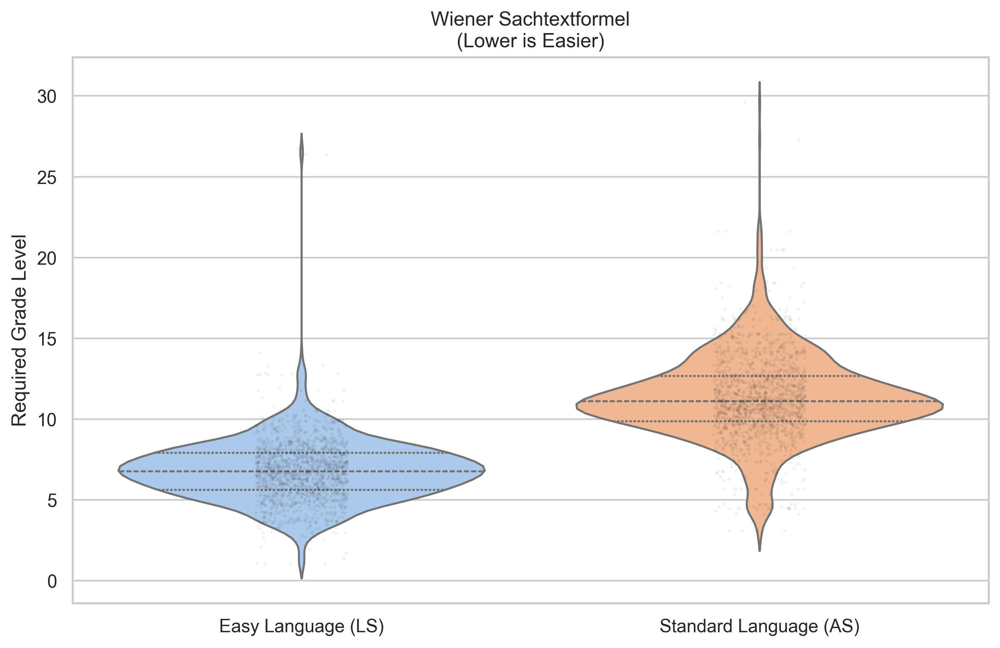
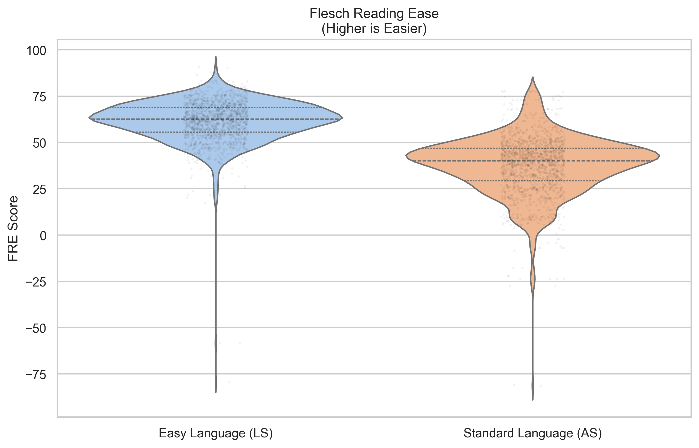
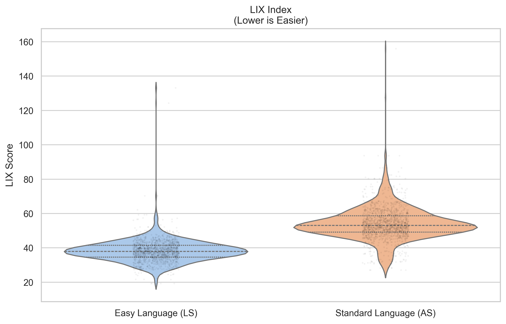
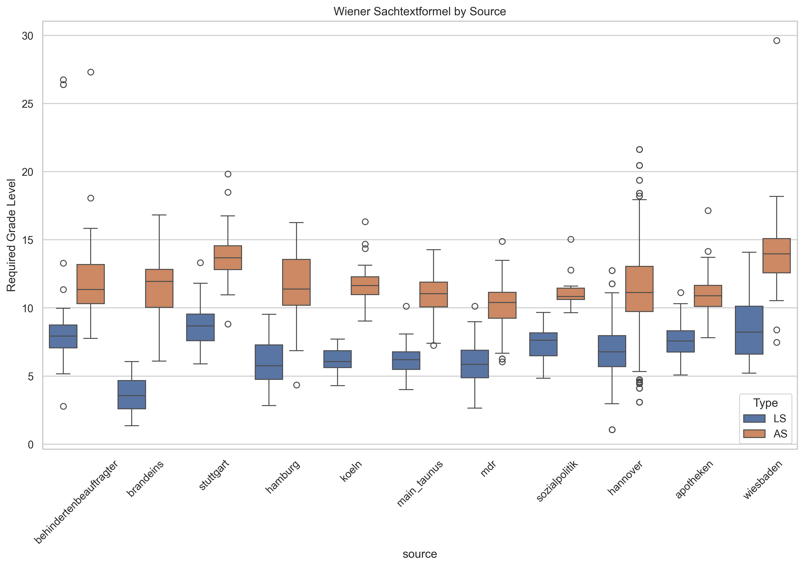

# Readability Analysis Summary

This report compares the readability of Standard Language (AS) and Easy Language (LS) texts in the final corpus.

## Key Findings
- **Difficulty Reduction (WSTF):** On average, LS texts are **4.46 grade levels easier** than their AS counterparts according to the Wiener Sachtextformel.
- **Standard Language Average:** Grade level 11.28
- **Easy Language Average:** Grade level 6.82

## Visualizations

### Wiener Sachtextformel Comparison

### Flesch Reading Ease Comparison

### LIX Index Comparison

### Analysis by Source

## Detailed Statistics

### Descriptive Statistics

| Metric | ls_wiener | as_wiener | ls_flesch | as_flesch | ls_lix | as_lix |
|---|---|---|---|---|---|---|
| count | 1471.00 | 1471.00 | 1471.00 | 1471.00 | 1471.00 | 1471.00 |
| mean | 6.82 | 11.28 | 61.53 | 37.75 | 38.23 | 54.06 |
| std | 1.99 | 2.67 | 11.62 | 15.91 | 7.04 | 9.63 |
| min | 1.07 | 3.09 | -79.34 | -81.50 | 19.24 | 27.13 |
| 25% | 5.63 | 9.87 | 55.69 | 29.44 | 34.70 | 49.17 |
| 50% | 6.77 | 11.12 | 62.67 | 40.21 | 37.98 | 53.08 |
| 75% | 7.91 | 12.66 | 68.97 | 47.02 | 41.50 | 58.72 |
| max | 26.75 | 29.63 | 91.00 | 77.96 | 133.12 | 155.98 |

### Means by Source

| Source | ls_wiener | as_wiener | ls_flesch | as_flesch |
|---|---|---|---|---|
| apotheken | 7.61 | 10.92 | 58.47 | 41.76 |
| behindertenbeauftragter | 8.91 | 12.04 | 45.95 | 27.60 |
| brandeins | 3.65 | 11.39 | 78.62 | 38.43 |
| hamburg | 6.09 | 11.54 | 64.54 | 36.07 |
| hannover | 6.78 | 11.31 | 61.40 | 36.94 |
| koeln | 6.17 | 11.74 | 64.65 | 33.83 |
| main_taunus | 6.20 | 10.95 | 66.64 | 40.78 |
| mdr | 5.91 | 10.22 | 67.99 | 46.32 |
| sozialpolitik | 7.33 | 11.24 | 58.70 | 37.56 |
| stuttgart | 8.72 | 13.81 | 51.53 | 22.06 |
| wiesbaden | 8.65 | 14.16 | 51.11 | 21.49 |
